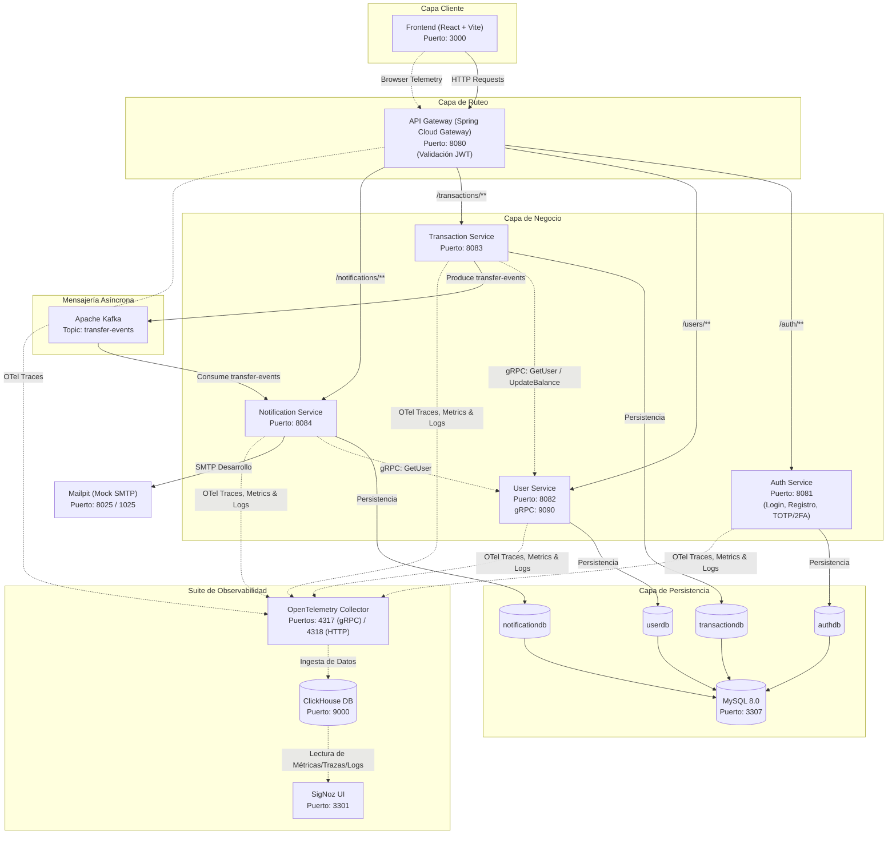

# FinTech Wallet - Arquitectura del Proyecto

Este documento detalla la arquitectura de software, infraestructura, flujos de datos y diseño de bases de datos del sistema **FinTech Wallet**.

---

## 1. Arquitectura General del Sistema

El sistema está diseñado bajo un patrón de **microservicios**, donde cada servicio tiene una responsabilidad única y su propia persistencia de datos (Database-per-Service).



---

## 2. Stack Tecnológico

| Capa | Tecnología |
|------|------------|
| **Frontend** | React 19, Vite 8, Tailwind CSS v4, React Router v6, Axios, Recharts, jsPDF, xlsx, qrcode.react, html5-qrcode |
| **Backend** | Spring Boot 3, Spring Data JPA, Spring Cloud Gateway, Spring Kafka, Spring Mail, JJWT, Protobuf (gRPC) |
| **Base de Datos** | MySQL 8.0, ClickHouse (Almacén de Telemetría) |
| **Mensajería** | Apache Kafka + Zookeeper |
| **Email** | Gmail SMTP (Producción) / Mailpit (Desarrollo) |
| **Contenedores** | Docker + Docker Compose |
| **Monitoreo/APM** | SigNoz + OpenTelemetry (OTel Collector) |

---

## 3. Microservicios - Detalle

### 3.1 Auth Service (Puerto 8081)
Maneja el registro, inicio de sesión, hashing de contraseñas (BCrypt), generación y verificación de JWT, y la autenticación de dos factores (2FA/TOTP).

*   **Base de Datos**: `authdb`
*   **Entidades**: `User` (email, password, role, verified, verificationToken, totpSecret, totpEnabled)
*   **Endpoints**:
    *   `POST /auth/register` (Registro)
    *   `POST /auth/login` (Inicio de sesión)
    *   `POST /auth/verify-totp` (Verificación de código de 2FA)
    *   `GET /auth/verify-email` (Activación de cuenta por token de email)
    *   `GET /auth/me` (Información del usuario autenticado)
    *   `POST /auth/setup-totp` (Inicializa clave secreta y código QR para 2FA)
    *   `POST /auth/enable-totp` (Habilita 2FA en el perfil)
    *   `POST /auth/disable-totp` (Deshabilita 2FA)

### 3.2 User Service (Puerto 8082 / gRPC: 9090)
Maneja los perfiles de usuario, saldos de cuenta, monedas activas y límites de transferencia diaria.
*   **Base de Datos**: `userdb`
*   **Entidades**: `UserProfile` (name, email, balance, dailyLimit, currency)
*   **Protocolo gRPC (user.proto)**:
    *   `rpc GetUser (UserRequest) returns (UserResponse);`
    *   `rpc UpdateBalance (UpdateBalanceRequest) returns (UserResponse);`
*   **Endpoints**:
    *   `POST /users` (Creación de perfil desde Auth)
    *   `GET /users/{id}` (Obtener perfil por ID)
    *   `PUT /users/{id}/settings` (Configurar límite diario y tipo de moneda)

### 3.3 Transaction Service (Puerto 8083)
Procesa transferencias de dinero y solicitudes de fondos, validando balances y límites diarios.
*   **Base de Datos**: `transactiondb`
*   **Entidades**:
    *   `Transaction` (fromUserId, toUserId, amount, status, createdAt)
    *   `MoneyRequest` (requesterId, targetId, amount, message, status, createdAt)
*   **Comunicación Síncrona**: Consulta y actualiza el saldo de `user-service` mediante **gRPC**.
*   **Comunicación Asíncrona**: Envía eventos al topic `transfer-events` de Kafka cuando se completa una transferencia.
*   **Endpoints**:
    *   `POST /transactions/transfer` (Efectuar transferencia)
    *   `GET /transactions/user/{userId}` (Historial de transacciones de un usuario)
    *   `POST /transactions/request` (Crear solicitud de dinero)
    *   `PUT /transactions/requests/{id}/accept` (Aceptar y pagar solicitud)
    *   `PUT /transactions/requests/{id}/reject` (Rechazar solicitud)

### 3.4 Notification Service (Puerto 8084)
Consume eventos de transferencias asíncronas desde Kafka para persistir notificaciones de transacciones enviadas/recibidas y enviar correos de confirmación.
*   **Base de Datos**: `notificationdb`
*   **Entidades**: `Notification` (userId, type, message, amount, fromUserId, isRead, createdAt)
*   **Comunicación Síncrona**: Consulta información de perfil en `user-service` mediante **gRPC**.
*   **Endpoints**:
    *   `GET /notifications/{userId}` (Listar notificaciones del usuario)
    *   `PUT /notifications/{id}/read` (Marcar notificación como leída)
    *   `GET /notifications/{userId}/unread-count` (Cantidad de notificaciones sin leer)

---

## 4. Flujos de Comunicación entre Servicios

### 4.1 Flujo de Autenticación y 2FA
```
Usuario -> Frontend (Login.jsx) -> API Gateway -> Auth Service (Verifica Password y 2FA)
   Si 2FA Inactivo: Devuelve Token JWT de Acceso Completo.
   Si 2FA Activo: Devuelve Estado Temporal indicando requerimiento de TOTP -> Usuario ingresa código -> Auth Service valida código y devuelve JWT.
```

### 4.2 Flujo de Transferencia y Notificaciones
```
Usuario -> Frontend (Transfer.jsx) -> API Gateway -> Transaction Service
   1. Transaction Service llama a User Service (vía gRPC) para validar fondos del Emisor y verificar el límite diario de transferencias.
   2. Transaction Service actualiza los balances del Emisor y Receptor en el User Service (vía gRPC).
   3. Transaction Service registra la transacción como COMPLETED y envía un evento al Broker de Kafka.
   4. Notification Service (consumidor) lee el evento, registra las notificaciones en notificationdb y envía un correo electrónico al receptor (vía SMTP Mailpit/Gmail).
```

---

## 5. Diseño de Base de Datos (MySQL)

El sistema utiliza bases de datos aisladas bajo un mismo servidor MySQL de desarrollo (Puerto `3307`):

### 5.1 authdb
*   **users**:
    *   `id` (BIGINT, PK, AUTO_INCREMENT)
    *   `email` (VARCHAR, UNIQUE, NOT NULL)
    *   `password` (VARCHAR, NOT NULL)
    *   `role` (VARCHAR, NOT NULL)
    *   `verified` (BOOLEAN, default false)
    *   `verification_token` (VARCHAR)
    *   `totp_secret` (VARCHAR)
    *   `totp_enabled` (BOOLEAN, default false)

### 5.2 userdb
*   **user_profiles**:
    *   `id` (BIGINT, PK, AUTO_INCREMENT)
    *   `name` (VARCHAR, NOT NULL)
    *   `email` (VARCHAR, UNIQUE, NOT NULL)
    *   `balance` (DECIMAL(19,2), NOT NULL)
    *   `daily_limit` (DECIMAL(19,2), default 50000.00)
    *   `currency` (VARCHAR(3), default ARS)

### 5.3 transactiondb
*   **transactions**:
    *   `id` (BIGINT, PK, AUTO_INCREMENT)
    *   `from_user_id` (BIGINT, NOT NULL)
    *   `to_user_id` (BIGINT, NOT NULL)
    *   `amount` (DECIMAL(19,2), NOT NULL)
    *   `status` (VARCHAR, NOT NULL)
    *   `created_at` (DATETIME, NOT NULL)
*   **money_requests**:
    *   `id` (BIGINT, PK, AUTO_INCREMENT)
    *   `requester_id` (BIGINT, NOT NULL)
    *   `target_id` (BIGINT, NOT NULL)
    *   `amount` (DECIMAL(19,2), NOT NULL)
    *   `message` (VARCHAR(255))
    *   `status` (VARCHAR, NOT NULL)
    *   `created_at` (DATETIME, NOT NULL)

### 5.4 notificationdb
*   **notifications**:
    *   `id` (BIGINT, PK, AUTO_INCREMENT)
    *   `user_id` (BIGINT, NOT NULL)
    *   `type` (VARCHAR, NOT NULL) -- 'SENT' / 'RECEIVED'
    *   `message` (VARCHAR(255), NOT NULL)
    *   `amount` (DECIMAL(19,2))
    *   `from_user_id` (BIGINT)
    *   `is_read` (BOOLEAN, default false)
    *   `created_at` (DATETIME, NOT NULL)

---

## 6. Puertos del Sistema y Contenedores Docker

El stack se compone de **15 contenedores** ejecutando los siguientes servicios:

| Puerto | Contenedor | Servicio | Descripción |
|--------|------------|----------|-------------|
| **3000** | `fintech-frontend` | Nginx + React Frontend | Interfaz de Usuario Web |
| **8080** | `fintech-gateway` | Spring Cloud Gateway | Puerta de enlace y filtros de seguridad |
| **8081** | `fintech-auth` | Auth Service | Gestión de usuarios y credenciales |
| **8082** | `fintech-user` | User Service | Gestión de saldos y configuraciones de perfil |
| **9090** | `fintech-user` (gRPC) | User Service | Endpoint gRPC interno para microservicios |
| **8083** | `fintech-transaction` | Transaction Service | Procesamiento de transferencias y solicitudes |
| **8084** | `fintech-notification` | Notification Service | Consumo de mensajes Kafka e historial |
| **3307** | `fintech-mysql` | MySQL Database | Motores de bases de datos relacionales |
| **9092** | `fintech-kafka` | Apache Kafka Broker | Bus de eventos y mensajería |
| **2181** | `fintech-zookeeper` | ZooKeeper | Coordinación del broker Kafka |
| **8025** | `fintech-mailpit` | Mailpit (Web UI) | Panel de lectura de correos locales |
| **1025** | `fintech-mailpit` | Mailpit (SMTP) | Servidor SMTP para capturar emails de prueba |
| **3301** | `fintech-signoz` | SigNoz Frontend UI | Panel web de observabilidad |
| **9000** | `fintech-clickhouse` | ClickHouse DB | Base de datos columnar de telemetría de SigNoz |
| **4317** | `fintech-otel-collector` | OpenTelemetry Collector | Puerto gRPC de ingesta de métricas/trazas/logs |
| **8000** | `fintech-signoz-mcp-server` | SigNoz MCP Server | API para interacción externa con SigNoz |
