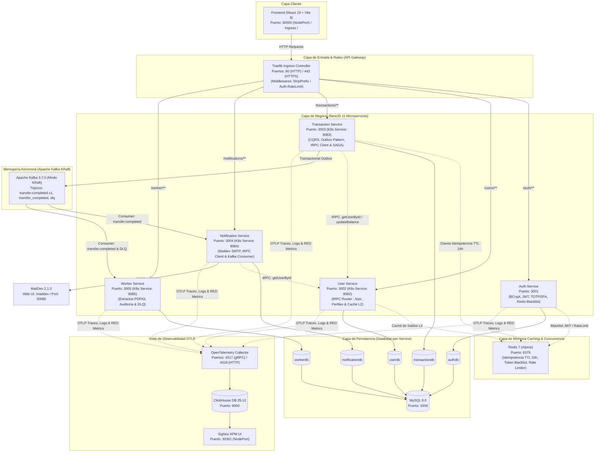
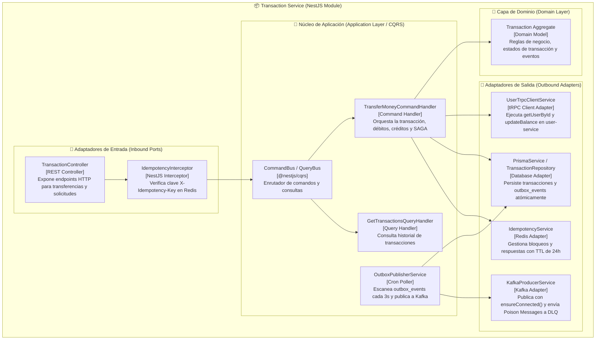
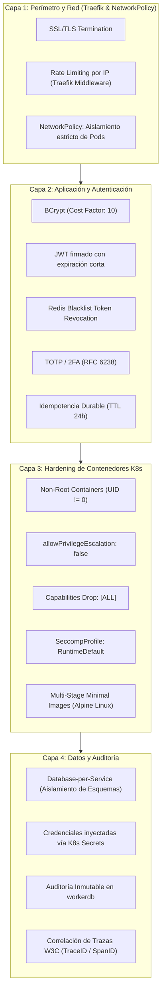
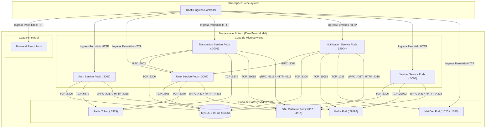

# FinTech Wallet - Arquitectura del Sistema 💳🏛️

Este documento detalla la arquitectura de software, infraestructura de microservicios, diagramas del **Modelo C4 (Context, Containers, Components)**, flujos transaccionales distribuidos, diseño de bases de datos, patrones DevSecOps y estrategias de **Seguridad, Hardening y Network Policies** del sistema **FinTech Wallet**.

---

## 1. Arquitectura General del Sistema

El sistema está diseñado bajo un patrón de **Microservicios con Arquitectura Hexagonal (Ports & Adapters)**, donde cada servicio posee aislamiento de dominio y persistencia propia (**Database-per-Service**).


```mermaid
graph TD
    subgraph Client ["Capa Cliente"]
        Frontend["Frontend (React 19 + Vite 8)<br>Puerto: 30000 (NodePort) / Ingress /"]
    end

    subgraph Gateway ["Capa de Entrada & Ruteo (API Gateway)"]
        Traefik["Traefik Ingress Controller<br>Puertos: 80 (HTTP) / 443 (HTTPS)<br>(Middlewares: StripPrefix / Auth-RateLimit)"]
    end

    subgraph Microservices ["Capa de Negocio (NestJS 11 Microservices)"]
        AuthService["Auth Service<br>Puerto: 3001<br>(BCrypt, JWT, TOTP/2FA, Redis Blacklist)"]
        UserService["User Service<br>Puerto: 3002 (K8s Service: 8082)<br>(tRPC Router : /trpc, Perfiles & Caché L2)"]
        TransactionService["Transaction Service<br>Puerto: 3003 (K8s Service: 8083)<br>(CQRS, Outbox Pattern, tRPC Client & SAGA)"]
        NotificationService["Notification Service<br>Puerto: 3004 (K8s Service: 8084)<br>(Maildev SMTP, tRPC Client & Kafka Consumer)"]
        WorkerService["Worker Service<br>Puerto: 3005 (K8s Service: 8085)<br>(Extractos PDFKit, Auditoría & DLQ)"]
    end

    subgraph CacheLayer ["Capa de Memoria Caching & Concurrencia"]
        Redis["Redis 7 (Alpine)<br>Puerto: 6379<br>(Idempotencia TTL 24h, Token Blacklist, Rate Limiter)"]
    end

    subgraph Messaging ["Mensajería Asíncrona (Apache Kafka KRaft)"]
        Kafka["Apache Kafka 3.7.0 (Modo KRaft)<br>Tópicos: transfer.completed.v1, transfer_completed, dlq"]
    end

    subgraph Database ["Capa de Persistencia (Database-per-Service)"]
        MySQL[("MySQL 8.0<br>Puerto: 3306")]
        AuthDB[("authdb")]
        UserDB[("userdb")]
        TransactionDB[("transactiondb")]
        NotificationDB[("notificationdb")]
        WorkerDB[("workerdb")]
    end

    subgraph Observability ["Suite de Observabilidad OTLP"]
        OTelCollector["OpenTelemetry Collector<br>Puertos: 4317 (gRPC) / 4318 (HTTP)"]
        ClickHouse[("ClickHouse DB 25.12<br>Puerto: 9000")]
        SigNoz["SigNoz APM UI<br>Puerto: 30301 (NodePort)"]
    end

    %% Client & Gateway Routing
    Frontend -->|HTTP Requests| Traefik
    Traefik -->|/auth/**| AuthService
    Traefik -->|/users/**| UserService
    Traefik -->|/transactions/**| TransactionService
    Traefik -->|/notifications/**| NotificationService
    Traefik -->|/worker/**| WorkerService

    %% Microservices to Redis
    AuthService -.->|Blacklist JWT / RateLimit| Redis
    UserService -.->|Caché de Saldos L2| Redis
    TransactionService -.->|Claves Idempotencia TTL 24h| Redis

    %% Persistence
    AuthService --> AuthDB
    UserService --> UserDB
    TransactionService --> TransactionDB
    NotificationService --> NotificationDB
    WorkerService --> WorkerDB
    AuthDB & UserDB & TransactionDB & NotificationDB & WorkerDB --> MySQL

    %% Inter-service Sync RPC (tRPC)
    TransactionService -.->|tRPC: getUserById / updateBalance| UserService
    NotificationService -.->|tRPC: getUserById| UserService

    %% Async Event Streams
    TransactionService -->|Transactional Outbox| Kafka
    Kafka -->|Consumer: transfer.completed| NotificationService
    Kafka -->|Consumer: transfer.completed & DLQ| WorkerService

    %% Email Delivery
    NotificationService -->|SMTP :1025| Maildev["MailDev 2.1.0<br>Web UI: /maildev / Port: 30080"]

    %% OpenTelemetry Ingestion
    AuthService & UserService & TransactionService & NotificationService & WorkerService -.->|OTLP Traces, Logs & RED Metrics| OTelCollector
    OTelCollector --> ClickHouse
    ClickHouse --> SigNoz
```

---

## 2. Diagramas del Modelo C4 (C4 Architecture Model) 📐

El **Modelo C4** permite visualizar la arquitectura en múltiples niveles de abstracción jerárquica:

### 2.1 C4 Nivel 1: Diagrama de Contexto del Sistema (System Context)

Muestra los usuarios humanos y los límites del sistema FinTech Wallet con sus sistemas externos colaboradores.

```mermaid
graph TD
    User["👤 Usuario Final (Cliente Billetera)<br>[Persona]<br>Transfiere fondos, consulta saldos y recibe alertas"]
    Admin["👨‍💼 Oficial de Cumplimiento / Admin<br>[Persona]<br>Monitorea métricas RED, auditoría y alertas"]

    subgraph SystemBoundary ["🏦 FinTech Wallet System"]
        FintechSystem["FinTech Wallet Core Platform<br>[Software System]<br>Plataforma de servicios financieros, billetera digital, transferencias y extractos bancarios"]
    end

    MailSystem["📧 Servidor SMTP / MailDev<br>[External System]<br>Envío y entrega de correos de confirmación y alertas 2FA"]
    ObservabilitySystem["📊 SigNoz & ClickHouse APM<br>[External Platform]<br>Ingesta OTLP, visualización de trazas W3C y logs de auditoría"]

    User -->|Consulta saldo y efectúa transferencias [HTTPS]| FintechSystem
    Admin -->|Inspecciona trazas, rendimiento y seguridad [HTTPS]| ObservabilitySystem
    Admin -->|Descarga extractos bancarios de auditoría [HTTPS]| FintechSystem
    FintechSystem -->|Envía notificaciones de transacciones [SMTP]| MailSystem
    FintechSystem -->|Exporta telemetría distribuida OTLP [gRPC / HTTP]| ObservabilitySystem
```

---

### 2.2 C4 Nivel 2: Diagrama de Contenedores (Containers Diagram)

Describe los contenedores de software que componen la solución dentro del clúster de Kubernetes.

```mermaid
graph TD
    User["👤 Usuario Final"]

    subgraph Browser ["Navegador Web"]
        SPA["Frontend SPA<br>[Container: React 19 + Vite 8]<br>Renderiza la interfaz web reactiva y dashboard financiero"]
    end

    subgraph K8sCluster ["☸️ Kubernetes Cluster (Namespace: fintech)"]
        Ingress["Traefik API Gateway<br>[Container: Traefik Ingress]<br>Enrutamiento perimetral, SSL Termination y Rate Limiting"]

        subgraph Apps ["Microservicios Backend (NestJS 11 + TypeScript)"]
            AuthApp["Auth Service<br>[Container: Node.js 22]<br>Maneja registro, login, 2FA y JWT"]
            UserApp["User Service<br>[Container: Node.js 22]<br>Gestión de saldos, perfiles y tRPC Router"]
            TxApp["Transaction Service<br>[Container: Node.js 22]<br>CQRS, transferencias, Outbox e Idempotencia"]
            NotifApp["Notification Service<br>[Container: Node.js 22]<br>Envío de emails SMTP y alertas"]
            WorkerApp["Worker Service<br>[Container: Node.js 22]<br>Generación PDF, Auditoría y Dead Letter Queue"]
        end

        subgraph DataStores ["Persistencia & Mensajería"]
            RedisStore["Redis 7 Server<br>[Container: StatefulSet]<br>Caché L2, Idempotency TTL y Token Blacklist"]
            KafkaBroker["Apache Kafka KRaft<br>[Container: StatefulSet]<br>Bus de eventos distribuidos de alta velocidad"]
            MySQLStore[("MySQL 8.0 Database<br>[Container: StatefulSet]<br>Esquemas: authdb, userdb, transactiondb, notificationdb, workerdb")]
            MaildevApp["MailDev 2.1.0<br>[Container: Deployment]<br>Servidor SMTP mock y Web UI de correos"]
        end

        subgraph APM ["Suite de Observabilidad"]
            OTelApp["OpenTelemetry Collector<br>[Container: Deployment]<br>Pipeline de recolección de trazas y logs"]
            CHApp[("ClickHouse DB 25.12<br>[Container: StatefulSet]<br>Almacén columnar de telemetría")]
            SigNozApp["SigNoz APM Dashboard<br>[Container: Deployment]<br>UI web de monitoreo y alertas"]
        end
    end

    User -->|Interactúa con la UI| SPA
    SPA -->|Peticiones HTTP/JSON [Puerto 80/443]| Ingress
    Ingress -->|Ruteo /auth| AuthApp
    Ingress -->|Ruteo /users| UserApp
    Ingress -->|Ruteo /transactions| TxApp
    Ingress -->|Ruteo /notifications| NotifApp
    Ingress -->|Ruteo /worker| WorkerApp
    Ingress -->|Ruteo /maildev| MaildevApp

    TxApp -.->|tRPC Sync RPC| UserApp
    NotifApp -.->|tRPC Sync RPC| UserApp

    AuthApp --> MySQLStore
    UserApp --> MySQLStore
    TxApp --> MySQLStore
    NotifApp --> MySQLStore
    WorkerApp --> MySQLStore

    AuthApp -.-> RedisStore
    UserApp -.-> RedisStore
    TxApp -.-> RedisStore

    TxApp -->|Publica eventos| KafkaBroker
    KafkaBroker -->|Consume eventos| NotifApp
    KafkaBroker -->|Consume eventos & DLQ| WorkerApp

    NotifApp -->|Envía correos SMTP :1025| MaildevApp

    AuthApp & UserApp & TxApp & NotifApp & WorkerApp -.->|Exporta OTLP :4317/:4318| OTelApp
    OTelApp --> CHApp
    CHApp --> SigNozApp
```

---

### 2.3 C4 Nivel 3: Diagrama de Componentes (Component Diagram - Transaction Service)

Muestra la arquitectura interna hexagonal y modular del **Transaction Service** y cómo interactúa con sus adaptadores.


```mermaid
graph TD
    subgraph TransactionService ["📦 Transaction Service (NestJS Module)"]
        subgraph InboundAdapters ["🔌 Adaptadores de Entrada (Inbound Ports)"]
            TxController["TransactionController<br>[REST Controller]<br>Expone endpoints HTTP para transferencias y solicitudes"]
            IdempotencyGuard["IdempotencyInterceptor<br>[NestJS Interceptor]<br>Verifica clave X-Idempotency-Key en Redis"]
        end

        subgraph ApplicationCore ["🧠 Núcleo de Aplicación (Application Layer / CQRS)"]
            CommandBus["CommandBus / QueryBus<br>[@nestjs/cqrs]<br>Enrutador de comandos y consultas"]
            TransferHandler["TransferMoneyCommandHandler<br>[Command Handler]<br>Orquesta la transacción, débitos, créditos y SAGA"]
            GetTxHandler["GetTransactionsQueryHandler<br>[Query Handler]<br>Consulta historial de transacciones"]
            OutboxPublisher["OutboxPublisherService<br>[Cron Poller]<br>Escanea outbox_events cada 3s y publica a Kafka"]
        end

        subgraph DomainLayer ["💎 Capa de Dominio (Domain Layer)"]
            TxAggregate["Transaction Aggregate<br>[Domain Model]<br>Reglas de negocio, estados de transacción y eventos"]
        end

        subgraph OutboundAdapters ["🔌 Adaptadores de Salida (Outbound Adapters)"]
            UserTrpcClient["UserTrpcClientService<br>[tRPC Client Adapter]<br>Ejecuta getUserById y updateBalance en user-service"]
            KafkaProducer["KafkaProducerService<br>[Kafka Adapter]<br>Publica con ensureConnected() y envía Poison Messages a DLQ"]
            PrismaRepo["PrismaService / TransactionRepository<br>[Database Adapter]<br>Persiste transacciones y outbox_events atómicamente"]
            RedisAdapter["IdempotencyService<br>[Redis Adapter]<br>Gestiona bloqueos y respuestas con TTL de 24h"]
        end
    end

    TxController --> IdempotencyGuard
    IdempotencyGuard --> CommandBus
    CommandBus --> TransferHandler
    CommandBus --> GetTxHandler

    TransferHandler --> TxAggregate
    TransferHandler --> UserTrpcClient
    TransferHandler --> PrismaRepo
    TransferHandler --> RedisAdapter

    OutboxPublisher --> PrismaRepo
    OutboxPublisher --> KafkaProducer
```

---

## 3. Stack Tecnológico

| Capa | Tecnología | Propósito |
| :--- | :--- | :--- |
| **Frontend** | React 19, Vite 8, Tailwind CSS v4, Axios, Recharts, Lucide Icons | Interfaz de Usuario Single Page Application (SPA) |
| **Backend Framework** | NestJS 11 + TypeScript 5.9, `@nestjs/cqrs` | Microservicios con Arquitectura Hexagonal y modular |
| **ORM / Acceso a BD** | Prisma ORM 7.9.1 | Tipado estricto de esquemas, migraciones y pool de conexiones |
| **Comunicación Síncrona** | tRPC (`@trpc/server`, `@trpc/client`) | RPC tipado de extremo a extremo sin sobrecarga Protobuf |
| **API Gateway & Ingress** | Traefik Ingress Controller (K3s nativo) | Enrutamiento perimetral, middleware StripPrefix y RateLimiting |
| **Base de Datos** | MySQL 8.0 (InnoDB) + ClickHouse 25.12 | Persistencia transaccional ACID y almacén columnar de telemetría |
| **Caché e Idempotencia** | Redis 7 (Alpine) con `ioredis` | Registro de idempotencia con TTL (24h), JWT Blacklist y Rate Limiting |
| **Event Broker** | Apache Kafka 3.7.0 en modo KRaft (`kafkajs`) | Bus de eventos asíncrono sin dependencia de ZooKeeper |
| **Testing de Email** | MailDev 2.1.0 (SMTP + Web UI) | Captura y visualización interactiva de correos en desarrollo |
| **Observabilidad / APM** | OpenTelemetry SDK + SigNoz v0.136.1 | Trazabilidad distribuida W3C, métricas RED y correlación de logs |
| **Orquestación & CI/CD** | Kubernetes (K3s), Rancher Desktop, `containerd`, `nerdctl`, Helm 3 | Despliegue de contenedores, StatefulSets con PVCs y paquetes Helm |

---

## 4. Detalle de los Microservicios

### 4.1 Auth Service (Puerto 3001)
Responsable del ciclo de vida de usuarios, autenticación y seguridad de credenciales.
* **Base de Datos**: `authdb`
* **Tecnologías**: BCrypt, `@nestjs/jwt`, `otplib` (TOTP/2FA), `qrcode`, `ioredis`.
* **Endpoints Principales**:
  * `POST /auth/register` (Registro de usuario y creación de perfil en `user-service`)
  * `POST /auth/login` (Autenticación con password o emisión de challenge 2FA)
  * `POST /auth/verify-totp` (Verificación de código de 6 dígitos 2FA)
  * `POST /auth/logout` (Invalidación de token en Redis Blacklist)
  * `GET /auth/health` (Startup, Liveness y Readiness Probes)
  * `GET /auth/docs/` (Swagger OpenAPI UI)

### 4.2 User Service (Puerto 3002 / Servicio K8s: 8082)
Gestiona perfiles de usuario, saldos, límites diarios y expone el **Router tRPC** para comunicación interna.
* **Base de Datos**: `userdb`
* **Procedimientos tRPC (`/trpc`)**:
  * `getUserById`: Consulta de perfil de usuario por ID con caché L2 en Redis.
  * `getUserByEmail`: Búsqueda de usuario por correo.
  * `updateBalance`: Operación atómica de débito/crédito con validación de saldo no negativo.
* **Endpoints REST**:
  * `GET /users/:id` (Consulta de perfil)
  * `PUT /users/:id/settings` (Configuración de límite diario y moneda)
  * `GET /users/health` y `GET /users/docs/`

### 4.3 Transaction Service (Puerto 3003 / Servicio K8s: 8083)
Motor central de transferencias financieras. Implementa **CQRS**, **Idempotencia en Redis**, **Transactional Outbox Pattern** y **tRPC Client**.
* **Base de Datos**: `transactiondb`
* **Patrones Implementados**:
  * **CQRS**: Separación de `TransferMoneyCommand` (escritura) y `GetTransactionsQuery` (lectura).
  * **Idempotencia**: Validación de encabezado `X-Idempotency-Key` en Redis con TTL de 24 horas.
  * **Transactional Outbox**: Escritura atómica en `outbox_events` y publicación resiliente a Kafka mediante poller en segundo plano con reconexión automática (`ensureConnected()`).
* **Endpoints REST**:
  * `POST /transactions/transfer` (Ejecutar transferencia atómica)
  * `GET /transactions/user/:userId` (Historial de transacciones)
  * `POST /transactions/request` (Solicitud de cobro)
  * `PUT /transactions/requests/:id/accept` (Aceptar y pagar solicitud)
  * `GET /transactions/health` y `GET /transactions/docs/`

### 4.4 Notification Service (Puerto 3004 / Servicio K8s: 8084)
Consumidor de eventos de Kafka encargado de enviar alertas por correo electrónico y persistir el historial de notificaciones.
* **Base de Datos**: `notificationdb`
* **Flujo**:
  1. Consume mensajes de los tópicos `fintech.transaction.transfer.completed.v1` y `transfer_completed`.
  2. Obtiene los datos del destinatario mediante tRPC (`getUserById`).
  3. Despacha el correo HTML transaccional mediante Nodemailer (`maildev:1025`).
  4. Persiste la notificación en `notificationdb`.
* **Endpoints REST**:
  * `GET /notifications/user/:userId` (Notificaciones del usuario)
  * `PATCH /notifications/:id/read` (Marcar como leída)
  * `GET /notifications/unread-count/:userId` (Contador de no leídas)

### 4.5 Worker Service (Puerto 3005 / Servicio K8s: 8085)
Servicio de procesamiento en segundo plano para auditoría, generación de extractos bancarios y gestión de colas muertas.
* **Base de Datos**: `workerdb`
* **Flujo**:
  * Generación de extractos bancarios en PDF con `PDFKit`.
  * Ingesta de registros de auditoría de transacciones.
  * Consumo y aislamiento de mensajes envenenados en **Dead Letter Queue (`fintech.dlq`)**.
* **Endpoints REST**:
  * `POST /worker/statements/request` (Solicitar generación de extracto PDF)
  * `GET /worker/statements/:id/download` (Descarga de archivo PDF)
  * `GET /worker/audit/user/:userId` (Historial de auditoría)

---

## 5. Patrones de Diseño y Flujos Transaccionales

### 5.1 Patrón SAGA Coreografiado (Transferencia de Fondos)
```mermaid
sequenceDiagram
    autonumber
    actor User as Usuario (Emisor)
    participant Gateway as Traefik API Gateway
    participant TxService as Transaction Service
    participant Redis as Redis (Idempotency)
    participant UserService as User Service (tRPC)
    participant DB as transactiondb (Outbox)
    participant Kafka as Apache Kafka (KRaft)
    participant NotifService as Notification Service
    participant Mail as MailDev (SMTP)

    User->>Gateway: POST /transactions/transfer (X-Idempotency-Key)
    Gateway->>TxService: Forward Request
    TxService->>Redis: Verificar si idempotencyKey ya existe
    alt Clave duplicada detectada
        Redis-->>TxService: Duplicado
        TxService-->>User: HTTP 400 (Solicitud duplicada)
    else Clave nueva
        TxService->>UserService: tRPC updateBalance(Emisor, -monto)
        alt Saldo insuficiente
            UserService-->>TxService: Falla
            TxService-->>User: HTTP 400 (Saldo insuficiente)
        else Débito exitoso
            TxService->>UserService: tRPC updateBalance(Receptor, +monto)
            alt Falla en crédito
                UserService-->>TxService: Falla
                TxService->>UserService: tRPC updateBalance(Emisor, +monto) [Compensación SAGA]
                TxService-->>User: HTTP 400 (Error en destino; transfer revertida)
            else Crédito exitoso
                TxService->>DB: Guardar Transacción + Outbox Event (TRANSFER_COMPLETED)
                TxService->>Redis: Registrar Idempotency Key (TTL 24h)
                TxService-->>User: HTTP 200 (Transferencia exitosa)
                loop Poller Outbox (Cada 3s)
                    TxService->>Kafka: Publicar TransferCompletedV1
                end
                Kafka->>NotifService: Consume TransferCompletedV1
                NotifService->>UserService: tRPC getUserById(Receptor)
                NotifService->>Mail: Enviar Correo SMTP
            end
        end
    end
```

---

## 6. Seguridad, Hardening y DevSecOps 🔐🛡️

La seguridad en **FinTech Wallet** se implementa bajo el principio de **Defensa en Profundidad (Defense in Depth)** a través de múltiples capas:


```mermaid
graph TD
    subgraph Layer1 ["Capa 1: Perímetro y Red (Traefik & NetworkPolicy)"]
        L1_1["SSL/TLS Termination"]
        L1_2["Rate Limiting por IP (Traefik Middleware)"]
        L1_3["NetworkPolicy: Aislamiento estricto de Pods"]
    end

    subgraph Layer2 ["Capa 2: Aplicación y Autenticación"]
        L2_1["BCrypt (Cost Factor: 10)"]
        L2_2["JWT firmado con expiración corta"]
        L2_3["Redis Blacklist Token Revocation"]
        L2_4["TOTP / 2FA (RFC 6238)"]
        L2_5["Idempotencia Durable (TTL 24h)"]
    end

    subgraph Layer3 ["Capa 3: Hardening de Contenedores K8s"]
        L3_1["Non-Root Containers (UID != 0)"]
        L3_2["allowPrivilegeEscalation: false"]
        L3_3["Capabilities Drop: [ALL]"]
        L3_4["SeccompProfile: RuntimeDefault"]
        L3_5["Multi-Stage Minimal Images (Alpine Linux)"]
    end

    subgraph Layer4 ["Capa 4: Datos y Auditoría"]
        L4_1["Database-per-Service (Aislamiento de Esquemas)"]
        L4_2["Credenciales inyectadas vía K8s Secrets"]
        L4_3["Auditoría Inmutable en workerdb"]
        L4_4["Correlación de Trazas W3C (TraceID / SpanID)"]
    end

    Layer1 --> Layer2
    Layer2 --> Layer3
    Layer3 --> Layer4
```

### 6.1 Hardening de Contenedores en Kubernetes (`SecurityContext`)

Todos los microservicios y componentes de infraestructura aplican políticas de endurecimiento en sus manifiestos `k8s/`:

* **`allowPrivilegeEscalation: false`**: Bloquea que cualquier subproceso dentro del contenedor obtenga privilegios superiores a su proceso padre (prevención de exploits SUID).
* **`capabilities.drop: ["ALL"]`**: Elimina todas las capacidades avanzadas de Linux del kernel (como `CAP_SYS_ADMIN`, `CAP_NET_ADMIN`, `CAP_RAW_IO`).
* **`seccompProfile: RuntimeDefault`**: Limita las llamadas al sistema (*syscalls*) a un conjunto seguro predeterminado por el motor de contenedores (`containerd`).
* **Imágenes Multi-Stage**: Los Dockerfiles compilan en un stage `builder` y copian únicamente los binarios optimizados en un stage `runner` sobre **Node.js Alpine**, reduciendo la superficie de ataque (sin herramientas de compilación ni dependencias de desarrollo).

### 6.2 Seguridad en la Capa de Identidad y Autenticación

1. **Protección de Credenciales**:
   - Contraseñas procesadas con **BCrypt** con 10 rondas de salting antes de persistir en `authdb`.
2. **Ciclo de Vida de Tokens JWT y Revocación**:
   - Tokens JWT firmados criptográficamente. Al invocar `POST /auth/logout`, el identificador del token se persiste en **Redis** con un tiempo de expiración equivalente a su TTL remanente (**Token Blacklist**), impidiendo su reuso incluso antes de su caducidad natural.
3. **Autenticación Multifactor (TOTP 2FA)**:
   - Implementación del algoritmo RFC 6238 con clave secreta Base32 generada criptográficamente (`otplib`). Ventana de tolerancia temporal limitada a $\pm 1$ paso para prevenir ataques de repetición.
4. **Idempotencia Financiera contra Ataques de Repetición y Concurrencia**:
   - Cada transacción financiera exige el encabezado `X-Idempotency-Key`. `Transaction Service` adquiere un candado atómico en Redis (`SET NX EX 86400`). Peticiones simultáneas o duplicadas son rechazadas inmediatamente con **HTTP 400**, asegurando que jamás ocurra un doble débito.

---

## 7. Políticas de Red en Kubernetes (Network Policies) 🚦🌐

El namespace `fintech` implementa políticas de red basadas en el estándar de Kubernetes (`networking.k8s.io/v1`) para gobernar el flujo de tráfico:


```mermaid
graph TD
    subgraph KubeSystem ["Namespace: kube-system"]
        TraefikPod["Traefik Ingress Controller"]
    end

    subgraph FintechNamespace ["Namespace: fintech (Zero-Trust Model)"]
        subgraph FrontTier ["Capa Perimetral"]
            FrontendPod["Frontend React Pods"]
        end

        subgraph AppTier ["Capa de Microservicios"]
            AuthPod["Auth Service Pods (:3001)"]
            UserPod["User Service Pods (:3002)"]
            TxPod["Transaction Service Pods (:3003)"]
            NotifPod["Notification Service Pods (:3004)"]
            WorkerPod["Worker Service Pods (:3005)"]
        end

        subgraph InfraTier ["Capa de Datos y Middleware"]
            MySQLPod[("MySQL 8.0 Pod (:3306)")]
            RedisPod["Redis 7 Pod (:6379)"]
            KafkaPod["Kafka Pod (:29092)"]
            MaildevPod["MailDev Pod (:1025 / :1080)"]
            OTelPod["OTel Collector Pod (:4317 / :4318)"]
        end
    end

    TraefikPod -->|Ingress Permitido HTTP| FrontendPod
    TraefikPod -->|Ingress Permitido HTTP| AuthPod
    TraefikPod -->|Ingress Permitido HTTP| UserPod
    TraefikPod -->|Ingress Permitido HTTP| TxPod
    TraefikPod -->|Ingress Permitido HTTP| NotifPod
    TraefikPod -->|Ingress Permitido HTTP| WorkerPod
    TraefikPod -->|Ingress Permitido HTTP| MaildevPod

    %% Inter-microservice
    TxPod -->|tRPC :3002| UserPod
    NotifPod -->|tRPC :3002| UserPod

    %% Microservices to Data
    AuthPod & UserPod & TxPod & NotifPod & WorkerPod -->|TCP :3306| MySQLPod
    AuthPod & UserPod & TxPod -->|TCP :6379| RedisPod
    TxPod & NotifPod & WorkerPod -->|TCP :29092| KafkaPod
    NotifPod -->|TCP :1025| MaildevPod
    AuthPod & UserPod & TxPod & NotifPod & WorkerPod -->|gRPC :4317 / HTTP :4318| OTelPod
```

### 7.1 Reglas de Aislamiento de Tráfico

1. **Aislamiento Ingress (Entrada)**:
   - Los microservicios backend **solo aceptan tráfico HTTP/tRPC** proveniente del Ingress Controller Traefik o de Pods autorizados del mismo namespace `fintech`.
2. **Aislamiento de la Base de Datos (MySQL / Redis / Kafka)**:
   - No poseen puertos expuestos a internet ni NodePorts públicos. Únicamente son accesibles mediante DNS interno del clúster (`mysql.fintech.svc.cluster.local`, `redis.fintech.svc.cluster.local`, `kafka.fintech.svc.cluster.local`).
3. **Aislamiento Egress (Salida)**:
   - Los microservicios solo pueden establecer conexiones salientes hacia los puertos estrictamente necesarios: MySQL (`3306`), Redis (`6379`), Kafka (`29092`), MailDev (`1025`), OpenTelemetry Collector (`4317/4318`) y tRPC (`3002`).

---

## 8. Diseño de Bases de Datos (MySQL 8.0)

El sistema implementa **Database-per-Service** con 5 esquemas independientes en MySQL 8.0:

```text
MySQL 8.0 (:3306)
├── authdb
│   └── users (id, email, password, role, is_active, two_factor_secret, two_factor_enabled, created_at, updated_at)
├── userdb
│   └── user_profiles (id, user_id, email, name, balance, daily_limit, currency, created_at, updated_at)
├── transactiondb
│   ├── transactions (id, from_user_id, to_user_id, amount, status, created_at)
│   ├── money_requests (id, requester_id, target_id, amount, message, status, created_at)
│   ├── outbox_events (id, aggregate_type, aggregate_id, event_type, payload, status, created_at, processed_at)
│   └── idempotency_records (id, idempotency_key, user_id, response, created_at, expires_at)
├── notificationdb
│   └── notifications (id, user_id, type, title, message, is_read, metadata, created_at)
└── workerdb
    ├── statement_jobs (id, user_id, status, file_path, start_date, end_date, created_at, completed_at)
    └── audit_logs (id, event_type, aggregate_id, user_id, payload, ip_address, created_at)
```

---

## 9. Observabilidad y Monitoreo (SigNoz + OpenTelemetry)

* **OpenTelemetry SDK**: Integrado en cada microservicio NestJS mediante `@opentelemetry/sdk-node` y `@opentelemetry/auto-instrumentations-node`.
* **Correlación de Logs**: Winston Logger inyecta `trace_id` y `span_id` en formato JSON estructurado en todos los logs de aplicación.
* **Métricas RED**: Monitoreo de *Rate* (RPS), *Errors* (Tasa de error HTTP 4xx/5xx) y *Duration* (Latencias P50, P95, P99) en tiempo real en ClickHouse y SigNoz APM.

---

## 10. Enlaces a Documentación de Soporte (`docs/`)

Para detalles operativos y comandos específicos, consulta las guías dedicadas:
- ☸️ [Guía de Kubernetes & Kubectl Cheat Sheet](file:///c:/dev/DevOps/fintech-wallet/docs/kubernetes.md)
- 🔄 [Guía de Patrón SAGA & CQRS](file:///c:/dev/DevOps/fintech-wallet/docs/saga.md)
- 📩 [Guía de Apache Kafka & Transactional Outbox](file:///c:/dev/DevOps/fintech-wallet/docs/kafka.md)
- ⚡ [Guía de Redis & Idempotencia](file:///c:/dev/DevOps/fintech-wallet/docs/redis.md)
- 🚦 [Guía de Traefik API Gateway](file:///c:/dev/DevOps/fintech-wallet/docs/traefik.md)
- 📊 [Guía de SigNoz & Observabilidad](file:///c:/dev/DevOps/fintech-wallet/docs/signoz.md)
- ⚓ [Guía de Helm 3 Package Manager](file:///c:/dev/DevOps/fintech-wallet/docs/helm.md)
- 🚀 [Guía: Crear Nuevo Microservicio Paso a Paso](file:///c:/dev/DevOps/fintech-wallet/docs/crear-nuevo-microservicio.md)
