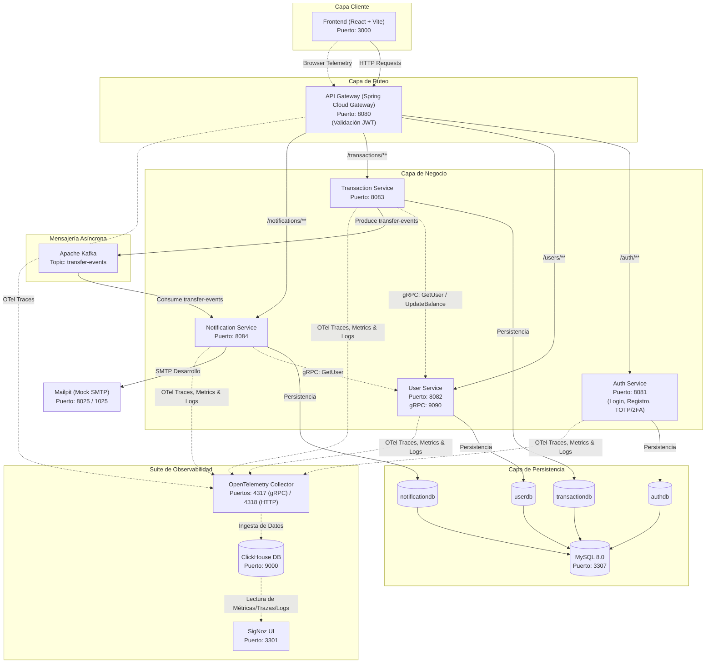

# FinTech Wallet

Sistema de billetera virtual desarrollado con arquitectura de microservicios. Permite realizar transferencias, solicitar dinero, gestionar contactos favoritos, pagos por QR y mas.

## Arquitectura




## Stack Tecnologico

| Capa | Tecnologias |
|------|-------------|
| **Frontend** | React 19, Vite 8, Tailwind CSS v4, React Router v6, Axios, Recharts, jsPDF, xlsx, qrcode.react, html5-qrcode |
| **Backend** | Spring Boot 3, Spring Data JPA, Spring Cloud Gateway, Spring Kafka, Spring Mail, JJWT, Lombok, Commons Codec |
| **Base de Datos** | MySQL 8.0 |
| **Mensajeria** | Apache Kafka + Zookeeper |
| **Email** | Gmail SMTP (produccion) / Mailpit (desarrollo) |
| **Contenedores** | Docker + Docker Compose |
| **Servidor Web** | Nginx (reverse proxy) |

## Funcionalidades

### Faciles
- Depositar y retirar dinero
- Buscar usuarios por nombre o email
- Modo oscuro / claro
- Diseno responsive (mobile + desktop)

### Intermedias
- Filtros por fecha en historial de transacciones
- Exportar historial a PDF y Excel
- Graficos de transacciones en el Dashboard (Recharts)
- Notificaciones en tiempo real (polling)
- Cambio de contrasena
- Contactos favoritos (localStorage)

### Avanzadas
- Transferencias por codigo QR (generar y escanear)
- Solicitar dinero a otros usuarios (crear/aceptar/rechazar)
- Limite diario de transferencias configurable
- Panel de administracion (rol ADMIN)
- Verificacion de email (Gmail SMTP real)
- Autenticacion de dos factores (2FA/TOTP con Google Authenticator)
- Multiples monedas (ARS, USD, EUR) con tasas de cambio

## Microservicios

### Auth Service (Puerto 8081)
Maneja autenticacion, registro, JWT, verificacion de email y 2FA.

| Metodo | Endpoint | Descripcion |
|--------|----------|-------------|
| POST | `/auth/register` | Registrar usuario |
| POST | `/auth/login` | Iniciar sesion |
| POST | `/auth/verify-totp` | Verificar codigo 2FA |
| GET | `/auth/verify-email` | Verificar email por token |
| GET | `/auth/me` | Estado actual del usuario |
| POST | `/auth/resend-verification` | Reenviar email de verificacion |
| POST | `/auth/setup-totp` | Configurar 2FA |
| POST | `/auth/enable-totp` | Activar 2FA |
| POST | `/auth/disable-totp` | Desactivar 2FA |
| PUT | `/auth/change-password` | Cambiar contrasena |
| PUT | `/auth/promote-admin` | Promover a administrador |

### User Service (Puerto 8082)
Gestiona perfiles de usuario, balances y configuraciones.

| Metodo | Endpoint | Descripcion |
|--------|----------|-------------|
| POST | `/users` | Crear usuario |
| GET | `/users` | Listar todos los usuarios |
| GET | `/users/{id}` | Obtener usuario por ID |
| PUT | `/users/{id}/balance` | Actualizar saldo |
| PUT | `/users/{id}/settings` | Cambiar moneda y limite diario |

### Transaction Service (Puerto 8083)
Procesa transferencias, solicitudes de dinero y valida limites diarios.

| Metodo | Endpoint | Descripcion |
|--------|----------|-------------|
| POST | `/transactions/transfer` | Realizar transferencia |
| GET | `/transactions/user/{userId}` | Historial por usuario |
| GET | `/transactions/all` | Todas las transacciones (admin) |
| POST | `/transactions/request` | Crear solicitud de dinero |
| GET | `/transactions/requests/{userId}` | Solicitudes por usuario |
| PUT | `/transactions/requests/{id}/accept` | Aceptar solicitud |
| PUT | `/transactions/requests/{id}/reject` | Rechazar solicitud |

### Notification Service (Puerto 8084)
Consume eventos de Kafka cuando se completa una transferencia.

### API Gateway (Puerto 8080)
Punto de entrada unico. Valida JWT y rutea a los servicios correspondientes.

## Requisitos Previos

- [Docker Desktop](https://www.docker.com/products/docker-desktop/) instalado y corriendo
- Puertos disponibles: 3000, 3307, 8080-8084, 9092, 2181, 8025, 1025

## Instalacion y Ejecucion

### 1. Clonar el repositorio

```bash
git clone https://github.com/jara96/fintech-wallet.git
cd fintech-wallet
```

### 2. Configurar el archivo de entorno (.env)

Crea una copia de del archivo de ejemplo `.env.example` y nómbralo `.env`:

```bash
cp .env.example .env
```

Abre el archivo `.env` y rellena las siguientes variables:

*   **Configuración de Base de Datos**: Configura el usuario y contraseña para MySQL (por defecto `root` y `12345`).
*   **Gmail (opcional)**: Para enviar correos de verificación y notificaciones reales. Si no se configura, los correos serán capturados por Mailpit en desarrollo.
*   **SigNoz API Key**: Necesaria si deseas interactuar con la API de SigNoz para automatizar la creación de dashboards y alertas (la puedes obtener desde la sección Settings -> Service Accounts en SigNoz UI).

### 3. Levantar la aplicación y la infraestructura

Inicia todos los servicios (Base de datos, Kafka, Microservicios Java, Frontend React y la suite de Observabilidad de SigNoz):

```bash
docker compose up -d
```

Espera unos minutos a que todos los servicios arranquen y compilen. Puedes verificar el estado con:

```bash
docker compose ps
```

### 4. Acceder a los servicios

Una vez que todo esté corriendo, puedes acceder a las siguientes interfaces:

| Servicio | URL |
|----------|-----|
| **Aplicación Web (Frontend)** | [http://localhost:3000](http://localhost:3000) |
| **SigNoz (Consola de Observabilidad)** | [http://localhost:3301](http://localhost:3301) |
| **Mailpit (Correos de prueba locales)** | [http://localhost:8025](http://localhost:8025) |
| **API Gateway** | [http://localhost:8080](http://localhost:8080) |

### 5. Crear tu primer usuario

1. Ve a [http://localhost:3000/register](http://localhost:3000/register).
2. Regístrate con nombre, email y contraseña.
3. Si no configuraste credenciales de Gmail reales, ve a Mailpit ([http://localhost:8025](http://localhost:8025)) para abrir el correo de verificación recibido y activar tu cuenta haciendo clic en el enlace.
4. ¡Listo! Ya puedes iniciar sesión y usar la billetera virtual.

## Base de Datos

El sistema usa 4 bases de datos MySQL independientes:

| Base | Servicio | Tablas |
|------|----------|--------|
| `authdb` | Auth Service | `users` (credenciales, 2FA, verificación) |
| `userdb` | User Service | `user_profiles` (nombre, balance, moneda, límite) |
| `transactiondb` | Transaction Service | `transactions`, `money_requests` |
| `notificationdb` | Notification Service | `notifications` (historial de notificaciones) |

Conexión a MySQL:
```
Host: localhost
Puerto: 3307
Usuario: ${DB_USERNAME} (por defecto: root)
Contraseña: ${DB_PASSWORD} (por defecto: 12345)
```

## Estructura del Proyecto

```
fintech-wallet/
├── backend/                  # Microservicios Spring Boot
│   ├── api-gateway/          # Gateway + Filtro JWT
│   ├── auth-service/         # Autenticación, 2FA, email
│   ├── user-service/         # Perfiles y balances (gRPC)
│   ├── transaction-service/  # Transferencias y solicitudes (gRPC Client)
│   └── notification-service/ # Consumidor Kafka + notificaciones (gRPC Client)
├── frontend/                 # Aplicación React + Vite
├── infra/                    # Archivos de infraestructura
│   ├── mysql/                # Script de inicialización de MySQL
│   ├── clickhouse/           # Configuración ClickHouse para SigNoz
│   └── otel/                 # Configuraciones del colector y migrador de OTel
├── observability/            # Suite de observabilidad
│   ├── dashboards/           # Plantillas de dashboards para SigNoz
│   └── scripts/              # Scripts auxiliares para dashboards y métricas
├── docs/                     # Reportes y planes de migración
├── docker-compose.yml        # Stack completo de contenedores
├── .env.example              # Ejemplo de variables de entorno
├── ARQUITECTURA.md           # Documentación de arquitectura
└── README.md
```

## Puertos

| Puerto | Servicio |
|--------|----------|
| 3000 | Frontend (React) |
| 8080 | API Gateway |
| 8081 | Auth Service |
| 8082 | User Service |
| 8083 | Transaction Service |
| 8084 | Notification Service |
| 3307 | MySQL |
| 9092 | Kafka |
| 2181 | Zookeeper |
| 8025 | Mailpit (Web UI) |
| 1025 | Mailpit (SMTP) |

## Comandos Utiles

```bash
# Levantar todo
docker compose up -d

# Ver logs de un servicio
docker compose logs -f auth-service

# Detener todo
docker compose down

# Reconstruir un servicio especifico
docker compose up -d --build auth-service

# Ver estado de los contenedores
docker compose ps
```

## Tecnologias Detalladas

### Frontend
- **React 19** - UI library
- **Vite 8** - Build tool
- **Tailwind CSS v4** - Estilos con dark mode
- **React Router v6** - Navegacion SPA
- **Axios** - HTTP client con interceptors JWT
- **Recharts** - Graficos del dashboard
- **jsPDF + jspdf-autotable** - Exportar a PDF
- **xlsx + file-saver** - Exportar a Excel
- **qrcode.react** - Generar codigos QR
- **html5-qrcode** - Escanear QR con camara
- **react-hot-toast** - Notificaciones toast

### Backend
- **Spring Boot 3** - Framework principal
- **Spring Data JPA** - ORM con Hibernate
- **Spring Cloud Gateway** - API Gateway
- **Spring Kafka** - Mensajeria asincrona
- **Spring Mail** - Envio de emails
- **JJWT** - JSON Web Tokens
- **Lombok** - Reduccion de boilerplate
- **Commons Codec** - Base32 para TOTP/2FA
- **BCrypt** - Hash de contrasenas
- **MySQL Connector** - Driver de base de datos
