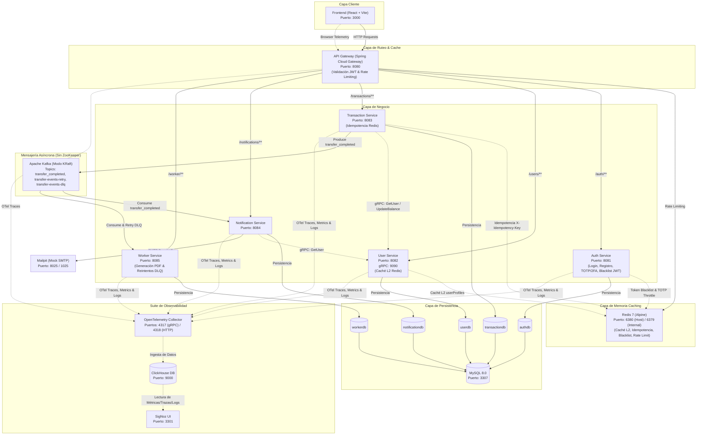

# FinTech Wallet

Sistema de billetera virtual desarrollado con arquitectura de microservicios. Permite realizar transferencias, solicitar dinero, gestionar contactos favoritos, pagos por QR, generación de extractos en PDF y más.

## Arquitectura




## Stack Tecnologico

| Capa | Tecnologias |
|------|-------------|
| **Frontend** | React 19, Vite 8, Tailwind CSS v4, React Router v6, Axios, Recharts, OpenPDF/jsPDF, xlsx, qrcode.react, html5-qrcode |
| **Backend** | Spring Boot 3, Spring Data JPA, Spring Cloud Gateway, Spring Kafka, Spring Data Redis, Spring Mail, JJWT, Lombok |
| **Base de Datos** | MySQL 8.0 (`authdb`, `userdb`, `transactiondb`, `notificationdb`, `workerdb`) |
| **Caché y Rendimiento** | Redis 7 (Caché L2, Idempotencia, Blacklist JWT, Rate Limiting) |
| **Mensajería** | Apache Kafka en **modo KRaft** (Reintentos automáticos + Dead Letter Queue - DLQ) |
| **Email** | Gmail SMTP (producción) / Mailpit (desarrollo) |
| **Observabilidad** | OpenTelemetry Collector, SigNoz APM, ClickHouse, Docker Stats, Kafka Metrics |
| **Contenedores** | Docker + Docker Compose |

## Funcionalidades

### Fáciles
- Depositar y retirar dinero con saldo inicial de bienvenida
- Buscar usuarios por nombre o email
- Modo oscuro / claro
- Diseño responsive (mobile + desktop)

### Intermedias
- Filtros por fecha en historial de transacciones
- Exportar historial a PDF y Excel (Servicio dedicado OpenPDF en `worker-service`)
- Gráficos de transacciones en el Dashboard (Recharts)
- Notificaciones en tiempo real (polling + persistencia)
- Cambio de contraseña
- Contactos favoritos (localStorage)

### Avanzadas
- Transferencias por código QR (generar y escanear)
- Solicitar dinero a otros usuarios (crear/aceptar/rechazar)
- Límite diario de transferencias configurable
- Panel de administración (rol ADMIN)
- Verificación de email (Gmail SMTP real / Mailpit local)
- Autenticación de dos factores (2FA/TOTP con Google Authenticator)
- Múltiples monedas (ARS, USD, EUR) con tasas de cambio
- **Idempotencia de Transferencias** (`X-Idempotency-Key` en Redis)
- **Reintentos y Cola Muerta (DLQ)** con Apache Kafka KRaft

## Microservicios

### Auth Service (Puerto 8081)
Maneja autenticación, registro, JWT, verificación de email, 2FA y lista negra de tokens revocados en Redis.

| Método | Endpoint | Descripción |
|--------|----------|-------------|
| POST | `/auth/register` | Registrar usuario |
| POST | `/auth/login` | Iniciar sesión |
| POST | `/auth/verify-totp` | Verificar código 2FA |
| GET | `/auth/verify-email` | Verificar email por token |
| GET | `/auth/me` | Estado actual del usuario |
| POST | `/auth/resend-verification` | Reenviar email de verificación |
| POST | `/auth/setup-totp` | Configurar 2FA |
| POST | `/auth/enable-totp` | Activar 2FA |
| POST | `/auth/disable-totp` | Desactivar 2FA |
| PUT | `/auth/change-password` | Cambiar contraseña |
| PUT | `/auth/promote-admin` | Promover a administrador |

### User Service (Puerto 8082)
Gestiona perfiles de usuario, balances y configuraciones con almacenamiento en caché L2 de Redis (`userProfiles`).

| Método | Endpoint | Descripción |
|--------|----------|-------------|
| POST | `/users` | Crear usuario |
| GET | `/users` | Listar todos los usuarios |
| GET | `/users/{id}` | Obtener usuario por ID (Cacheable) |
| PUT | `/users/{id}/balance` | Actualizar saldo (Evicts cache) |
| PUT | `/users/{id}/settings` | Cambiar moneda y límite diario |

### Transaction Service (Puerto 8083)
Procesa transferencias, solicitudes de dinero, valida límites diarios y garantiza idempotencia con Redis.

| Método | Endpoint | Descripción |
|--------|----------|-------------|
| POST | `/transactions/transfer` | Realizar transferencia (Idempotente) |
| GET | `/transactions/user/{userId}` | Historial por usuario |
| GET | `/transactions/all` | Todas las transacciones (admin) |
| POST | `/transactions/request` | Crear solicitud de dinero |
| GET | `/transactions/requests/{userId}` | Solicitudes por usuario |
| PUT | `/transactions/requests/{id}/accept` | Aceptar solicitud |
| PUT | `/transactions/requests/{id}/reject` | Rechazar solicitud |

### Notification Service (Puerto 8084)
Consume eventos de Kafka cuando se completa una transferencia y gestiona notificaciones por email.

### Worker Service (Puerto 8085)
Microservicio para la generación de extractos bancarios en PDF (OpenPDF) y el procesamiento desacoplado de reintentos y mensajes en la cola muerta (DLQ) de Kafka.

| Método | Endpoint | Descripción |
|--------|----------|-------------|
| POST | `/worker/statements/generate` | Generar extracto en PDF |
| GET | `/worker/statements/job/{jobId}` | Estado del trabajo de extracto |
| GET | `/worker/audit/logs` | Logs de auditoría |

### API Gateway (Puerto 8080)
Punto de entrada único. Valida JWT, aplica Rate Limiting distribuido con Redis y rutea las peticiones.

## Requisitos Previos

- [Docker Desktop](https://www.docker.com/products/docker-desktop/) instalado y corriendo
- Puertos disponibles: 3000, 3307, 6380, 8080-8085, 9092, 8025, 1025

## Instalación y Ejecución

### 1. Clonar el repositorio

```bash
git clone https://github.com/jara96/fintech-wallet.git
cd fintech-wallet
```

### 2. Configurar el archivo de entorno (.env)

Crea una copia del archivo de ejemplo `.env.example` y nómbralo `.env`:

```bash
cp .env.example .env
```

Abre el archivo `.env` y rellena las siguientes variables:

*   **Configuración de Base de Datos**: Configura el usuario y contraseña para MySQL (por defecto `root` y `12345`).
*   **Gmail (opcional)**: Para enviar correos de verificación y notificaciones reales. Si no se configura, los correos serán capturados por Mailpit en desarrollo.
*   **SigNoz API Key**: Necesaria si deseas interactuar con la API de SigNoz para automatizar la creación de dashboards y alertas.

### 3. Levantar la aplicación y la infraestructura

Inicia todos los servicios (Base de datos, Redis, Kafka KRaft, Microservicios Java, Frontend React y la suite de Observabilidad de SigNoz):

```bash
docker compose up -d
```

Espera unos minutos a que todos los servicios arranquen y compilen. Puedes verificar el estado con:

```bash
docker compose ps
```

### 4. Acceder a los servicios

Una vez que todo esté corriendo, puedes acceder a las siguientes interfaces:

| Servicio | URL |
|----------|-----|
| **Aplicación Web (Frontend)** | [http://localhost:3000](http://localhost:3000) |
| **SigNoz (Consola de Observabilidad)** | [http://localhost:3301](http://localhost:3301) |
| **Mailpit (Correos de prueba locales)** | [http://localhost:8025](http://localhost:8025) |
| **API Gateway** | [http://localhost:8080](http://localhost:8080) |

### 5. Crear tu primer usuario

1. Ve a [http://localhost:3000/register](http://localhost:3000/register).
2. Regístrate con nombre, email y contraseña.
3. Si no configuraste credenciales de Gmail reales, ve a Mailpit ([http://localhost:8025](http://localhost:8025)) para abrir el correo de verificación recibido y activar tu cuenta haciendo clic en el enlace.
4. ¡Listo! Ya puedes iniciar sesión y usar la billetera virtual.

## Base de Datos

El sistema usa 5 bases de datos MySQL independientes:

| Base | Servicio | Tablas |
|------|----------|--------|
| `authdb` | Auth Service | `users` (credenciales, 2FA, verificación) |
| `userdb` | User Service | `user_profiles` (nombre, balance, moneda, límite) |
| `transactiondb` | Transaction Service | `transactions`, `money_requests` |
| `notificationdb` | Notification Service | `notifications` (historial de notificaciones) |
| `workerdb` | Worker Service | `statement_jobs`, `audit_logs` |

Conexión a MySQL:
```
Host: localhost
Puerto: 3307
Usuario: ${DB_USERNAME} (por defecto: root)
Contraseña: ${DB_PASSWORD} (por defecto: 12345)
```

## Estructura del Proyecto

```
fintech-wallet/
├── backend/                  # Microservicios Spring Boot
│   ├── api-gateway/          # Gateway + Filtro JWT + Rate Limiting
│   ├── auth-service/         # Autenticación, 2FA, email, JWT Blacklist
│   ├── user-service/         # Perfiles y balances (gRPC + Caché Redis)
│   ├── transaction-service/  # Transferencias y solicitudes (gRPC + Idempotencia Redis)
│   ├── notification-service/ # Consumidor Kafka + notificaciones email (gRPC Client)
│   └── worker-service/       # Extractos PDF OpenPDF + Reintentos y DLQ Kafka
├── frontend/                 # Aplicación React + Vite
├── infra/                    # Archivos de infraestructura
│   ├── mysql/                # Script de inicialización de MySQL
│   ├── clickhouse/           # Configuración ClickHouse para SigNoz
│   └── otel/                 # Configuraciones del colector y migrador de OTel
├── observability/            # Suite de observabilidad
│   ├── dashboards/           # Plantillas de dashboards para SigNoz
│   └── scripts/              # Scripts auxiliares para dashboards y métricas
├── docs/                     # Reportes y planes de migración
├── docker-compose.yml        # Stack completo de contenedores
├── .env.example              # Ejemplo de variables de entorno
├── ARQUITECTURA.md           # Documentación de arquitectura
└── README.md
```

## Puertos

| Puerto | Servicio |
|--------|----------|
| 3000 | Frontend (React) |
| 8080 | API Gateway |
| 8081 | Auth Service |
| 8082 | User Service |
| 8083 | Transaction Service |
| 8084 | Notification Service |
| 8085 | Worker Service |
| 3307 | MySQL |
| 6380 | Redis |
| 9092 | Apache Kafka (Modo KRaft) |
| 8025 | Mailpit (Web UI) |
| 1025 | Mailpit (SMTP) |


## Comandos Utiles

```bash
# Levantar todo
docker compose up -d

# Ver logs de un servicio
docker compose logs -f auth-service

# Detener todo
docker compose down

# Reconstruir un servicio especifico
docker compose up -d --build auth-service

# Ver estado de los contenedores
docker compose ps
```

## Tecnologias Detalladas

### Frontend
- **React 19** - UI library
- **Vite 8** - Build tool
- **Tailwind CSS v4** - Estilos con dark mode
- **React Router v6** - Navegacion SPA
- **Axios** - HTTP client con interceptors JWT
- **Recharts** - Graficos del dashboard
- **jsPDF + jspdf-autotable** - Exportar a PDF
- **xlsx + file-saver** - Exportar a Excel
- **qrcode.react** - Generar codigos QR
- **html5-qrcode** - Escanear QR con camara
- **react-hot-toast** - Notificaciones toast

### Backend
- **Spring Boot 3** - Framework principal
- **Spring Data JPA** - ORM con Hibernate
- **Spring Cloud Gateway** - API Gateway
- **Spring Kafka** - Mensajeria asincrona
- **Spring Mail** - Envio de emails
- **JJWT** - JSON Web Tokens
- **Lombok** - Reduccion de boilerplate
- **Commons Codec** - Base32 para TOTP/2FA
- **BCrypt** - Hash de contrasenas
- **MySQL Connector** - Driver de base de datos
