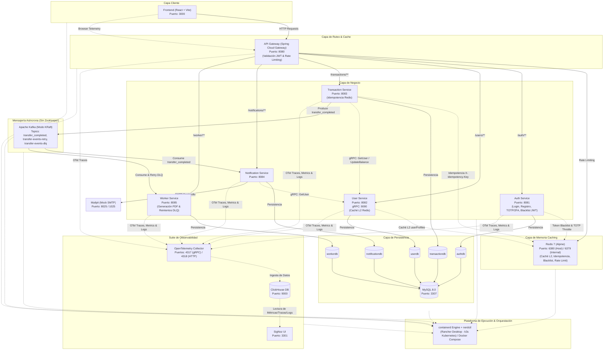

# FinTech Wallet

Sistema de billetera virtual desarrollado con arquitectura de microservicios. Permite realizar transferencias, solicitar dinero, gestionar contactos favoritos, pagos por QR, generación de extractos en PDF y más.

## Arquitectura


```mermaid
graph TD
    subgraph Client ["Capa Cliente"]
        Frontend["Frontend (React + Vite)<br>Puerto: 3000"]
    end

    subgraph Gateway ["Capa de Ruteo & Cache"]
        ApiGateway["API Gateway (Spring Cloud Gateway)<br>Puerto: 8080<br>(Validación JWT & Rate Limiting)"]
    end

    subgraph Microservices ["Capa de Negocio"]
        AuthService["Auth Service<br>Puerto: 8081<br>(Login, Registro, TOTP/2FA, Blacklist JWT)"]
        UserService["User Service<br>Puerto: 8082<br>gRPC: 9090<br>(Caché L2 Redis)"]
        TransactionService["Transaction Service<br>Puerto: 8083<br>(Idempotencia Redis)"]
        NotificationService["Notification Service<br>Puerto: 8084"]
        WorkerService["Worker Service<br>Puerto: 8085<br>(Generación PDF & Reintentos DLQ)"]
    end

    subgraph CacheLayer ["Capa de Memoria Caching"]
        Redis["Redis 7 (Alpine)<br>Puerto: 6380 (Host) / 6379 (Internal)<br>(Caché L2, Idempotencia, Blacklist, Rate Limit)"]
    end

    subgraph Messaging ["Mensajería Asíncrona (Sin ZooKeeper)"]
        Kafka["Apache Kafka (Modo KRaft)<br>Topics: transfer_completed, transfer-events-retry, transfer-events-dlq"]
    end

    subgraph Database ["Capa de Persistencia"]
        MySQL[("MySQL 8.0<br>Puerto: 3307")]
        AuthDB[("authdb")]
        UserDB[("userdb")]
        TransactionDB[("transactiondb")]
        NotificationDB[("notificationdb")]
        WorkerDB[("workerdb")]
    end

    subgraph Observability ["Suite de Observabilidad"]
        OTelCollector["OpenTelemetry Collector<br>Puertos: 4317 (gRPC) / 4318 (HTTP)"]
        ClickHouse[("ClickHouse DB<br>Puerto: 9000")]
        SigNoz["SigNoz UI<br>Puerto: 3301"]
    end

    subgraph Runtime ["Plataforma de Ejecución & Orquestación"]
        Engine["containerd Engine + nerdctl<br>(Rancher Desktop - k3s Kubernetes) / Docker Compose"]
    end

    %% Infrastructure Platform
    Microservices & Gateway & Database & CacheLayer & Messaging & Observability & Client -.-> Engine

    %% Client and Gateway routing
    Frontend -->|HTTP Requests| ApiGateway
    ApiGateway -->|Rate Limiting| Redis
    ApiGateway -->|/auth/**| AuthService
    ApiGateway -->|/users/**| UserService
    ApiGateway -->|/transactions/**| TransactionService
    ApiGateway -->|/notifications/**| NotificationService
    ApiGateway -->|/worker/**| WorkerService
    %% Redis Cache Layer
    UserService -.->|Caché L2 userProfiles| Redis
    TransactionService -.->|Idempotencia X-Idempotency-Key| Redis
    AuthService -.->|Token Blacklist & TOTP Throttle| Redis

    %% Databases
    AuthService -->|Persistencia| AuthDB
    UserService -->|Persistencia| UserDB
    TransactionService -->|Persistencia| TransactionDB
    NotificationService -->|Persistencia| NotificationDB
    WorkerService -->|Persistencia| WorkerDB
    AuthDB & UserDB & TransactionDB & NotificationDB & WorkerDB --> MySQL

    %% Inter-service communication (gRPC)
    TransactionService -.->|gRPC: GetUser / UpdateBalance| UserService
    NotificationService -.->|gRPC: GetUser| UserService

    %% Async messaging KRaft
    TransactionService -->|Produce transfer_completed| Kafka
    Kafka -->|Consume transfer_completed| NotificationService
    Kafka -->|Consume & Retry DLQ| WorkerService

    %% Email Delivery
    NotificationService -->|SMTP Desarrollo| Mailpit["Mailpit (Mock SMTP)<br>Puerto: 8025 / 1025"]

    %% Telemetry Collection (OTel)
    Frontend -.->|Browser Telemetry| ApiGateway
    ApiGateway -.->|OTel Traces| OTelCollector
    AuthService & UserService & TransactionService & NotificationService & WorkerService -.->|OTel Traces, Metrics & Logs| OTelCollector
    OTelCollector -.->|Ingesta de Datos| ClickHouse
    ClickHouse -.->|Lectura de Métricas/Trazas/Logs| SigNoz
```


## Stack Tecnologico

| Capa | Tecnologias |
|------|-------------|
| **Frontend** | React 19, Vite 8, Tailwind CSS v4, React Router v6, Axios, Recharts, OpenPDF/jsPDF, xlsx, qrcode.react, html5-qrcode |
| **Backend** | **NestJS 11 + TypeScript + Prisma ORM** (`auth-service`, `user-service`, `transaction-service`), **Spring Boot 3 + Spring Data JPA** (`notification-service`, `worker-service`) |
| **Base de Datos** | MySQL 8.0 (`authdb`, `userdb`, `transactiondb`, `notificationdb`, `workerdb`) |
| **Caché y Rendimiento** | Redis 7 (Caché L2, Idempotencia, Blacklist JWT, Rate Limiting) |
| **Mensajería** | Apache Kafka en **modo KRaft** (Reintentos automáticos + Dead Letter Queue - DLQ) |
| **Email** | Gmail SMTP (producción) / Mailpit (desarrollo) |
| **Observabilidad** | OpenTelemetry Collector, SigNoz APM, ClickHouse, Kafka Metrics |
| **Contenedores & Orquestación** | Rancher Desktop + containerd + `nerdctl` + Kubernetes (k3s) / Docker Compose |

## Funcionalidades

### Fáciles
- Depositar y retirar dinero con saldo inicial de bienvenida
- Buscar usuarios por nombre o email
- Modo oscuro / claro
- Diseño responsive (mobile + desktop)

### Intermedias
- Filtros por fecha en historial de transacciones
- Exportar historial a PDF y Excel (Servicio dedicado OpenPDF en `worker-service`)
- Gráficos de transacciones en el Dashboard (Recharts)
- Notificaciones en tiempo real (polling + persistencia)
- Cambio de contraseña
- Contactos favoritos (localStorage)

### Avanzadas
- Transferencias por código QR (generar y escanear)
- Solicitar dinero a otros usuarios (crear/aceptar/rechazar)
- Límite diario de transferencias configurable
- Panel de administración (rol ADMIN)
- Verificación de email (Gmail SMTP real / Mailpit local)
- Autenticación de dos factores (2FA/TOTP con Google Authenticator)
- Múltiples monedas (ARS, USD, EUR) con tasas de cambio
- **Idempotencia de Transferencias** (`X-Idempotency-Key` en Redis)
- **Reintentos y Cola Muerta (DLQ)** con Apache Kafka KRaft

## Microservicios

### Auth Service (NestJS 11 - Puerto 3001 / K8s 8081)
Maneja autenticación, registro de usuarios, JWT (bcrypt), verificación de email (Nodemailer/Mailpit), 2FA/TOTP y lista negra de tokens revocados en Redis.
- **Swagger UI**: [http://localhost/auth/docs/](http://localhost/auth/docs/)

| Método | Endpoint | Descripción |
|--------|----------|-------------|
| POST | `/auth/register` | Registrar usuario y crear perfil financiero |
| POST | `/auth/login` | Iniciar sesión (Retorna JWT) |
| POST | `/auth/verify-totp` | Verificar código 2FA / TOTP |
| GET | `/auth/verify-email` | Verificar email por token |
| GET | `/auth/me` | Estado actual del usuario autenticado |
| POST | `/auth/resend-verification` | Reenviar email de verificación |
| POST | `/auth/setup-totp` | Configurar 2FA (Genera QR / Secreto) |
| POST | `/auth/enable-totp` | Activar 2FA |
| POST | `/auth/disable-totp` | Desactivar 2FA |
| PUT | `/auth/change-password` | Cambiar contraseña |

### User Service (NestJS 11 - REST: Puerto 3002 / K8s 8082 - gRPC: Puerto 50051 / K8s 9090)
Gestiona perfiles de usuario, saldos, verificación KYC y expone un servidor gRPC de alto rendimiento (`user.proto`).
- **Swagger UI**: [http://localhost/users/docs/](http://localhost/users/docs/)

| Método | Endpoint / RPC | Descripción |
|--------|----------------|-------------|
| POST | `/users` | Crear perfil de usuario (Rest) |
| GET | `/users/profile/{id}` | Obtener perfil por ID (Rest) |
| PUT | `/users/profile/{id}/balance` | Actualizar saldo (Rest) |
| PUT | `/users/profile/{id}/kyc` | Actualizar estado KYC (Rest) |
| RPC | `UserService.GetUserProfile` | Consulta gRPC de perfil por ID (gRPC :50051) |

### Transaction Service (Puerto 8083)
Procesa transferencias, solicitudes de dinero, valida límites diarios y garantiza idempotencia con Redis.

| Método | Endpoint | Descripción |
|--------|----------|-------------|
| POST | `/transactions/transfer` | Realizar transferencia (Idempotente) |
| GET | `/transactions/user/{userId}` | Historial por usuario |
| GET | `/transactions/all` | Todas las transacciones (admin) |
| POST | `/transactions/request` | Crear solicitud de dinero |
| GET | `/transactions/requests/{userId}` | Solicitudes por usuario |
| PUT | `/transactions/requests/{id}/accept` | Aceptar solicitud |
| PUT | `/transactions/requests/{id}/reject` | Rechazar solicitud |

### Notification Service (Puerto 8084)
Consume eventos de Kafka cuando se completa una transferencia y gestiona notificaciones por email.

### Worker Service (Puerto 8085)
Microservicio para la generación de extractos bancarios en PDF (OpenPDF) y el procesamiento desacoplado de reintentos y mensajes en la cola muerta (DLQ) de Kafka.

| Método | Endpoint | Descripción |
|--------|----------|-------------|
| POST | `/worker/statements/generate` | Generar extracto en PDF |
| GET | `/worker/statements/job/{jobId}` | Estado del trabajo de extracto |
| GET | `/worker/audit/logs` | Logs de auditoría |

### API Gateway (Puerto 8080)
Punto de entrada único. Valida JWT, aplica Rate Limiting distribuido con Redis y rutea las peticiones.

## Requisitos Previos

- [Rancher Desktop](https://rancherdesktop.io/) con containerd y Kubernetes habilitados
- `nerdctl` y `kubectl` instalados (incluidos con Rancher Desktop)
- Puertos disponibles: 80, 3000, 3307, 6380, 8080-8085, 9092, 8025, 30301

## Instalación y Ejecución con Kubernetes (Rancher Desktop) - Recomendado

Para la guía detallada de despliegue en Kubernetes con Rancher Desktop, consulta [README_RANCHER.md](README_RANCHER.md).

### Despliegue en 1 Solo Paso:

- **En Windows (PowerShell):**
  ```powershell
  .\deploy-rancher.ps1
  ```
- **En Linux / macOS / Git Bash:**
  ```bash
  chmod +x deploy-rancher.sh
  ./deploy-rancher.sh
  ```

### Verificar Estado del Clúster:
```bash
kubectl get pods -n fintech
```

## Instalación y Ejecución con Docker Compose

Espera unos minutos a que todos los servicios arranquen y compilen. Puedes verificar el estado con:

```bash
docker compose ps
```

### 4. Acceder a los servicios

Una vez que todo esté corriendo, puedes acceder a las siguientes interfaces:

| Servicio | URL |
|----------|-----|
| **Aplicación Web (Frontend)** | [http://localhost:3000](http://localhost:3000) |
| **Auth Service Swagger UI** | [http://localhost/auth/docs/](http://localhost/auth/docs/) |
| **User Service Swagger UI** | [http://localhost/users/docs/](http://localhost/users/docs/) |
| **SigNoz (Consola de Observabilidad)** | [http://localhost:3301](http://localhost:3301) |
| **Mailpit (Correos de prueba locales)** | [http://localhost:8025](http://localhost:8025) |
| **API Gateway** | [http://localhost:8080](http://localhost:8080) |

### 5. Crear tu primer usuario

1. Ve a [http://localhost:3000/register](http://localhost:3000/register).
2. Regístrate con nombre, email y contraseña.
3. Si no configuraste credenciales de Gmail reales, ve a Mailpit ([http://localhost:8025](http://localhost:8025)) para abrir el correo de verificación recibido y activar tu cuenta haciendo clic en el enlace.
4. ¡Listo! Ya puedes iniciar sesión y usar la billetera virtual.

## Base de Datos

El sistema usa 5 bases de datos MySQL independientes:

| Base | Servicio | Tablas |
|------|----------|--------|
| `authdb` | Auth Service | `users` (credenciales, 2FA, verificación) |
| `userdb` | User Service | `user_profiles` (nombre, balance, moneda, límite) |
| `transactiondb` | Transaction Service | `transactions`, `money_requests` |
| `notificationdb` | Notification Service | `notifications` (historial de notificaciones) |
| `workerdb` | Worker Service | `statement_jobs`, `audit_logs` |

Conexión a MySQL:
```
Host: localhost
Puerto: 3307
Usuario: ${DB_USERNAME} (por defecto: root)
Contraseña: ${DB_PASSWORD} (por defecto: 12345)
```

## Estructura del Proyecto

```text
fintech-wallet/
├── backend-nestjs/           # Microservicios en NestJS 11 + TypeScript (Arquitectura Hexagonal)
│   ├── auth-service/         # Autenticación, JWT, 2FA/TOTP, Mailpit, Prisma ORM, OpenTelemetry
│   └── user-service/         # Perfiles de usuario, KYC, Saldos, Servidor gRPC (:50051), Prisma ORM
├── backend/                  # Microservicios Java Spring Boot 3
│   ├── api-gateway/          # Spring Cloud Gateway + Filtro JWT + Rate Limiting Redis
│   ├── transaction-service/  # Transferencias y solicitudes (Cliente gRPC + Idempotencia Redis)
│   ├── notification-service/ # Consumidor Kafka + notificaciones por email
│   └── worker-service/       # Generación de extractos PDF (OpenPDF) + DLQ Kafka
├── frontend/                 # Aplicación Web Frontend (React 19 + Vite 8 + Tailwind CSS v4)
├── k8s/                      # Manifiestos de Kubernetes (Deployments, Services, Ingress Traefik, NetworkPolicy)
├── scripts/                  # Scripts de automatización y pruebas de integración (PowerShell)
├── infra/                    # Configuraciones de MySQL, ClickHouse y OpenTelemetry Collector
├── observability/            # Plantillas de dashboards y vistas guardadas para SigNoz APM
├── docker-compose.yml        # Orquestación para entorno de desarrollo local con Docker
├── README_RANCHER.md         # Guía de despliegue detallada en Rancher Desktop (k3s Kubernetes)
└── README.md                 # Documentación principal del sistema
```

## Puertos

| Puerto | Servicio |
|--------|----------|
| 3000 | Frontend (React) |
| 8080 | API Gateway |
| 8081 | Auth Service |
| 8082 | User Service |
| 8083 | Transaction Service |
| 8084 | Notification Service |
| 8085 | Worker Service |
| 3307 | MySQL |
| 6380 | Redis |
| 9092 | Apache Kafka (Modo KRaft) |
| 8025 | Mailpit (Web UI) |
| 1025 | Mailpit (SMTP) |


## 🚀 Despliegue y Comandos Útiles

### 📦 Kubernetes (Rancher Desktop) - Entorno Recomendado
Para desplegar la aplicación completa en Kubernetes con Rancher Desktop y containerd:

```powershell
# En Windows (PowerShell)
.\deploy-rancher.ps1

# En Linux / macOS / Git Bash
chmod +x deploy-rancher.sh
./deploy-rancher.sh
```

Para ver la guía completa de despliegue manual, ruteo por Ingress y la **Guía Completa de Comandos Kubernetes (Cheat Sheet)**, consulta [`README_RANCHER.md`](./README_RANCHER.md).

```bash
# Ver estado de los Pods
kubectl get pods -n fintech

# Ver logs en tiempo real
kubectl logs -n fintech -l app=transaction-service --tail=50 -f

# Reiniciar un microservicio
kubectl rollout restart deployment transaction-service -n fintech
```

---

### 🐳 Docker Compose (Desarrollo Local Directo)

```bash
# Levantar el entorno local con Docker Compose
docker compose up -d

# Ver logs de un servicio
docker compose logs -f auth-service

# Detener todos los contenedores
docker compose down
```

## Tecnologias Detalladas

### Frontend
- **React 19** - UI library
- **Vite 8** - Build tool
- **Tailwind CSS v4** - Estilos con dark mode
- **React Router v6** - Navegacion SPA
- **Axios** - HTTP client con interceptors JWT
- **Recharts** - Graficos del dashboard
- **jsPDF + jspdf-autotable** - Exportar a PDF
- **xlsx + file-saver** - Exportar a Excel
- **qrcode.react** - Generar codigos QR
- **html5-qrcode** - Escanear QR con camara
- **react-hot-toast** - Notificaciones toast

### Backend
- **Spring Boot 3** - Framework principal
- **Spring Data JPA** - ORM con Hibernate
- **Spring Cloud Gateway** - API Gateway
- **Spring Kafka** - Mensajeria asincrona
- **Spring Mail** - Envio de emails
- **JJWT** - JSON Web Tokens
- **Lombok** - Reduccion de boilerplate
- **Commons Codec** - Base32 para TOTP/2FA
- **BCrypt** - Hash de contrasenas
- **MySQL Connector** - Driver de base de datos
