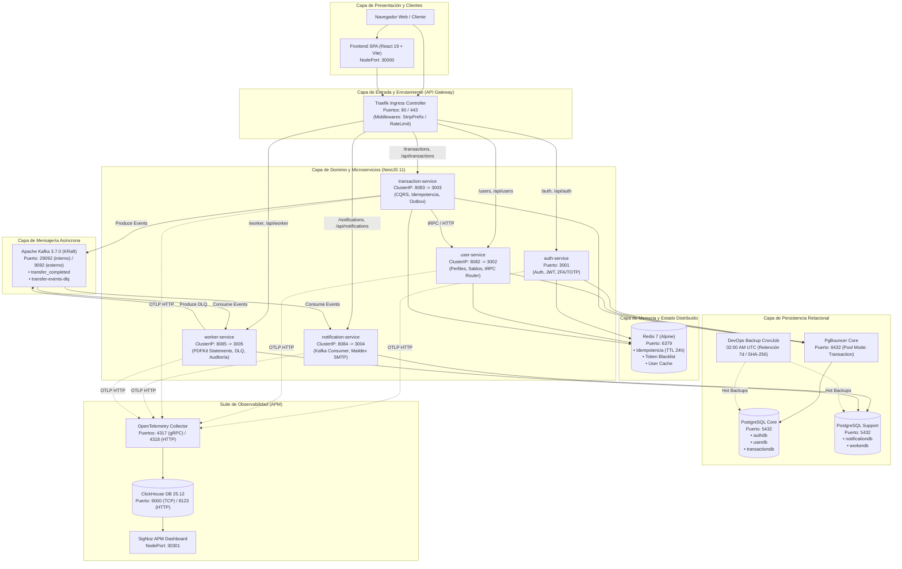
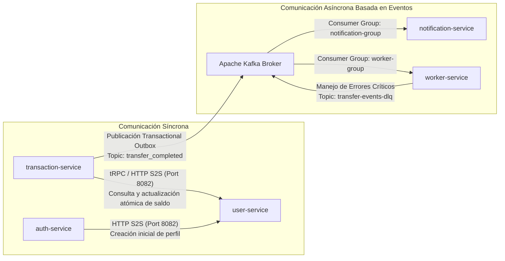

# FinTech Wallet 💳

Plataforma empresarial de billetera digital distribuida, diseñada bajo **Arquitectura Hexagonal (Ports & Adapters)**, patrones de **Domain-Driven Design (DDD)** y desplegada sobre **Kubernetes (K3s / Rancher Desktop)** con orquestación mediante manifiestos nativos y **Helm**.

El backend está compuesto por **5 microservicios independientes en NestJS y TypeScript**, persistencia segregada en **PostgreSQL 16** con connection pooling vía **PgBouncer**, caché y bloqueos distribuidos en **Redis 7**, mensajería asíncrona de eventos con **Apache Kafka (KRaft)**, enrutamiento inteligente mediante **Traefik Ingress Controller** y observabilidad integral con **OpenTelemetry, ClickHouse y SigNoz APM**.

---

## 📑 Tabla de Contenidos

1. [Características Principales](#-características-principales)
2. [Stack Tecnológico](#-stack-tecnológico)
3. [Arquitectura del Sistema](#-arquitectura-del-sistema)
   - [Diagrama de Arquitectura General](#diagrama-de-arquitectura-general)
   - [Diagrama de Comunicación entre Microservicios](#diagrama-de-comunicación-entre-microservicios)
   - [Diagrama de Flujo Transaccional de una Transferencia](#diagrama-de-flujo-transaccional-de-una-transferencia)
4. [Estructura del Repositorio](#-estructura-del-repositorio)
5. [Guía de Inicio Rápido (Quick Start)](#-guía-de-inicio-rápido-quick-start)
6. [Puertos y Endpoints del Ecosistema](#-puertos-y-endpoints-del-ecosistema)
7. [Documentación Técnica Especializada](#-documentación-técnica-especializada)
8. [Matriz de Dependencias por Servicio](#-matriz-de-dependencias-por-servicio)

---

## ✨ Características Principales

* 🔐 **Autenticación y Seguridad**: Registro de usuarios, login con JSON Web Tokens (JWT HMAC SHA-256), verificación de cuentas por correo electrónico, segundo factor de autenticación (2FA / TOTP) con generación de códigos QR y revocación de sesiones mediante lista negra en Redis.
* 👤 **Gestión de Perfiles y Cuentas**: Administración de cuentas multi-moneda (ARS, USD, EUR), control de límites diarios de operación y consultas de perfil de alta velocidad vía comunicación síncrona tipada con tRPC.
* 💸 **Transferencias y Transacciones**: Ejecución de transferencias entre cuentas con garantía de idempotencia distribuida (encabezado `X-Idempotency-Key` y bloqueos en Redis), arquitectura CQRS (Command & Query Responsibility Segregation) y manejo de transacciones distribuidas con compensación atómica de saldos.
* 📨 **Solicitudes de Dinero (Money Requests)**: Creación de solicitudes de cobro entre usuarios con estados de aprobación y rechazo, ejecutando transferencias automáticas tras la aceptación.
* 📬 **Notificaciones Asíncronas**: Consumo de eventos Kafka en segundo plano, persistencia del historial de alertas para los usuarios y despacho de correos transaccionales mediante SMTP (Maildev).
* 📄 **Generación Asíncrona de Documentos**: Solicitud y procesamiento en background de extractos bancarios en PDF con PDFKit, almacenamiento local y descarga mediante streaming HTTP.
* 🛡️ **Tolerancia a Fallos y DLQ**: Manejo automático de errores con reintentos exponenciales en consumidores Kafka y enrutamiento a Dead Letter Queue (`transfer-events-dlq`) con registro en bitácora de auditoría.
* 📊 **Observabilidad Integral (APM)**: Auto-instrumentación con OpenTelemetry SDK, exportación OTLP HTTP hacia OpenTelemetry Collector, almacenamiento columnar en ClickHouse y visualización unificada de trazas distribuidas, métricas de infraestructura y logs correlacionados en SigNoz.

---

## 🛠️ Stack Tecnológico

| Componente / Tecnología | Versión | Propósito en el Ecosistema |
| :--- | :--- | :--- |
| **Node.js** | `20.x` / `22.x` | Runtime base de ejecución para microservicios y herramientas de build |
| **NestJS** | `11.0.11` | Framework backend modular para los 5 microservicios |
| **TypeScript** | `5.7.3` | Lenguaje tipado estricto para todo el código de backend |
| **Prisma ORM** | `6.4.1` | Mapeo objeto-relacional, migraciones y cliente tipado de bases de datos |
| **PostgreSQL** | `16-alpine` | Persistencia relacional ACID (`postgres-core` y `postgres-support`) |
| **PgBouncer** | `1.22+` (`latest`) | Connection pooler en modo `transaction` para alta concurrencia |
| **Redis** | `7-alpine` | Caché en memoria, tokens revocados y candados de idempotencia |
| **Apache Kafka** | `3.7.0` | Broker de mensajería distribuida operando en modo KRaft (sin ZooKeeper) |
| **Traefik** | `2.x` / `3.x` (K3s) | Ingress Controller, enrutamiento API Gateway y control de tasa (RateLimit) |
| **React** | `19.0.0` | Biblioteca de interfaz de usuario para la Single Page Application (SPA) |
| **Vite** | `6.1.0` | Herramienta de empaquetado y servidor de desarrollo frontend |
| **OpenTelemetry SDK** | `0.57.x` / `1.30.x` | Instrumentación de trazas distribuidas, métricas y logs estructurados |
| **SigNoz OTel Collector**| `v0.144.7` | Agente receptor, procesador y exportador de pipelines de telemetría |
| **ClickHouse** | `25.12.5` | Motor de base de datos columnar analítico para almacenamiento APM |
| **SigNoz APM UI** | `v0.136.1` | Panel de visualización de trazas, dashboards y métricas de rendimiento |
| **Maildev** | `2.1.0` | Servidor SMTP y visor web de correos electrónicos transaccionales |
| **Kubernetes (K3s)** | `v1.28+` | Orquestador de contenedores para despliegue local y en producción |
| **Helm** | `3.x` | Gestor de paquetes para despliegue parametrizado en Kubernetes |

---

## 🏛️ Arquitectura del Sistema

### Diagrama de Arquitectura General


```mermaid
graph TD
    subgraph ClientLayer ["Capa de Presentación y Clientes"]
        Browser["Navegador Web / Cliente"]
        Frontend["Frontend SPA (React 19 + Vite)<br>NodePort: 30000"]
    end

    subgraph GatewayLayer ["Capa de Entrada y Enrutamiento (API Gateway)"]
        Traefik["Traefik Ingress Controller<br>Puertos: 80 / 443<br>(Middlewares: StripPrefix / RateLimit)"]
    end

    subgraph MicroservicesLayer ["Capa de Dominio y Microservicios (NestJS 11)"]
        AuthSvc["auth-service<br>Puerto: 3001<br>(Auth, JWT, 2FA/TOTP)"]
        UserSvc["user-service<br>ClusterIP: 8082 -> 3002<br>(Perfiles, Saldos, tRPC Router)"]
        TxSvc["transaction-service<br>ClusterIP: 8083 -> 3003<br>(CQRS, Idempotencia, Outbox)"]
        NotifSvc["notification-service<br>ClusterIP: 8084 -> 3004<br>(Kafka Consumer, Maildev SMTP)"]
        WorkerSvc["worker-service<br>ClusterIP: 8085 -> 3005<br>(PDFKit Statements, DLQ, Auditoría)"]
    end

    subgraph CacheAndState ["Capa de Memoria y Estado Distribuido"]
        RedisNode[("Redis 7 (Alpine)<br>Puerto: 6379<br>• Idempotencia (TTL 24h)<br>• Token Blacklist<br>• User Cache")]
    end

    subgraph EventStreaming ["Capa de Mensajería Asíncrona"]
        KafkaBroker["Apache Kafka 3.7.0 (KRaft)<br>Puerto: 29092 (interno) / 9092 (externo)<br>• transfer_completed<br>• transfer-events-dlq"]
    end

    subgraph PersistenceLayer ["Capa de Persistencia Relacional"]
        PgBouncerNode["PgBouncer Core<br>Puerto: 6432 (Pool Mode: Transaction)"]
        PostgresCore[("PostgreSQL Core<br>Puerto: 5432<br>• authdb<br>• userdb<br>• transactiondb")]
        PostgresSupport[("PostgreSQL Support<br>Puerto: 5432<br>• notificationdb<br>• workerdb")]
        BackupJob["DevOps Backup CronJob<br>02:00 AM UTC (Retención 7d / SHA-256)"]
    end

    subgraph ObservabilityLayer ["Suite de Observabilidad (APM)"]
        OTelCol["OpenTelemetry Collector<br>Puertos: 4317 (gRPC) / 4318 (HTTP)"]
        ClickHouseDB[("ClickHouse DB 25.12<br>Puerto: 9000 (TCP) / 8123 (HTTP)")]
        SigNozUI["SigNoz APM Dashboard<br>NodePort: 30301"]
    end

    Browser --> Frontend
    Browser --> Traefik
    Frontend --> Traefik

    Traefik -->|/auth, /api/auth| AuthSvc
    Traefik -->|/users, /api/users| UserSvc
    Traefik -->|/transactions, /api/transactions| TxSvc
    Traefik -->|/notifications, /api/notifications| NotifSvc
    Traefik -->|/worker, /api/worker| WorkerSvc

    AuthSvc --> PgBouncerNode
    AuthSvc --> RedisNode
    UserSvc --> PgBouncerNode
    UserSvc --> RedisNode
    TxSvc --> PgBouncerNode
    TxSvc --> RedisNode
    PgBouncerNode --> PostgresCore

    TxSvc -->|tRPC / HTTP| UserSvc
    TxSvc -->|Produce Events| KafkaBroker
    KafkaBroker -->|Consume Events| NotifSvc
    KafkaBroker -->|Consume Events| WorkerSvc
    WorkerSvc -->|Produce DLQ| KafkaBroker

    NotifSvc --> PostgresSupport
    WorkerSvc --> PostgresSupport
    BackupJob -.->|Hot Backups| PostgresCore & PostgresSupport

    AuthSvc -.->|OTLP HTTP| OTelCol
    UserSvc -.->|OTLP HTTP| OTelCol
    TxSvc -.->|OTLP HTTP| OTelCol
    NotifSvc -.->|OTLP HTTP| OTelCol
    WorkerSvc -.->|OTLP HTTP| OTelCol
    OTelCol --> ClickHouseDB
    ClickHouseDB --> SigNozUI
```

---

### Diagrama de Comunicación entre Microservicios


```mermaid
graph LR
    subgraph Synchronous ["Comunicación Síncrona"]
        TxSvc["transaction-service"] -- "tRPC / HTTP S2S (Port 8082)<br>Consulta y actualización atómica de saldo" --> UserSvc["user-service"]
        AuthSvc["auth-service"] -- "HTTP S2S (Port 8082)<br>Creación inicial de perfil" --> UserSvc
    end

    subgraph Asynchronous ["Comunicación Asíncrona Basada en Eventos"]
        TxSvc -- "Publicación Transactional Outbox<br>Topic: transfer_completed" --> Kafka["Apache Kafka Broker"]
        Kafka -- "Consumer Group: notification-group" --> NotifSvc["notification-service"]
        Kafka -- "Consumer Group: worker-group" --> WorkerSvc["worker-service"]
        WorkerSvc -- "Manejo de Errores Críticos<br>Topic: transfer-events-dlq" --> Kafka
    end
```

---

### Diagrama de Flujo Transaccional de una Transferencia

```mermaid
sequenceDiagram
    autonumber
    actor Cliente as Cliente / Frontend
    participant Gateway as Traefik Ingress
    participant TxSvc as transaction-service (CQRS)
    participant Redis as Redis 7 (Lock & Idempotencia)
    participant UserSvc as user-service (tRPC)
    participant CoreDB as PostgreSQL (transactiondb)
    participant Kafka as Apache Kafka (KRaft)
    participant NotifSvc as notification-service
    participant WorkerSvc as worker-service

    Cliente->>Gateway: POST /api/transactions/transfer (X-Idempotency-Key)
    Gateway->>TxSvc: Reenvía petición despojada de prefijo
    TxSvc->>Redis: Adquirir candado atómico (idemp:lock:<key>)
    alt Solicitud duplicada en proceso
        Redis-->>TxSvc: Candado no adquirido
        TxSvc-->>Cliente: HTTP 400 (Solicitud duplicada procesada previamente)
    else Candado adquirido
        TxSvc->>UserSvc: tRPC: getUserById(fromUserId)
        UserSvc-->>TxSvc: Datos de perfil y saldo emisor
        TxSvc->>UserSvc: tRPC: getUserById(toUserId)
        UserSvc-->>TxSvc: Datos de perfil receptor
        
        Note over TxSvc: Valida saldo suficiente >= monto
        
        TxSvc->>UserSvc: tRPC: updateBalance(fromUserId, -monto)
        UserSvc-->>TxSvc: Débito exitoso
        
        TxSvc->>UserSvc: tRPC: updateBalance(toUserId, +monto)
        alt Falla acreditación a destino
            TxSvc->>UserSvc: tRPC: updateBalance(fromUserId, +monto) [Compensación SAGA]
            TxSvc->>Redis: Liberar candado
            TxSvc-->>Cliente: HTTP 400 (Falla en crédito; transferencia revertida)
        else Crédito exitoso
            TxSvc->>CoreDB: INSERT transactions & INSERT outbox_events (ACID)
            CoreDB-->>TxSvc: Transacción guardada
            TxSvc->>Redis: Registrar clave completada (TTL 24h)
            TxSvc->>Kafka: Publicar evento 'transfer_completed'
            TxSvc-->>Cliente: HTTP 200 { id, status: 'SUCCESS', ... }
            
            par Notificación Asíncrona
                Kafka->>NotifSvc: Consumir evento 'transfer_completed'
                NotifSvc->>NotifSvc: Guardar en notificationdb & enviar correo SMTP
            and Auditoría y Extracto
                Kafka->>WorkerSvc: Consumir evento 'transfer_completed'
                WorkerSvc->>WorkerSvc: Registrar audit_log en workerdb
            end
        end
    end
```

---

## 📂 Estructura del Repositorio

```text
fintech-wallet/
├── backend-nestjs/               # Código fuente de los 5 microservicios NestJS
│   ├── auth-service/            # Autenticación, JWT, 2FA/TOTP y Blacklist
│   ├── user-service/            # Perfiles de usuario, saldos y enrutador tRPC
│   ├── transaction-service/     # Transferencias CQRS, Idempotencia y Outbox
│   ├── notification-service/    # Consumidor Kafka, notificaciones y correos SMTP
│   └── worker-service/          # Auditoría, DLQ y generación de extractos PDF
├── frontend/                    # Single Page Application en React 19 + Vite + Nginx
├── k8s/                         # Manifiestos declarativos de Kubernetes (K3s)
│   ├── 00-namespace-config.yaml # Namespace fintech, ConfigMaps SQL iniciales y Secrets
│   ├── 01-infrastructure.yaml   # StatefulSets: Postgres Core/Support, PgBouncer, Redis, Kafka, Maildev
│   ├── 02-microservices.yaml    # Deployments y Services de los 5 microservicios NestJS
│   ├── 03-frontend.yaml         # Deployment y NodePort Service para la aplicación React
│   ├── 04-observability.yaml     # Suite SigNoz: ClickHouse, OTel Collector, Migrator y SigNoz UI
│   ├── 05-ingress.yaml          # Middlewares Traefik y reglas de Ingress para APIs y UIs
│   ├── 06-networkpolicy.yaml    # Políticas de aislamiento y seguridad de red de Pods
│   ├── 07-backup-cronjob.yaml   # CronJob automatizado para copias de seguridad PostgreSQL
│   ├── 08-restore-job-template.yaml # Plantilla de Job de recuperación de desastres (DR)
│   └── helm/                    # Helm Chart empaquetado para despliegues parametrizados
├── scripts/                     # Scripts de automatización, testing y operaciones
│   ├── smoke-test.ps1           # Prueba de humo de salud de infraestructura y APIs
│   ├── test-services-integration.ps1 # Prueba E2E de integración de flujos principales
│   ├── concurrency-test.ps1     # Pruebas de estrés de concurrencia e idempotencia
│   ├── run-k6.ps1               # Ejecución de pruebas de carga con K6
│   ├── performance-test.ps1     # Medición de latencias P95 y P99
│   ├── backup-databases.ps1     # Script manual para respaldo de bases de datos
│   └── restore-database.ps1    # Script manual para restauración de bases de datos
├── docs/                        # Documentación técnica exhaustiva y guías de operación
├── deploy-rancher.ps1           # Script principal de despliegue automatizado en Windows (nerdctl)
├── deploy-rancher.sh            # Script principal de despliegue automatizado en Linux/macOS
├── docker-compose.yml           # Configuración Docker Compose para desarrollo local auxiliar
└── .env.example                 # Plantilla de variables de entorno del sistema
```

---

## 🚀 Guía de Inicio Rápido (Quick Start)

### 1. Requisitos Previos

* **Rancher Desktop** con motor **containerd** y Kubernetes (K3s) activado.
* **kubectl** configurado en el contexto `rancher-desktop`.
* **nerdctl** CLI disponible en el PATH del sistema.
* **Node.js** 20.x o superior y **pnpm** 10.x (para desarrollo local).
* **PowerShell 7+** (en Windows) o **Bash** (en Linux/macOS).

### 2. Clonar el Repositorio y Seleccionar la Rama

```bash
git clone https://github.com/bleidertcs/fintech-wallet.git
cd fintech-wallet
git checkout k8s-nestjs
```

### 3. Configurar Variables de Entorno

```bash
# En Windows (PowerShell)
Copy-Item .env.example .env

# En Linux / macOS (Bash)
cp .env.example .env
```

### 4. Desplegar Todo el Sistema en Kubernetes

El script de despliegue compila las imágenes de contenedor directamente en el espacio de nombres `k8s.io` de containerd y aplica todos los manifiestos en el orden requerido:

```powershell
# En Windows (PowerShell)
.\deploy-rancher.ps1

# En Linux / macOS (Bash)
chmod +x ./deploy-rancher.sh
./deploy-rancher.sh
```

### 5. Verificar el Estado del Despliegue

```bash
# Inspeccionar todos los pods del namespace fintech
kubectl get pods -n fintech -o wide

# Inspeccionar los servicios expuestos
kubectl get svc -n fintech

# Inspeccionar las rutas Ingress activas
kubectl get ingress -n fintech
```

### 6. Ejecutar la Suite de Pruebas de Humo

```powershell
# Ejecutar verificación de salud de pods, base de datos, Redis y Swaggers
.\scripts\smoke-test.ps1
```

---

## 🌐 Puertos y Endpoints del Ecosistema

| Componente | Servicio K8s | Puerto Interno | Puerto / URL de Acceso Local | Descripción |
| :--- | :--- | :--- | :--- | :--- |
| **Frontend Web** | `frontend` | `80` | `http://localhost/` o `http://localhost:30000` | Interfaz gráfica SPA de usuario |
| **Auth Service** | `auth-service` | `3001` | `http://localhost/auth/docs/` | Swagger API de autenticación y 2FA |
| **User Service** | `user-service` | `3002` (Svc: `8082`) | `http://localhost/users/docs/` | Swagger API de perfiles y saldos |
| **Transaction Service** | `transaction-service` | `3003` (Svc: `8083`) | `http://localhost/transactions/docs/` | Swagger API de transferencias CQRS |
| **Notification Service** | `notification-service`| `3004` (Svc: `8084`) | `http://localhost/notifications/docs/` | Swagger API de notificaciones |
| **Worker Service** | `worker-service` | `3005` (Svc: `8085`) | `http://localhost/worker/docs/` | Swagger API de extractos y auditoría |
| **Maildev Web** | `maildev` | `1080` (NodePort: `30080`)| `http://localhost/maildev/` | Servidor SMTP y visor de correos |
| **SigNoz APM UI** | `signoz` | `8080` (NodePort: `30301`)| `http://localhost:30301/` | Consola de observabilidad y trazas |
| **Traefik Dashboard** | `traefik` | `9000` | `http://traefik.localhost/dashboard/` | Métricas y routers del Ingress Controller |
| **PgBouncer Core** | `pgbouncer-core` | `6432` | `pgbouncer-core.fintech.svc:6432` | Pool de conexiones para `postgres-core` |
| **Kafka Broker** | `kafka` | `29092` / `9092` | `kafka.fintech.svc:29092` | Broker de eventos KRaft |
| **Redis** | `redis` | `6379` | `redis.fintech.svc:6379` | Memoria caché e idempotencia |
| **OTel Collector** | `otel-collector` | `4317` / `4318` | `http://localhost/otlp` (HTTP OTLP) | Ingesta de telemetría OpenTelemetry |

---

## 📚 Documentación Técnica Especializada

Para profundizar en cada uno de los aspectos de la arquitectura, configuración, operaciones y pruebas, consulta las guías dedicadas en la carpeta `docs/`:

* 🏁 [**Guía de Inicio Rápido y Requisitos**](docs/getting-started.md): Requisitos detallados, configuración de herramientas, desarrollo local vs Kubernetes.
* 🏛️ [**Arquitectura General del Sistema**](docs/architecture.md): Principios DDD, arquitectura hexagonal, protocolos de comunicación síncrona (tRPC) y asíncrona (Kafka).
* ⚙️ [**Ficha Técnica de Microservicios**](docs/services.md): Detalle exhaustivo de responsabilidades, capas internas, puertos, variables y dependencias de cada microservicio.
* 🔐 [**Autenticación y Seguridad (2FA / JWT)**](docs/authentication.md): Flujos de registro, login, 2FA/TOTP, Blacklist en Redis y Rate Limiting.
* 💸 [**Transacciones, CQRS, SAGA e Idempotencia**](docs/transactions.md): Modelo transaccional, comandos CQRS, compensaciones SAGA, candados en Redis y Transactional Outbox.
* 🗄️ [**Bases de Datos Relacionales y PgBouncer**](docs/database.md): Modelo de datos PostgreSQL 16, esquemas de tablas, índices, pooler PgBouncer y diagramas ER.
* ⚡ [**Redis: Caché, Idempotencia y Sesiones**](docs/redis.md): Patrones de clave, políticas de expiración (TTL) y casos de uso en el sistema.
* 📩 [**Apache Kafka: Mensajería Asíncrona y Eventos**](docs/kafka.md): Modo KRaft, catálogo de tópicos, productores, consumidores, reintentos y Dead Letter Queue (DLQ).
* 🚦 [**API Gateway e Ingress Traefik**](docs/api-gateway.md): Configuración de Ingress, Middlewares (StripPrefix, RateLimiting), rutas de servicios y Dashboard.
* ☸️ [**Kubernetes: Manifiestos y Clúster**](docs/kubernetes.md): Arquitectura de recursos, orden de despliegue, StatefulSets, NetworkPolicies y cheat sheet `kubectl`.
* ⚓ [**Helm: Charts y Parametrización**](docs/helm.md): Despliegue con Helm, parametrización con `values.yaml`, upgrades y rollbacks.
* 📊 [**Observabilidad: OpenTelemetry y SigNoz**](docs/observability.md): Instrumentación de trazas, correlación de logs Winston con TraceID, métricas RED y ClickHouse.
* 🧪 [**Guía de Testing y Benchmarking**](docs/testing.md): Ejecución de smoke tests, tests de integración, pruebas de concurrencia e idempotencia y pruebas de carga con K6.
* 🛠️ [**Guía de Operaciones Day-2 y Backups**](docs/operations.md): Despliegues continuos, escalado horizontal, rotación de logs, CronJob de backups y recuperación de desastres (DR).
* 🩺 [**Guía de Troubleshooting y Resolución de Fallos**](docs/troubleshooting.md): Diagnóstico paso a paso de problemas en Pods, Postgres, Redis, Kafka, Traefik y SigNoz.
* 💻 [**Guía de Desarrollo Local**](docs/development.md): Flujo de trabajo para desarrolladores, ejecución individual de servicios, Prisma CLI y depuración.
* 🚀 [**Guía: Cómo Crear un Nuevo Microservicio**](docs/creating-a-microservice.md): Manual paso a paso para extender la plataforma con un nuevo microservicio.
* 📋 [**Auditoría de Gaps y Mejoras Recomendadas**](docs/documentation-gaps.md): Hallazgos técnicos y oportunidades de evolución priorizadas (Crítico, Importante, Recomendado).

---

## 🧩 Matriz de Dependencias por Servicio

| Microservicio | PostgreSQL DB | PgBouncer | Redis 7 | Kafka (KRaft) | S2S (tRPC / HTTP) | OpenTelemetry | Maildev SMTP |
| :--- | :---: | :---: | :---: | :---: | :---: | :---: | :---: |
| **auth-service** | `authdb` | Sí (`6432`) | Sí (Blacklist) | No | `user-service` (HTTP) | Sí (OTLP) | Sí (Email Verif.) |
| **user-service** | `userdb` | Sí (`6432`) | Sí (User Cache) | No | Expone tRPC (`8082`) | Sí (OTLP) | No |
| **transaction-service** | `transactiondb` | Sí (`6432`) | Sí (Lock / Key)| Sí (Producer) | `user-service` (tRPC) | Sí (OTLP) | No |
| **notification-service**| `notificationdb`| No (Directo) | No | Sí (Consumer) | No | Sí (OTLP) | Sí (Email Alertas)|
| **worker-service** | `workerdb` | No (Directo) | No | Sí (Consumer/DLQ)| No | Sí (OTLP) | No |
