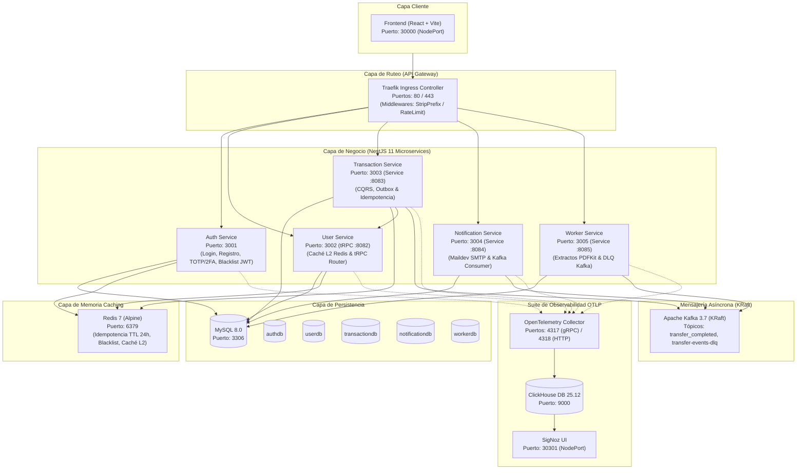

# FinTech Wallet 💳

Sistema enterprise de billetera virtual desarrollado bajo **Arquitectura Hexagonal (Ports & Adapters)** y **Microservicios en NestJS 11 + TypeScript + tRPC + Prisma ORM + Redis 7 + Apache Kafka KRaft + OpenTelemetry + Traefik API Gateway + Kubernetes (K3s / Rancher Desktop)**.

---

## 🏛️ Arquitectura General del Sistema


```mermaid
graph TD
    subgraph Client ["Capa Cliente"]
        Frontend["Frontend (React + Vite)<br>Puerto: 30000 (NodePort)"]
    end

    subgraph Gateway ["Capa de Ruteo (API Gateway)"]
        Traefik["Traefik Ingress Controller<br>Puertos: 80 / 443<br>(Middlewares: StripPrefix / RateLimit)"]
    end

    subgraph Microservices ["Capa de Negocio (NestJS 11 Microservices)"]
        AuthService["Auth Service<br>Puerto: 3001<br>(Login, Registro, TOTP/2FA, Blacklist JWT)"]
        UserService["User Service<br>Puerto: 3002 (tRPC :8082)<br>(Caché L2 Redis & tRPC Router)"]
        TransactionService["Transaction Service<br>Puerto: 3003 (Service :8083)<br>(CQRS, Outbox & Idempotencia)"]
        NotificationService["Notification Service<br>Puerto: 3004 (Service :8084)<br>(Maildev SMTP & Kafka Consumer)"]
        WorkerService["Worker Service<br>Puerto: 3005 (Service :8085)<br>(Extractos PDFKit & DLQ Kafka)"]
    end

    subgraph CacheLayer ["Capa de Memoria Caching"]
        Redis["Redis 7 (Alpine)<br>Puerto: 6379<br>(Idempotencia TTL 24h, Blacklist, Caché L2)"]
    end

    subgraph Messaging ["Mensajería Asíncrona (KRaft)"]
        Kafka["Apache Kafka 3.7 (KRaft)<br>Tópicos: transfer_completed, transfer-events-dlq"]
    end

    subgraph Database ["Capa de Persistencia"]
        MySQL[("MySQL 8.0<br>Puerto: 3306")]
        AuthDB[("authdb")]
        UserDB[("userdb")]
        TransactionDB[("transactiondb")]
        NotificationDB[("notificationdb")]
        WorkerDB[("workerdb")]
    end

    subgraph Observability ["Suite de Observabilidad OTLP"]
        OTelCollector["OpenTelemetry Collector<br>Puertos: 4317 (gRPC) / 4318 (HTTP)"]
        ClickHouse[("ClickHouse DB 25.12<br>Puerto: 9000")]
        SigNoz["SigNoz UI<br>Puerto: 30301 (NodePort)"]
    end

    Client --> Traefik
    Traefik --> AuthService
    Traefik --> UserService
    Traefik --> TransactionService
    Traefik --> NotificationService
    Traefik --> WorkerService

    AuthService --> MySQL
    AuthService --> Redis
    UserService --> MySQL
    UserService --> Redis
    TransactionService --> MySQL
    TransactionService --> Redis
    TransactionService --> UserService
    TransactionService --> Kafka
    NotificationService --> MySQL
    NotificationService --> Kafka
    WorkerService --> MySQL
    WorkerService --> Kafka

    AuthService -.-> OTelCollector
    UserService -.-> OTelCollector
    TransactionService -.-> OTelCollector
    NotificationService -.-> OTelCollector
    WorkerService -.-> OTelCollector
    OTelCollector --> ClickHouse
    ClickHouse --> SigNoz
```

---

## 📚 Documentación Especializada por Módulo (`docs/`)

Para profundizar en la arquitectura y patrones implementados, consulta los siguientes documentos en la carpeta [`docs/`](file:///c:/dev/DevOps/fintech-wallet/docs/):

- ☸️ **[Kubernetes & CLI Cheat Sheet](file:///c:/dev/DevOps/fintech-wallet/docs/kubernetes.md)**: Arquitectura K8s, pods, statefulsets, services y la guía completa de comandos `kubectl`.
- 🔄 **[Patrón SAGA & CQRS](file:///c:/dev/DevOps/fintech-wallet/docs/saga.md)**: Transacciones distribuidas, acciones de compensación, consistencia eventual y comandos/consultas CQRS.
- 📩 **[Apache Kafka & Outbox Pattern](file:///c:/dev/DevOps/fintech-wallet/docs/kafka.md)**: Broker KRaft, Transactional Outbox, Event Envelope estándar y estrategia DLQ.
- ⚡ **[Redis & Idempotencia Durable](file:///c:/dev/DevOps/fintech-wallet/docs/redis.md)**: Garantía de no duplicidad con TTL de 24h, Token Blacklist y Caché L2.
- 🚦 **[Traefik API Gateway & Routers](file:///c:/dev/DevOps/fintech-wallet/docs/traefik.md)**: Configuración de Ingress, Middlewares (`strip-api-prefix`, `auth-ratelimit`) y enrutamiento.
- 📊 **[Suite de Observabilidad SigNoz](file:///c:/dev/DevOps/fintech-wallet/docs/signoz.md)**: Trazabilidad distribuida OTLP, Logs estructurados Winston, Métricas RED y ClickHouse.
- ⚓ **[Helm Package Manager & Cheat Sheet](file:///c:/dev/DevOps/fintech-wallet/docs/helm.md)**: Empaquetado de microservicios, estructura de Charts, parametrización con `values.yaml` y guía de comandos `helm`.
- 🚀 **[Guía: Crear Nuevo Microservicio Paso a Paso](file:///c:/dev/DevOps/fintech-wallet/docs/crear-nuevo-microservicio.md)**: Flujo estandarizado para crear, implementar, containerizar y desplegar un nuevo microservicio desde cero en K8s.

---

## 🚀 Despliegue Automatizado en Kubernetes / Rancher Desktop

### Requisitos Previos
- Rancher Desktop (motor **containerd** habilitado).
- PowerShell 7+ o Bash.
- `kubectl` configurado en el contexto `rancher-desktop`.

### Ejecutar Despliegue Completo
```powershell
# En Windows (PowerShell)
.\deploy-rancher.ps1

# En Linux / macOS (Bash)
./deploy-rancher.sh
```

---

## 🧪 Ejecución de la Suite de Pruebas (`scripts/`)

```powershell
# 1. Prueba de Humo y Sanidad General (Validación de Pods, Ingress, BD, Redis y Swagger UIs)
.\scripts\smoke-test.ps1

# 2. Prueba E2E de Integración de Servicios (Registro -> Login -> Perfil -> Saldo)
.\scripts\test-services-integration.ps1

# 3. Prueba de Concurrencia e Idempotencia (5 solicitudes simultáneas con X-Idempotency-Key)
.\scripts\concurrency-test.ps1

# 4. Benchmark de Rendimiento y Latencias P95/P99
.\scripts\performance-test.ps1
```

---

## 🌐 Puertos y Endpoints del Sistema

| Componente | Servicio / Contenedor | Puerto K8s | Acceso Local / Ingress |
| :--- | :--- | :--- | :--- |
| **Frontend Web** | `frontend` | `30000` | `http://localhost/` o `http://localhost:30000` |
| **Auth Service** | `auth-service` | `3001` | `http://localhost/auth/docs/` |
| **User Service** | `user-service` | `8082` | `http://localhost/users/docs/` |
| **Transaction Service** | `transaction-service` | `8083` | `http://localhost/transactions/docs/` |
| **Notification Service** | `notification-service` | `8084` | `http://localhost/notifications/docs/` |
| **Worker Service** | `worker-service` | `8085` | `http://localhost/worker/docs/` |
| **Maildev Web** | `maildev` | `30080` | `http://localhost/maildev/` |
| **SigNoz UI** | `signoz` | `30301` | `http://localhost:30301/` |
| **Traefik Dashboard** | `traefik` | `80` | `http://traefik.localhost/dashboard/` |
