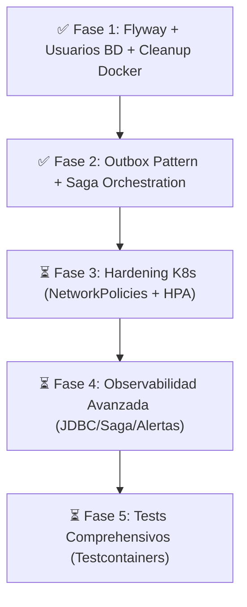

# FinTech Wallet - Plan de Arquitectura y Tareas Pendientes

## 📊 Estado Actual del Sistema

El sistema utiliza la arquitectura **Database-per-Service** en **Kubernetes (k3s / Rancher Desktop con containerd & nerdctl)**, compuesta por 6 microservicios y 5 instancias aisladas de MySQL 8.0:

* **Microservicios Backend (Spring Boot 3 / Java 21-25)**:
  * `api-gateway` (puerto 8080 / NodePort 30080)
  * `auth-service` (puerto 8081) — BD: `auth-mysql` (`authdb`)
  * `user-service` (puerto 8082, gRPC 9090) — BD: `user-mysql` (`userdb`)
  * `transaction-service` (puerto 8083) — BD: `tx-mysql` (`transactiondb`)
  * `notification-service` (puerto 8084) — BD: `notif-mysql` (`notificationdb`)
  * `worker-service` (puerto 8085) — BD: `worker-mysql` (`workerdb`)
* **Frontend**:
  * `frontend` (React 19 + Vite 8 + Tailwind v4, puerto 3000 / NodePort 30000)
* **Infraestructura**:
  * 5 StatefulSets independientes de MySQL 8.0 con usuarios dedicados por microservicio.
  * Redis 7.0 (Rate Limiting, Caché L2, Idempotencia, Blacklist JWT)
  * Apache Kafka en modo KRaft (Mensajería asíncrona)
  * Kafka Connect + Debezium CDC (Captura de eventos Outbox)
  * Mailpit (Servidor SMTP de pruebas)
* **Suite de Observabilidad**:
  * SigNoz APM UI (puerto 3301 / NodePort 30301) + OpenTelemetry Collector + ClickHouse

---

## 🚀 Plan de Maduración a Producción-Grade y Estado por Fases



---

### ✅ FASE 1: Versionado de Esquemas, Seguridad BD y Entorno Nativo K8s (COMPLETADO)

* [x] **Flyway Baseline**: Creados scripts `V1__init_*.sql` para los 5 microservicios backend:
  * `auth-service`: `V1__init_authdb.sql` (tabla `users`)
  * `user-service`: `V1__init_userdb.sql` (tabla `user_profiles`)
  * `transaction-service`: `V1__init_transactiondb.sql` (tablas `transactions` y `money_requests`)
  * `notification-service`: `V1__init_notificationdb.sql` (tabla `notifications`)
  * `worker-service`: `V1__init_workerdb.sql` (tablas `audit_logs` y `statement_jobs`)
* [x] **Spring Boot & JPA**:
  * Inclusión de dependencias `flyway-core` y `flyway-mysql` en los 5 `pom.xml`.
  * Cambio de `hibernate.ddl-auto=update` a `hibernate.ddl-auto=validate`.
  * Activación de `spring.flyway.enabled=true` y `baseline-on-migrate=true`.
* [x] **Seguridad de BD en K8s**:
  * Creación de usuarios de aplicación dedicados (`auth_user`, `user_user`, `tx_user`, `notif_user`, `worker_user`) y passwords root aislados en `k8s/00-namespace-config.yaml`.
  * Inyección de `MYSQL_USER` y `MYSQL_PASSWORD` en los StatefulSets de `k8s/01-infrastructure.yaml`.
* [x] **Eliminación Legacy**:
  * Eliminación definitiva de `docker-compose.yml` e `infra/mysql/init-databases.sql`.

---

### ✅ FASE 2: Consistencia Distribuida (Outbox Pattern & Saga con Orquestación) (COMPLETADO)

* [x] **Transactional Outbox Table**:
  * Script Flyway `V2__outbox_events_table.sql` en `transaction-service`.
  * Entidad `OutboxEvent`, `OutboxRepository` y `OutboxService`.
  * Registro de eventos outbox en la misma transacción local (`@Transactional`) que la transferencia.
* [x] **Debezium CDC + Kafka Connect**:
  * Manifiesto K8s `k8s/07-kafka-connect.yaml` para desplegar Kafka Connect con `debezium/connect:2.5`.
  * Job de inicialización para registrar el conector Debezium MySQL escuchando la tabla `outbox_events` de `tx-mysql` y enviando a Kafka.
* [x] **Saga Orchestrator en Transferencias**:
  * Orquestador `TransferSagaOrchestrator` implementado en `transaction-service`.
  * Tabla `saga_instances` (`V3__saga_instances_table.sql`) y repositorio para persistir el estado de la Saga (`STARTED`, `DEBIT_COMPLETED`, `CREDIT_COMPLETED`, `COMPENSATING`, `COMPENSATED`, `COMPLETED`, `FAILED`).
  * **Transacciones Compensatorias**: Si el paso de crédito falla, el orquestador revierte automáticamente el débito devolviendo los fondos al emisor vía gRPC.

---

### ⏳ FASE 3: Hardening de Infraestructura en Kubernetes

* [ ] **Network Policies Restrictivas**:
  * Manifiesto `k8s/06-networkpolicy.yaml` con aislamiento estricto (denegar todo por defecto).
  * Permitir únicamente tráfico legítimo (ej. `api-gateway` -> microservicios; microservicios -> su propia BD; `transaction-service` -> `user-service` gRPC).
* [ ] **Horizontal Pod Autoscaling (HPA)**:
  * Manifiesto `k8s/08-hpa.yaml` para autoescalar pods de microservicios según uso de CPU/memoria (mínimo 1, máximo 3 replicas).
* [ ] **Ajuste de Recursos & PodDisruptionBudgets**:
  * Definición estricta de `requests` y `limits` de CPU/memoria para prevenir OOMKilled.
  * Creación de `PodDisruptionBudget` para evitar caídas durante desalertas o mantenimientos del clúster.

---

### ⏳ FASE 4: Observabilidad Avanzada y Alertas en SigNoz

* [ ] **Dashboards Especializados**:
  * Panel de Métricas JDBC (tamaño de pool HikariCP, tiempo de espera de conexiones, consultas lentas por servicio).
  * Panel de Monitoreo de Sagas (Sagas completadas vs compensadas/fallidas, tiempo de ejecución).
  * Panel de Outbox & Debezium Lag (eventos pendientes de publicación a Kafka).
* [ ] **Reglas de Alerta en SigNoz**:
  * Alerta de Saga en estado `COMPENSATING` o `FAILED`.
  * Alerta de fallo en migraciones Flyway al arrancar un servicio.
  * Alerta de tasa de errores SQL / timeouts JDBC.

---

### ⏳ FASE 5: Suite de Pruebas Automáticas

* [ ] **Unit Testing**:
  * Tests de unidad para `TransferSagaOrchestrator`, `OutboxService` y `TransactionService` usando JUnit 5 + Mockito.
* [ ] **Integration Testing con Testcontainers**:
  * Pruebas de integración reales levantando contenedores MySQL 8.0 y Kafka con Testcontainers.
  * Pruebas de verificación de ejecuciones Flyway sobre MySQL limpio.
* [ ] **Contract Testing (gRPC / REST)**:
  * Pruebas de contrato entre `transaction-service` y `user-service` (gRPC Protobuf).

---

## 🛠️ Comandos Útiles de Despliegue en Rancher Desktop

Para recompilar y desplegar todo el sistema en Kubernetes con 1 solo comando:

```powershell
.\deploy-rancher.ps1
```

Para verificar el estado de los pods en Kubernetes:

```powershell
kubectl get pods -n fintech
```

Para revisar logs de la Saga y Outbox:

```powershell
kubectl logs -n fintech deployment/transaction-service
```
