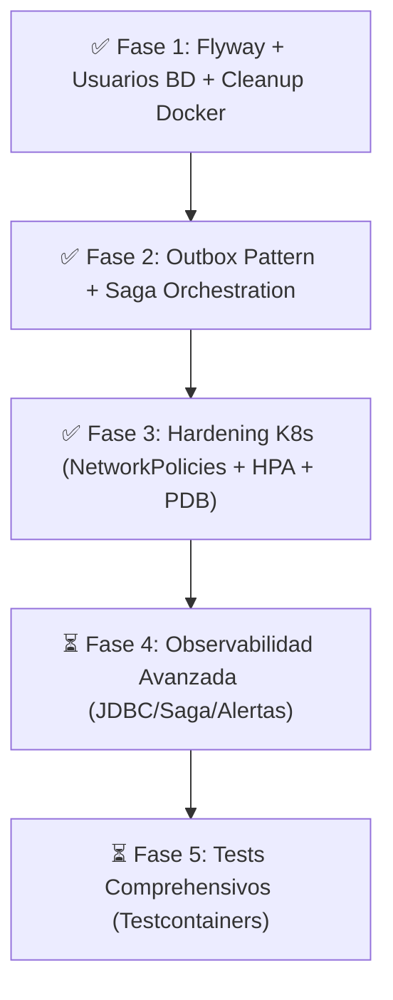

# FinTech Wallet - Plan de Arquitectura y Tareas Pendientes

## 📊 Estado Actual del Sistema

El sistema utiliza la arquitectura **Database-per-Service** en **Kubernetes (k3s / Rancher Desktop con containerd & nerdctl)**, compuesta por 6 microservicios y 5 instancias aisladas de MySQL 8.0:

* **Microservicios Backend (Spring Boot 3 / Java 21-25)**:
  * `api-gateway` (puerto 8080 / NodePort 30080)
  * `auth-service` (puerto 8081) — BD: `auth-mysql` (`authdb`)
  * `user-service` (puerto 8082, gRPC 9090) — BD: `user-mysql` (`userdb`)
  * `transaction-service` (puerto 8083) — BD: `tx-mysql` (`transactiondb`)
  * `notification-service` (puerto 8084) — BD: `notif-mysql` (`notificationdb`)
  * `worker-service` (puerto 8085) — BD: `worker-mysql` (`workerdb`)
* **Frontend**:
  * `frontend` (React 19 + Vite 8 + Tailwind v4, puerto 3000 / NodePort 30000)
* **Infraestructura & Hardening**:
  * 5 StatefulSets independientes de MySQL 8.0 con usuarios dedicados por microservicio.
  * Isolation Zero-Trust con **NetworkPolicies** por servicio y base de datos.
  * Autoescalado de pod con **HorizontalPodAutoscaler (HPA)** (min 1, max 5).
  * Alta disponibilidad durante mantenimientos con **PodDisruptionBudgets (PDB)** (`minAvailable: 1`).
  * Redis 7.0 (Rate Limiting, Caché L2, Idempotencia, Blacklist JWT).
  * Apache Kafka en modo KRaft (Mensajería asíncrona).
  * Kafka Connect + Debezium CDC (Captura de eventos Outbox).
  * Mailpit (Servidor SMTP de pruebas).
* **Suite de Observabilidad**:
  * SigNoz APM UI (puerto 3301 / NodePort 30301) + OpenTelemetry Collector + ClickHouse

---

## 🚀 Plan de Maduración a Producción-Grade y Estado por Fases



---

### ✅ FASE 1: Versionado de Esquemas, Seguridad BD y Entorno Nativo K8s (COMPLETADO)

* [x] **Flyway Baseline**: Creados scripts `V1__init_*.sql` para los 5 microservicios backend.
* [x] **Spring Boot & JPA**: Dependencias `flyway-core` y `flyway-mysql` agregadas; `hibernate.ddl-auto=validate`.
* [x] **Seguridad de BD en K8s**: Usuarios de aplicación dedicados e inyección de credenciales por servicio.
* [x] **Eliminación Legacy**: Eliminación definitiva de `docker-compose.yml` e `infra/mysql/init-databases.sql`.

---

### ✅ FASE 2: Consistencia Distribuida (Outbox Pattern & Saga con Orquestación) (COMPLETADO)

* [x] **Transactional Outbox Table**: Script `V2__outbox_events_table.sql`, `OutboxEvent` y `OutboxService`.
* [x] **Debezium CDC + Kafka Connect**: Manifiesto `k8s/07-kafka-connect.yaml` para captura CDC near-real-time.
* [x] **Saga Orchestrator en Transferencias**: `TransferSagaOrchestrator` con máquina de estados y **Transacciones Compensatorias** automáticas en caso de fallo.

---

### ✅ FASE 3: Hardening de Infraestructura en Kubernetes (COMPLETADO)

* [x] **Network Policies Restrictivas (Zero-Trust)**:
  * Manifiesto `k8s/06-networkpolicy.yaml` reescrito con `default-deny-all` y reglas ingress explícitas puerto a puerto.
  * Aislamiento total de las 5 bases de datos MySQL permitiendo conexión únicamente a su respectivo microservicio.
* [x] **Horizontal Pod Autoscaling (HPA)**:
  * Manifiesto `k8s/08-hpa.yaml` con reglas de autoescalado basado en consumo de CPU (70%) y Memoria (80%) para los 6 microservicios.
* [x] **PodDisruptionBudgets (PDB)**:
  * Manifiesto `k8s/09-pdb.yaml` que exige `minAvailable: 1` para todos los microservicios y StatefulSets de MySQL durante drains o mantenimientos del clúster.
* [x] **Scripts de Despliegue**:
  * Actualización de `deploy-rancher.ps1` y `deploy-rancher.sh` para aplicar automáticamente todos los nuevos manifiestos (`06-networkpolicy.yaml`, `07-kafka-connect.yaml`, `08-hpa.yaml`, `09-pdb.yaml`).

---

### ⏳ FASE 4: Observabilidad Avanzada y Alertas en SigNoz

* [ ] **Dashboards Especializados**:
  * Panel de Métricas JDBC (tamaño de pool HikariCP, tiempo de espera de conexiones, consultas lentas por servicio).
  * Panel de Monitoreo de Sagas (Sagas completadas vs compensadas/fallidas, tiempo de ejecución).
  * Panel de Outbox & Debezium Lag (eventos pendientes de publicación a Kafka).
* [ ] **Reglas de Alerta en SigNoz**:
  * Alerta de Saga en estado `COMPENSATING` o `FAILED`.
  * Alerta de fallo en migraciones Flyway al arrancar un servicio.
  * Alerta de tasa de errores SQL / timeouts JDBC.

---

### ⏳ FASE 5: Suite de Pruebas Automáticas

* [ ] **Unit Testing**:
  * Tests de unidad para `TransferSagaOrchestrator`, `OutboxService` y `TransactionService` usando JUnit 5 + Mockito.
* [ ] **Integration Testing con Testcontainers**:
  * Pruebas de integración reales levantando contenedores MySQL 8.0 y Kafka con Testcontainers.
  * Pruebas de verificación de ejecuciones Flyway sobre MySQL limpio.
* [ ] **Contract Testing (gRPC / REST)**:
  * Pruebas de contrato entre `transaction-service` y `user-service` (gRPC Protobuf).

---

## 🛠️ Comandos Útiles de Despliegue en Rancher Desktop

Para recompilar y desplegar todo el sistema en Kubernetes con 1 solo comando:

```powershell
.\deploy-rancher.ps1
```

Para verificar HPA y NetworkPolicies en Kubernetes:

```powershell
kubectl get hpa,pdb,netpol -n fintech
```
