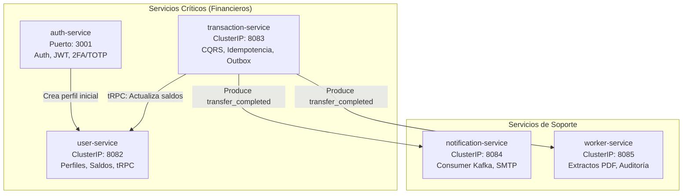
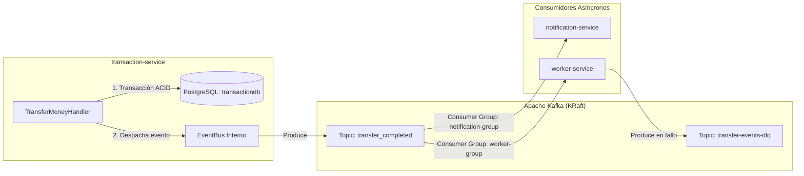
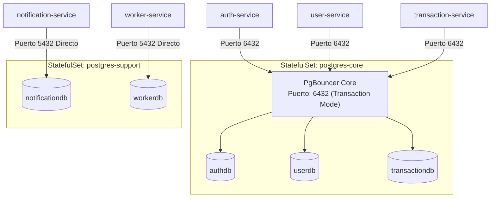
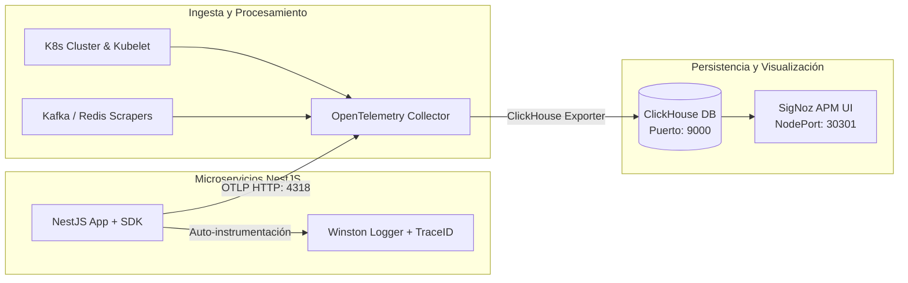

# Arquitectura General del Sistema

Este documento describe los fundamentos arquitectónicos, los patrones de diseño distribuido, las capas internas y los mecanismos de comunicación del ecosistema **FinTech Wallet**.

---

## 📑 Contenido

1. [Principios de Diseño](#1-principios-de-diseño)
2. [Arquitectura Hexagonal (Ports & Adapters)](#2-arquitectura-hexagonal-ports--adapters)
3. [Topología de Microservicios](#3-topología-de-microservicios)
4. [Mecanismos de Comunicación](#4-mecanismos-de-comunicación)
   - [Comunicación Síncrona: REST y tRPC](#comunicación-síncrona-rest-y-trpc)
   - [Comunicación Asíncrona: Apache Kafka y Outbox Pattern](#comunicación-asíncrona-apache-kafka-y-outbox-pattern)
5. [Estrategia de Persistencia y Segregación de Datos](#5-estrategia-de-persistencia-y-segregación-de-datos)
6. [Caché y Estado Distribuido con Redis](#6-caché-y-estado-distribuido-con-redis)
7. [API Gateway y Enrutamiento con Traefik](#7-api-gateway-y-enrutamiento-con-traefik)
8. [Suite de Observabilidad OTLP y APM](#8-suite-de-observabilidad-otlp-y-apm)

---

## 1. Principios de Diseño

El sistema está construido siguiendo los siguientes principios arquitectónicos:

* **Separación de Responsabilidades y Microservicios Desacoplados**: Cada servicio posee su propio ciclo de vida, lógica de negocio y esquema de base de datos aislado.
* **Arquitectura Hexagonal (Puertos y Adaptadores)**: Aislamiento total del núcleo del negocio (dominio y casos de uso) respecto a tecnologías externas, bases de datos, brokers o frameworks de transporte.
* **Domain-Driven Design (DDD)**: Entidades ricas (`User`, `UserProfile`, `TransactionEntity`), objetos de valor inmutables (`Money`, `UserId`, `Email`) y eventos de dominio (`TransferCompletedEvent`).
* **Database-per-Service (Segregación Lógica y Física)**: Cada microservicio se conecta exclusivamente a su propia base de datos, previniendo el acoplamiento a nivel de datos.
* **Garantía de Idempotencia y Consistencia Eventual**: Procesamiento no duplicado de transacciones críticas mediante candados distribuidos y conciliación asíncrona de eventos.

---

## 2. Arquitectura Hexagonal (Ports & Adapters)

Cada uno de los 5 microservicios en `backend-nestjs/` sigue una estructura hexagonal uniforme:

```text
                        ┌──────────────────────────────────────────────────────────┐
                        │                     ADAPTERS INBOUND                     │
                        │   • REST Controllers (Swagger / OpenAPI)                 │
                        │   • tRPC Routers (user-trpc.router.ts)                   │
                        │   • Kafka Consumers (kafkajs consumers)                  │
                        └────────────────────────────┬─────────────────────────────┘
                                                     │
                                                     ▼
                        ┌──────────────────────────────────────────────────────────┐
                        │                 INBOUND PORTS (Interfaces)               │
                        │   • AuthServicePort, IUserServicePort, ...               │
                        └────────────────────────────┬─────────────────────────────┘
                                                     │
                                                     ▼
    ┌──────────────────────────────────────────────────────────────────────────────────────────────┐
    │                                         CORE DOMAIN                                          │
    │   ┌──────────────────────────────────────────────────────────────────────────────────────┐   │
    │   │                                APPLICATION LAYER (Casos de Uso)                      │   │
    │   │   • Command Handlers (CQRS: TransferMoneyCommandHandler)                             │   │
    │   │   • Query Handlers (CQRS: GetTransactionHistoryQueryHandler)                         │   │
    │   │   • Services de Aplicación                                                           │   │
    │   └──────────────────────────────────────────┬───────────────────────────────────────────┘   │
    │                                              │                                               │
    │                                              ▼                                               │
    │   ┌──────────────────────────────────────────────────────────────────────────────────────┐   │
    │   │                                DOMAIN LAYER (Núcleo Puro)                            │   │
    │   │   • Entities: User, UserProfile, TransactionEntity, NotificationEntity               │   │
    │   │   • Value Objects: Money, UserId, Email                                              │   │
    │   │   • Domain Events: TransferCompletedEvent                                            │   │
    │   └──────────────────────────────────────────────────────────────────────────────────────┘   │
    └──────────────────────────────────────────────┬───────────────────────────────────────────────┘
                                                   │
                                                   ▼
                        ┌──────────────────────────────────────────────────────────┐
                        │                 OUTBOUND PORTS (Interfaces)              │
                        │   • TransactionRepositoryPort, UserServiceClientPort     │
                        └────────────────────────────┬─────────────────────────────┘
                                                     │
                                                     ▼
                        ┌──────────────────────────────────────────────────────────┐
                        │                     ADAPTERS OUTBOUND                    │
                        │   • Prisma ORM Repositories (PostgreSQL)                 │
                        │   • Redis Service (Locks, TTL, Key Registry)             │
                        │   • Kafka Producer (kafkajs)                             │
                        │   • HTTP / tRPC Client Adapters                          │
                        └──────────────────────────────────────────────────────────┘
```

---

## 3. Topología de Microservicios

El sistema está conformado por 5 microservicios con responsabilidades bien delimitadas:



---

## 4. Mecanismos de Comunicación

### Comunicación Síncrona: REST y tRPC

1. **REST / HTTP (Externa e Ingress)**:
   - Expuesto para el Frontend SPA y clientes externos a través de Traefik.
   - Documentado automáticamente mediante Swagger/OpenAPI en `/docs` de cada servicio.
   - Utilizado para operaciones que requieren respuesta inmediata (registro, login, consulta de extractos).

2. **tRPC (Interna Service-to-Service)**:
   - Utilizado para la comunicación síncrona de alto rendimiento y seguridad de tipos entre `transaction-service` y `user-service`.
   - Evita la duplicación de DTOs gracias a la inferencia de tipos TypeScript y esquemas Zod en `UserTrpcRouter` (`getUserById`, `getUserByEmail`, `updateBalance`).

### Comunicación Asíncrona: Apache Kafka y Outbox Pattern

Para desacoplar las operaciones financieras de los procesos colaterales (notificaciones por correo, auditoría, generación de PDFs), se utiliza un flujo basado en eventos con Apache Kafka en modo KRaft:



#### Estructura del Evento (`transfer_completed`):

```json
{
  "eventId": "9b1deb4d-3b7d-4bad-9bdd-2b0d7b3dcb6d",
  "eventType": "TRANSFER_COMPLETED",
  "aggregateType": "Transaction",
  "aggregateId": "104",
  "timestamp": "2026-08-17T12:00:00.000Z",
  "data": {
    "transactionId": "104",
    "fromUser": 1,
    "toUser": 2,
    "amount": 1500.50
  }
}
```

---

## 5. Estrategia de Persistencia y Segregación de Datos

La persistencia relacional utiliza **PostgreSQL 16** segregado en dos StatefulSets para optimizar el rendimiento y aislar cargas críticas:



* **PgBouncer Core**: Multiplexa hasta 1000 conexiones concurrentes de clientes hacia un pool reducido en PostgreSQL, evitando la saturación del proceso de base de datos bajo tráfico intenso.
* **Prisma ORM**: Administra el mapeo relacional de objetos, migraciones y tipos generados (`@prisma/client`) para cada microservicio.

---

## 6. Caché y Estado Distribuido con Redis

**Redis 7** cumple tres funciones fundamentales:

1. **Idempotencia Transaccional**:
   - `idemp:lock:<key>`: Candado distribuido con expiración corta para bloquear solicitudes duplicadas concurrentes.
   - `idemp:key:<key>`: Registro de operación exitosa con TTL de 24 horas.
2. **Lista Negra de Tokens JWT**:
   - `jwt:blacklist:<token>`: Almacena tokens revocados tras el cierre de sesión o cambio de contraseña hasta su expiración natural.
3. **Caché L2 de Perfiles de Usuario**:
   - `user:cache:<id>`: Almacena perfiles consultados frecuentemente para aliviar lecturas en `userdb`.

---

## 7. API Gateway y Enrutamiento con Traefik

El Ingress Controller Traefik centraliza el tráfico HTTP del clúster:

* **Middlewares Activos**:
  - `strip-api-prefix`: Transforma `/api/transactions/transfer` en `/transactions/transfer` antes de entregarlo a `transaction-service`.
  - `strip-maildev-prefix`: Permite servir la interfaz web de Maildev bajo `/maildev`.
  - `strip-otlp-prefix`: Enruta llamadas OTLP del navegador hacia el OTel Collector.
  - `auth-ratelimit`: Limita el tráfico sobre `/auth` a un promedio de 100 req/s con ráfagas de 50 para mitigar ataques de fuerza bruta.
* **Enrutamiento por Prefijo**: Mapea directamente `/auth`, `/users`, `/transactions`, `/notifications`, `/worker` y `/` (Frontend SPA).

---

## 8. Suite de Observabilidad OTLP y APM

La arquitectura de observabilidad implementa el estándar OpenTelemetry:



* **Correlación Automática**: Cada solicitud HTTP entrante genera un `trace_id` y un `span_id` que se inyectan automáticamente en los encabezados HTTP y en los logs estructurados JSON de Winston.
* **ClickHouse**: Motor columnar de ultra-alta velocidad que almacena trazas (`signoz_traces`), métricas (`signoz_metrics`) y logs (`signoz_logs`).

Para conocer el detalle de cada microservicio, consulta la [Ficha Técnica de Microservicios](services.md).
