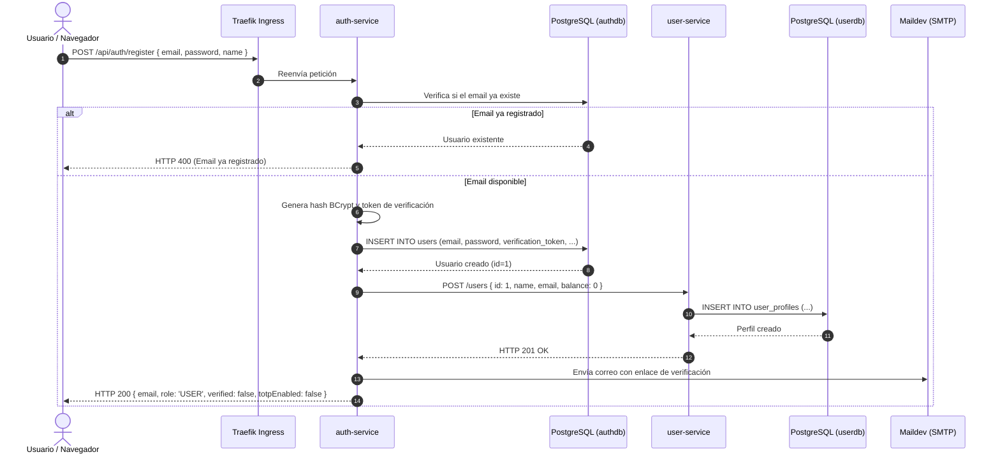
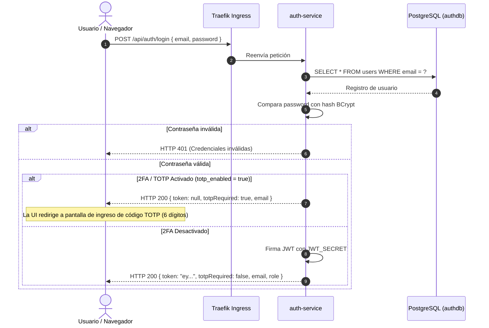
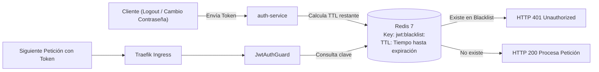

# Autenticación, Seguridad y 2FA

Este documento detalla la arquitectura de seguridad, la gestión de identidad, los mecanismos criptográficos de JSON Web Tokens (JWT), la autenticación de dos factores (2FA / TOTP) y las políticas de revocación y control de tasa implementadas en **FinTech Wallet**.

---

## 📑 Contenido

1. [Visión General de Seguridad](#1-visión-general-de-seguridad)
2. [Flujo de Registro de Usuario](#2-flujo-de-registro-de-usuario)
3. [Flujo de Inicio de Sesión (Login)](#3-flujo-de-inicio-de-sesión-login)
4. [Autenticación de Dos Factores (2FA / TOTP)](#4-autenticación-de-dos-factores-2fa--totp)
   - [Configuración y Generación de Secreto Base32](#configuración-y-generación-de-secreto-base32)
   - [Verificación y Activación](#verificación-y-activación)
   - [Desafío 2FA durante el Login](#desafío-2fa-durante-el-login)
5. [Verificación de Cuenta por Correo Electrónico](#5-verificación-de-cuenta-por-correo-electrónico)
6. [Gestión de Sesiones y Blacklist de Tokens en Redis](#6-gestión-de-sesiones-y-blacklist-de-tokens-en-redis)
7. [Cambio de Contraseña y Administración](#7-cambio-de-contraseña-y-administración)
8. [Protección contra Fuerza Bruta con Traefik Rate Limiting](#8-protección-contra-fuerza-bruta-con-traefik-rate-limiting)

---

## 1. Visión General de Seguridad

El modelo de seguridad se fundamenta en:

* **Contraseñas Cifradas**: Almacenamiento no reversible mediante el algoritmo **BCrypt** con 10 rondas de salt.
* **Tokens JWT Sin Estado (Stateless)**: Firmados con el algoritmo HMAC SHA-256 (`HS256`), incluyendo claims esenciales (`userId`, `email`, `role`) y expiración de 24 horas.
* **Estándar RFC 6238 (TOTP)**: Segundo factor de autenticación compatible con aplicaciones como Google Authenticator, Microsoft Authenticator o Authy.
* **Lista Negra de Tokens en Memoria**: Revocación instantánea en Redis para prevenir la reutilización de tokens válidos tras un cierre de sesión o cambio de credenciales.
* **Defensa Perimetral**: Middleware Traefik RateLimiting en el Ingress para mitigar ataques de diccionario o fuerza bruta.

---

## 2. Flujo de Registro de Usuario

El registro crea simultáneamente la identidad en `auth-service` y el perfil financiero en `user-service`:



---

## 3. Flujo de Inicio de Sesión (Login)

El proceso de login evalúa si el usuario requiere segundo factor antes de expedir el token JWT:



---

## 4. Autenticación de Dos Factores (2FA / TOTP)

### Configuración y Generación de Secreto Base32

1. **Solicitud de Setup**: El usuario autenticado solicita configurar 2FA mediante `POST /api/auth/setup-totp`.
2. **Generación de Secreto**: El servicio genera un secreto criptográfico aleatorio en formato Base32 (`speakeasy.generateSecret()`).
3. **Generación de URI y Código QR**:
   - URI generada: `otpauth://totp/FinTechWallet:<email>?secret=<secret>&issuer=FinTechWallet&digits=6&period=30`
   - Código QR renderizado en formato Data URL (`data:image/png;base64,...`) usando la librería `qrcode`.
4. **Persistencia Temporal**: El secreto se guarda en la columna `totp_secret` de `authdb`, pero `totp_enabled` permanece en `false` hasta su verificación.

### Verificación y Activación

Para activar formalmente 2FA, el usuario debe ingresar un código válido generado por su aplicación móvil:

* **Endpoint**: `POST /api/auth/enable-totp`
* **Payload**: `{ "email": "usuario@ejemplo.com", "code": "123456" }`
* **Lógica**: Se valida el código usando `speakeasy.totp.verify({ secret, encoding: 'base32', token: code, window: 1 })`. Si es válido, se actualiza `totp_enabled = true`.

### Desafío 2FA durante el Login

Cuando un usuario con `totp_enabled = true` hace login:

1. El login retorna `totpRequired: true` y `token: null`.
2. El frontend solicita el código de 6 dígitos.
3. El cliente invoca `POST /api/auth/verify-totp` enviando `{ email, code }`.
4. `auth-service` valida el código contra `totp_secret`. Si la validación es exitosa, se genera y retorna el JWT definitivo.

---

## 5. Verificación de Cuenta por Correo Electrónico

1. Durante el registro, se genera un UUID criptográfico asignado a `verification_token`.
2. Se despacha un correo electrónico vía Maildev conteniendo un enlace con el token: `http://localhost/verify-email?token=<uuid>`.
3. Al acceder al enlace, el frontend invoca `GET /api/auth/verify-email?token=<uuid>`.
4. El servicio busca al usuario por `verification_token`, actualiza `verified = true` y limpia el campo del token en la base de datos.
5. Si el usuario pierde el enlace, puede solicitar un nuevo correo con `POST /api/auth/resend-verification`.

---

## 6. Gestión de Sesiones y Blacklist de Tokens en Redis

Para invalidar tokens JWT antes de su fecha natural de expiración:



---

## 7. Cambio de Contraseña y Administración

* **Cambio de Contraseña (`PUT /api/auth/change-password`)**:
  - Requiere `{ email, oldPassword, newPassword }`.
  - Verifica la validez de `oldPassword` con BCrypt.
  - Genera el nuevo hash BCrypt y actualiza `password` en `authdb`.
  - Invalida los tokens previos del usuario.
* **Promoción de Administrador (`PUT /api/auth/promote-admin`)**:
  - Requiere `{ email }`.
  - Actualiza el campo `role` a `'ADMIN'` en `authdb`.

---

## 8. Protección contra Fuerza Bruta con Traefik Rate Limiting

Para mitigar intentos automatizados de autenticación o ataques de diccionario, el Ingress `auth-ingress` aplica el middleware Traefik `auth-ratelimit`:

```yaml
apiVersion: traefik.io/v1alpha1
kind: Middleware
metadata:
  name: auth-ratelimit
  namespace: fintech
spec:
  rateLimit:
    average: 100 # Permite un promedio sostenido de 100 peticiones por segundo
    burst: 50    # Permite ráfagas de hasta 50 solicitudes concurrentes
```

Si un cliente excede estos límites, Traefik rechaza inmediatamente las solicitudes adicionales con código **HTTP 429 Too Many Requests**, protegiendo a `auth-service` y al pool de PostgreSQL.

Para conocer la interacción entre autenticación y transferencias, consulta la [Guía de Transacciones](transactions.md).
