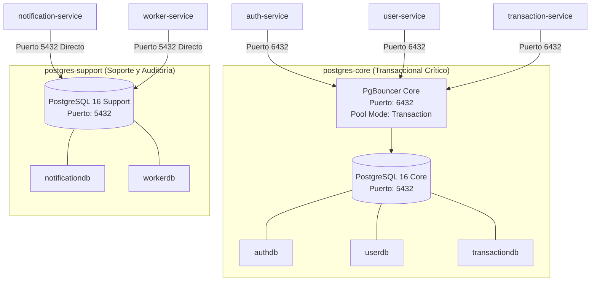
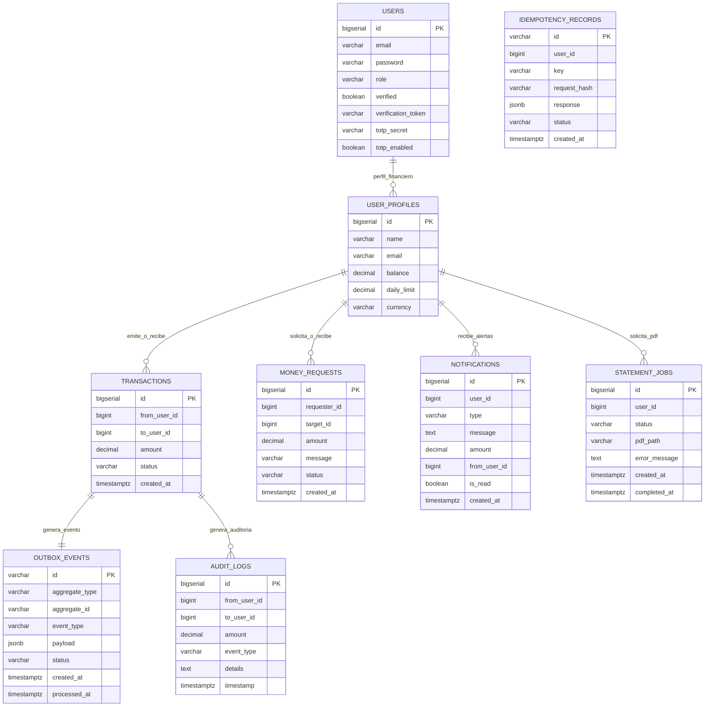

# Bases de Datos Relacionales y PgBouncer

Este documento detalla la topología de persistencia relacional con **PostgreSQL 16**, el pool de conexiones con **PgBouncer**, el esquema de bases de datos por servicio, las definiciones de tablas, índices, restricciones de integridad y diagramas Entidad-Relación (ER) de **FinTech Wallet**.

---

## 📑 Contenido

1. [Topología de Persistencia y Segregación](#1-topología-de-persistencia-y-segregación)
2. [Connection Pooling con PgBouncer Core](#2-connection-pooling-con-pgbouncer-core)
3. [Catálogo de Bases de Datos y Esquemas](#3-catálogo-de-bases-de-datos-y-esquemas)
   - [Base de Datos `authdb` (`auth-service`)](#base-de-datos-authdb-auth-service)
   - [Base de Datos `userdb` (`user-service`)](#base-de-datos-userdb-user-service)
   - [Base de Datos `transactiondb` (`transaction-service`)](#base-de-datos-transactiondb-transaction-service)
   - [Base de Datos `notificationdb` (`notification-service`)](#base-de-datos-notificationdb-notification-service)
   - [Base de Datos `workerdb` (`worker-service`)](#base-de-datos-workerdb-worker-service)
4. [Diagrama Entidad-Relación (ERD) Consolidado](#4-diagrama-entidad-relación-erd-consolidado)
5. [Gestión de Esquemas con Prisma ORM](#5-gestión-de-esquemas-con-prisma-orm)
6. [Estrategia de Copias de Seguridad y Recuperación](#6-estrategia-de-copias-de-seguridad-y-recuperación)

---

## 1. Topología de Persistencia y Segregación

El sistema implementa el patrón **Database-per-Service** utilizando dos instancias independientes de PostgreSQL 16 (StatefulSets en Kubernetes):



* **`postgres-core`**: Aislado para las cargas transaccionales financieras críticas (`authdb`, `userdb`, `transactiondb`). Cuenta con un volumen persistente dedicado de 5 GiB (`postgres-core-data`).
* **`postgres-support`**: Dedicado a operaciones auxiliares de mensajería y auditoría (`notificationdb`, `workerdb`) con volumen de 5 GiB (`postgres-support-data`).

---

## 2. Connection Pooling con PgBouncer Core

Para mitigar el costo de apertura de conexiones y evitar el agotamiento del pool de PostgreSQL durante picos de concurrencia:

* **Modo de Operación**: `transaction` (la conexión al servidor PostgreSQL se devuelve al pool tan pronto concluye la transacción SQL en curso).
* **Parámetros Clave**:
  - `LISTEN_PORT`: `6432`
  - `MAX_CLIENT_CONN`: `1000` (soporta hasta 1000 clientes concurrentes).
  - `DEFAULT_POOL_SIZE`: `25` conexiones persistentes al motor PostgreSQL.
  - `RESERVE_POOL_SIZE`: `5`
  - `IGNORE_STARTUP_PARAMETERS`: `"extra_float_digits,options"` (requerido para compatibilidad con Prisma ORM).

---

## 3. Catálogo de Bases de Datos y Esquemas

### Base de Datos `authdb` (`auth-service`)

#### Tabla `users`
Almacena las credenciales y configuración de seguridad de cada usuario.

| Columna | Tipo de Dato | Modificadores | Descripción |
| :--- | :--- | :--- | :--- |
| `id` | `BIGSERIAL` | `PRIMARY KEY` | Identificador único del usuario |
| `email` | `VARCHAR(255)` | `UNIQUE NOT NULL` | Correo electrónico de acceso |
| `password` | `VARCHAR(255)` | `NOT NULL` | Hash de contraseña con BCrypt |
| `role` | `VARCHAR(50)` | `NOT NULL DEFAULT 'USER'` | Rol del usuario (`USER`, `ADMIN`) |
| `verified` | `BOOLEAN` | `NOT NULL DEFAULT false` | Estado de verificación por email |
| `verification_token` | `VARCHAR(255)` | `NULL` | Token UUID para confirmación de email |
| `totp_secret` | `VARCHAR(255)` | `NULL` | Secreto Base32 para 2FA |
| `totp_enabled` | `BOOLEAN` | `NOT NULL DEFAULT false` | Indica si 2FA/TOTP está activo |

#### Tabla `outbox_events`
Almacena eventos de autenticación para despacho asíncrono.

---

### Base de Datos `userdb` (`user-service`)

#### Tabla `user_profiles`
Almacena el perfil financiero, balance y configuración de cuenta.

| Columna | Tipo de Dato | Modificadores | Descripción |
| :--- | :--- | :--- | :--- |
| `id` | `BIGSERIAL` | `PRIMARY KEY` | Identificador único del perfil |
| `name` | `VARCHAR(255)` | `NOT NULL` | Nombre completo del titular |
| `email` | `VARCHAR(255)` | `UNIQUE NOT NULL` | Correo electrónico (sincronizado) |
| `balance` | `DECIMAL(15, 2)`| `NOT NULL DEFAULT 0.00` | Saldo disponible en cuenta |
| `daily_limit` | `DECIMAL(15, 2)`| `NOT NULL DEFAULT 50000.00` | Límite máximo de transferencia diaria |
| `currency` | `VARCHAR(3)` | `NOT NULL DEFAULT 'ARS'` | Moneda principal (`ARS`, `USD`, `EUR`) |

* **Constraint**: `CONSTRAINT check_positive_balance CHECK (balance >= 0)` (garantiza a nivel de motor que el saldo jamás sea negativo).

---

### Base de Datos `transactiondb` (`transaction-service`)

#### Tabla `transactions`
Bitácora inmutable de todas las transferencias ejecutadas con éxito.

| Columna | Tipo de Dato | Modificadores | Descripción |
| :--- | :--- | :--- | :--- |
| `id` | `BIGSERIAL` | `PRIMARY KEY` | Identificador único de transacción |
| `from_user_id` | `BIGINT` | `NOT NULL` | ID del usuario origen (emisor) |
| `to_user_id` | `BIGINT` | `NOT NULL` | ID del usuario destino (receptor) |
| `amount` | `DECIMAL(15, 2)`| `NOT NULL` | Monto transferido |
| `status` | `VARCHAR(50)` | `NOT NULL DEFAULT 'SUCCESS'` | Estado (`SUCCESS`, `REVERTED`) |
| `created_at` | `TIMESTAMPTZ` | `NOT NULL DEFAULT NOW()` | Fecha y hora UTC del registro |

#### Tabla `money_requests`
Solicitudes de cobro entre usuarios.

| Columna | Tipo de Dato | Modificadores | Descripción |
| :--- | :--- | :--- | :--- |
| `id` | `BIGSERIAL` | `PRIMARY KEY` | Identificador único de solicitud |
| `requester_id`| `BIGINT` | `NOT NULL` | ID del usuario que solicita el dinero |
| `target_id` | `BIGINT` | `NOT NULL` | ID del usuario al que se le cobra |
| `amount` | `DECIMAL(15, 2)`| `NOT NULL` | Monto solicitado |
| `message` | `VARCHAR(255)` | `NULL` | Motivo o mensaje opcional |
| `status` | `VARCHAR(50)` | `NOT NULL DEFAULT 'PENDING'` | Estado (`PENDING`, `ACCEPTED`, `REJECTED`) |
| `created_at` | `TIMESTAMPTZ` | `NOT NULL DEFAULT NOW()` | Fecha de creación de la solicitud |

#### Tabla `idempotency_records`
Registro de claves de idempotencia para garantizar ejecución única.

| Columna | Tipo de Dato | Modificadores | Descripción |
| :--- | :--- | :--- | :--- |
| `id` | `VARCHAR(36)` | `PRIMARY KEY` (UUID) | Identificador interno |
| `user_id` | `BIGINT` | `NOT NULL` | ID del usuario emisor |
| `key` | `VARCHAR(255)` | `NOT NULL` | Clave enviada en `X-Idempotency-Key` |
| `request_hash`| `VARCHAR(255)` | `NULL` | Hash SHA-256 del cuerpo de la petición |
| `response` | `JSONB` | `NULL` | Respuesta HTTP cacheada |
| `status` | `VARCHAR(50)` | `NOT NULL DEFAULT 'COMPLETED'` | Estado de la clave |
| `created_at` | `TIMESTAMPTZ` | `NOT NULL DEFAULT NOW()` | Fecha de registro |

* **Constraint**: `CONSTRAINT user_key_unique UNIQUE (user_id, key)`.

#### Tabla `outbox_events`
Eventos transaccionales generados para publicación a Kafka.

| Columna | Tipo de Dato | Modificadores | Descripción |
| :--- | :--- | :--- | :--- |
| `id` | `VARCHAR(36)` | `PRIMARY KEY` (UUID) | Identificador del evento |
| `aggregate_type` | `VARCHAR(100)` | `NOT NULL` | Agregado de dominio (`Transaction`) |
| `aggregate_id` | `VARCHAR(100)` | `NOT NULL` | ID del registro principal |
| `event_type` | `VARCHAR(100)` | `NOT NULL` | Tipo de evento (`TRANSFER_COMPLETED`) |
| `payload` | `JSONB` | `NOT NULL` | Cuerpo estructurado del evento |
| `status` | `VARCHAR(50)` | `NOT NULL DEFAULT 'PENDING'` | Estado (`PENDING`, `PUBLISHED`) |
| `created_at` | `TIMESTAMPTZ` | `NOT NULL DEFAULT NOW()` | Fecha de creación |
| `processed_at`| `TIMESTAMPTZ` | `NULL` | Fecha de despacho a Kafka |

* **Índice**: `CREATE INDEX idx_tx_outbox_status_created ON outbox_events (status, created_at)`.

---

### Base de Datos `notificationdb` (`notification-service`)

#### Tabla `notifications`
Historial de alertas y notificaciones despachadas a cada usuario.

| Columna | Tipo de Dato | Modificadores | Descripción |
| :--- | :--- | :--- | :--- |
| `id` | `BIGSERIAL` | `PRIMARY KEY` | Identificador de notificación |
| `user_id` | `BIGINT` | `NOT NULL` | ID del usuario destinatario |
| `type` | `VARCHAR(50)` | `NOT NULL` | Tipo (`TRANSFER_RECEIVED`, `TRANSFER_SENT`) |
| `message` | `TEXT` | `NOT NULL` | Mensaje descriptivo |
| `amount` | `DECIMAL(15, 2)`| `NOT NULL` | Monto asociado |
| `from_user_id`| `BIGINT` | `NULL` | ID del usuario contraparte |
| `is_read` | `BOOLEAN` | `NOT NULL DEFAULT false` | Estado de lectura por el usuario |
| `created_at` | `TIMESTAMPTZ` | `NOT NULL DEFAULT NOW()` | Fecha de generación |

* **Índice**: `CREATE INDEX idx_notifications_user_id ON notifications (user_id)`.

---

### Base de Datos `workerdb` (`worker-service`)

#### Tabla `statement_jobs`
Control de generación de extractos bancarios en PDF.

| Columna | Tipo de Dato | Modificadores | Descripción |
| :--- | :--- | :--- | :--- |
| `id` | `BIGSERIAL` | `PRIMARY KEY` | Identificador único del trabajo |
| `user_id` | `BIGINT` | `NOT NULL` | ID del usuario solicitante |
| `status` | `VARCHAR(50)` | `NOT NULL DEFAULT 'PENDING'` | Estado (`PENDING`, `COMPLETED`, `FAILED`) |
| `pdf_path` | `VARCHAR(255)` | `NULL` | Ruta en disco al archivo PDF compilado |
| `error_message`| `TEXT` | `NULL` | Detalle del error en caso de fallo |
| `created_at` | `TIMESTAMPTZ` | `NOT NULL DEFAULT NOW()` | Fecha de solicitud |
| `completed_at`| `TIMESTAMPTZ` | `NULL` | Fecha de finalización |

#### Tabla `audit_logs`
Registro inmutable de auditoría financiera.

| Columna | Tipo de Dato | Modificadores | Descripción |
| :--- | :--- | :--- | :--- |
| `id` | `BIGSERIAL` | `PRIMARY KEY` | Identificador del log |
| `from_user_id`| `BIGINT` | `NULL` | ID del emisor |
| `to_user_id` | `BIGINT` | `NULL` | ID del receptor |
| `amount` | `DECIMAL(15, 2)`| `NOT NULL DEFAULT 0.00` | Monto auditado |
| `event_type` | `VARCHAR(100)` | `NOT NULL` | Evento (`TRANSFER_COMPLETED`, `DLQ_TRANSFER_FAILED`)|
| `details` | `TEXT` | `NULL` | Descripción técnica del evento |
| `timestamp` | `TIMESTAMPTZ` | `NOT NULL DEFAULT NOW()` | Marca de tiempo |

---

## 4. Diagrama Entidad-Relación (ERD) Consolidado



---

## 5. Gestión de Esquemas con Prisma ORM

Cada microservicio mantiene su archivo de esquema en `backend-nestjs/<service>/prisma/schema.prisma`.

### Comandos de Administración Prisma:

```bash
# Generar cliente tipado (@prisma/client)
pnpm prisma generate

# Sincronizar esquema contra la base de datos (desarrollo)
pnpm prisma db push

# Inspeccionar datos mediante Prisma Studio UI
pnpm prisma studio
```

---

## 6. Estrategia de Copias de Seguridad y Recuperación

Las bases de datos están protegidas mediante un CronJob automatizado en Kubernetes (`postgres-backup-cronjob`) que ejecuta respaldos diarios a las 02:00 AM UTC con compresión `gzip`, verificación SHA256 y retención de 7 días.

Para más información operativa, consulta la [Guía de Operaciones Day-2 y Backups](operations.md).
