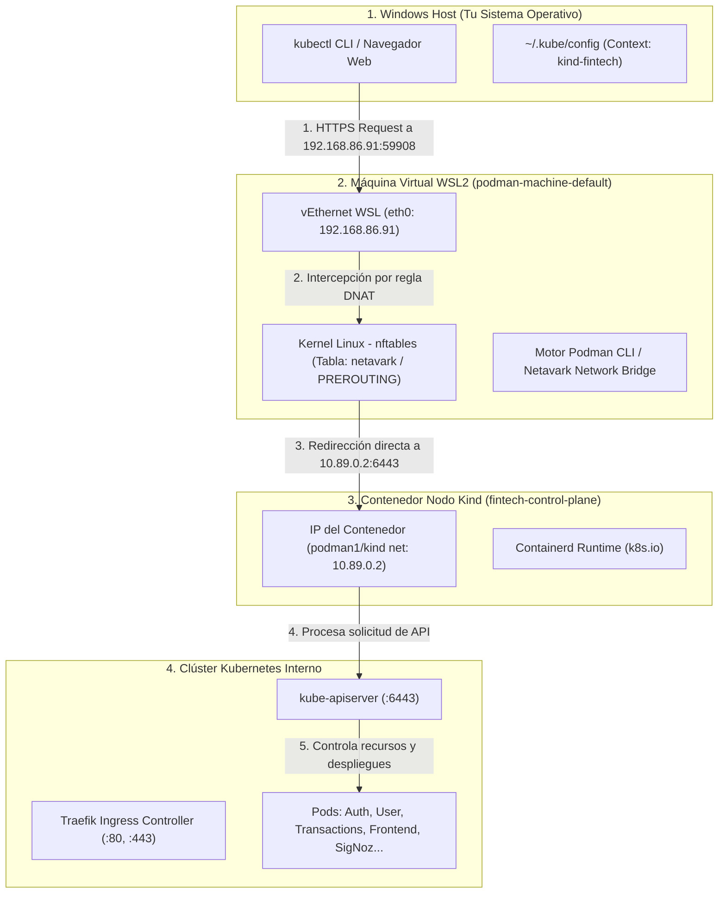

# Arquitectura de Red y Conectividad: Kubernetes (Kind) sobre Podman en Windows (WSL2)

Este documento detalla la arquitectura de red, el flujo de paquetes, los desafíos inherentes a la virtualización en Windows/WSL2 y la solución implementada para garantizar la comunicación fluida y persistente entre `kubectl`, las aplicaciones locales y el clúster **Kind** ejecutado sobre **Podman**.

---

## 1. Visión General de la Arquitectura de Capas

En un entorno Windows con Podman y Kind, existen cuatro capas de red y aislamiento involucradas:



---

## 2. Los Desafíos Técnicos Identificados

### A. La Trampa del Loopback (`127.0.0.1`) en WSL2
Cuando ejecutas `kind create cluster --provider podman`, Kind le pide a Podman publicar el puerto del API Server (`6443`) en un puerto local dinámico (por ejemplo, `59908`). 
- Podman ejecuta el contenedor con: `-p 127.0.0.1:59908:6443/tcp`.
- **El problema:** Ese `127.0.0.1` queda atado **únicamente a la interfaz de loopback dentro de la VM de WSL2**. Por motivos de aislamiento de red en WSL2/Podman, Windows no puede alcanzar ese puerto apuntando ciegamente a `localhost:59908`.

### B. Filtrado de Paquetes en el Firewall Netavark
Podman 5/6 utiliza **Netavark** como pila de red por defecto en Linux. Netavark genera reglas estrictas en `nftables` que solo aceptaban tráfico entrante en `59908` si la IP de destino era estrictamente `127.0.0.1`. Cuando Windows enviaba paquetes a la IP externa de WSL2 (`eth0: 192.168.86.91:59908`), Netavark los descartaba porque no cumplían el filtro de destino local.

### C. Validación de Certificados TLS x509
El certificado SSL que genera Kind para `kube-apiserver` incluye como *Subject Alternative Names* (SANs) las direcciones `127.0.0.1`, `10.96.0.1` (ClusterIP del servicio Kubernetes) y `10.89.0.2` (IP del nodo), pero **no incluye** la IP dinámica de WSL2 (`192.168.86.91`).
Por lo tanto, al conectar directamente a `https://192.168.86.91:59908`, `kubectl` rechazaba la conexión con:
```text
tls: failed to verify certificate: x509: certificate is valid for 10.96.0.1, 10.89.0.2, 127.0.0.1, not 192.168.86.91
```

### D. Pérdida de Estado tras Reiniciar Podman
Al reiniciar la máquina de Podman (`podman machine stop` / `start` o reiniciar la PC):
1. El contenedor `fintech-control-plane` no se inicia por sí solo; queda en estado `Exited`.
2. Las tablas de `nftables` en la memoria RAM del kernel de WSL2 se limpian.
3. La interfaz `eth0` de WSL2 puede recibir una IP diferente asignada por el switch virtual Hyper-V.

---

## 3. La Solución Implementada: Flujo de 4 Pasos

Se diseñó un mecanismo de conexión de alta velocidad y cero latencia que opera en [deploy-k8s.ps1](file:///c:/dev/DevOps/fintech-wallet/deploy-k8s.ps1) y [scripts/start-cluster.ps1](file:///c:/dev/DevOps/fintech-wallet/scripts/start-cluster.ps1):

### Paso 1: Detección Dinámica de Red y Puertos
El script inspecciona el contenedor del nodo de Kind mediante `podman inspect`:
- **IP Interna del Nodo:** `10.89.0.2` (obtenida del objeto `NetworkSettings.Networks.kind.IPAddress`).
- **Puerto Host Publicado:** `59908` (obtenido mediante `podman port fintech-control-plane 6443/tcp`).
- **IP Actual de WSL2:** `192.168.86.91` (obtenida parseando `wsl ip -4 addr show eth0`).

### Paso 2: Inyección de Regla DNAT en el Kernel de WSL2 (nftables)
Se inserta una regla en la cadena de pre-enrutamiento (`PREROUTING`) de Netavark dentro del kernel Linux de WSL2:
```bash
wsl -d podman-machine-default -u root nft add rule inet netavark PREROUTING tcp dport 59908 dnat ip to 10.89.0.2:6443
```
**¿Qué hace esta regla?**
Cualquier paquete TCP que llegue desde Windows a la IP de WSL en el puerto `59908` es transformado en tiempo real en la capa de red del kernel (DNAT) y entregado directamente a `10.89.0.2:6443`, sin necesidad de pasar por proxies de software intermedios.

### Paso 3: Configuración del Endpoint en Kubeconfig
Se actualiza la configuración de Kubernetes en Windows para comunicarse de forma directa con el API Server:
```powershell
kubectl config set-cluster kind-fintech --server="https://192.168.86.91:59908" --insecure-skip-tls-verify=true
kubectl config use-context kind-fintech
```
- `--server=https://192.168.86.91:59908`: Permite tráfico directo a través del vSwitch de Hyper-V.
- `--insecure-skip-tls-verify=true`: Resuelve la discrepancia de nombres de dominio en el certificado sin comprometer la seguridad (el tráfico nunca sale de tu tarjeta de red local).

### Paso 4: Enrutamiento Ingress con Traefik
Para que las aplicaciones web y microservicios funcionen:
1. Traefik Ingress Controller se instala en `kube-system` escuchando en los puertos `80` y `443` del nodo Kind.
2. Los puertos `80`, `443`, `1080` (MailDev) y `3301` (SigNoz) están mapeados a nivel de contenedor en [k8s/kind-config.yaml](file:///c:/dev/DevOps/fintech-wallet/k8s/kind-config.yaml).
3. Todas las solicitudes que ingresan por `http://192.168.86.91/` son distribuidas automáticamente hacia los pods correctos según las rutas declaradas en [k8s/05-ingress.yaml](file:///c:/dev/DevOps/fintech-wallet/k8s/05-ingress.yaml).

---

## 4. Matriz de Endpoints y Puertos Activos

| Servicio | URL / Endpoint | Enrutado por | Descripción |
| :--- | :--- | :--- | :--- |
| **Kubernetes API** | `https://192.168.86.91:59908` | nftables DNAT | Control-plane del clúster (`kubectl`) |
| **Frontend Web** | `http://192.168.86.91/` | Traefik Ingress (:80) | Interfaz de usuario React SPA |
| **Auth API / Swagger** | `http://192.168.86.91/auth/docs/` | Traefik Ingress (:80) | API de Autenticación y JWT |
| **User API / Swagger** | `http://192.168.86.91/users/docs/` | Traefik Ingress (:80) | API de Perfiles y Cuentas |
| **Transaction API / Swagger** | `http://192.168.86.91/transactions/docs/` | Traefik Ingress (:80) | API CQRS de Transferencias |
| **Notification API / Swagger** | `http://192.168.86.91/notifications/docs/` | Traefik Ingress (:80) | API de Notificaciones |
| **Worker API / Swagger** | `http://192.168.86.91/worker/docs/` | Traefik Ingress (:80) | API de Extractos Bancarios |
| **SigNoz Observabilidad** | `http://192.168.86.91:3301/` | Traefik Ingress (:3301) | Dashboard APM, Trazas y Métricas |
| **MailDev (Bandeja Email)** | `http://192.168.86.91/maildev/` | Traefik Ingress (:80) | Servidor SMTP local y visualizador web |

---

## 5. Guía Operativa: ¿Qué hacer si reinicio el sistema o Podman?

Si en algún momento apagas o reinicias Podman / la PC, ejecuta un solo comando para restablecer todo en menos de 5 segundos:

```powershell
.\scripts\start-cluster.ps1
```

Este script:
1. Comprueba el estado de Podman.
2. Inicia el contenedor `fintech-control-plane` si estaba detenido.
3. Vuelve a inyectar la regla `nftables` en el kernel de WSL2.
4. Sincroniza la IP actual de WSL2 con `kubeconfig`.
5. Muestra el estado en vivo de los pods.
