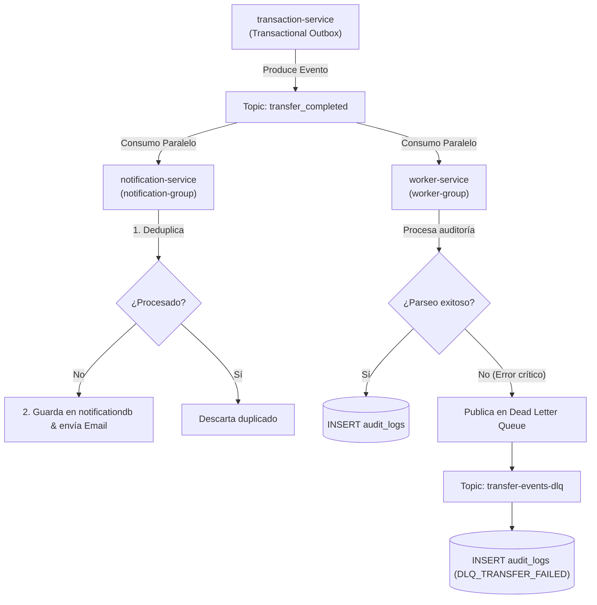

# Apache Kafka: Mensajería Asíncrona y Event Streaming

Este documento detalla la arquitectura de mensajería distribuida con **Apache Kafka 3.7.0 en modo KRaft**, el catálogo de tópicos, productores, consumidores, esquemas de eventos, estrategias de reintento, Dead Letter Queue (DLQ) y comandos de inspección en Kubernetes.

---

## 📑 Contenido

1. [Arquitectura de Kafka en Modo KRaft](#1-arquitectura-de-kafka-en-modo-kraft)
2. [Catálogo de Tópicos y Grupos de Consumidores](#2-catálogo-de-tópicos-y-grupos-de-consumidores)
3. [Esquema del Event Envelope](#3-esquema-del-event-envelope)
4. [Mecanismos de Resiliencia, Reintentos y DLQ](#4-mecanismos-de-resiliencia-reintentos-y-dlq)
5. [Flujo de Eventos Transaccionales](#5-flujo-de-eventos-transaccionales)
6. [Guía de Inspección y Diagnóstico en Kubernetes](#6-guía-de-inspección-y-diagnóstico-en-kubernetes)

---

## 1. Arquitectura de Kafka en Modo KRaft

El clúster utiliza la imagen oficial `apache/kafka:3.7.0` operando en modo **KRaft (Kafka Raft Metadata Mode)**, eliminando la dependencia de ZooKeeper y centralizando la gestión de quórum y metadatos en el propio broker:

* **StatefulSet en Kubernetes**: `kafka` en el namespace `fintech`.
* **Puertos de Red**:
  - `29092`: Tráfico interno entre Pods (`PLAINTEXT://kafka:29092`).
  - `9092`: Tráfico externo / depuración local (`EXTERNAL://localhost:9092`).
  - `29093`: Quórum del controlador KRaft (`CONTROLLER://0.0.0.0:29093`).
* **Almacenamiento Persistente**: Volumen PVC de 5 GiB (`kafka-data` montado en `/tmp/kafka-logs`).
* **Auto-creación de Tópicos**: Habilitada (`KAFKA_AUTO_CREATE_TOPICS_ENABLE: "true"`).

---

## 2. Catálogo de Tópicos y Grupos de Consumidores

| Tópico | Productor | Consumidor | Consumer Group | Propósito del Evento |
| :--- | :--- | :--- | :--- | :--- |
| `transfer_completed`<br>`fintech.transaction.transfer.completed.v1` | `transaction-service` | `notification-service` | `notification-group` | Envío de correos de alerta y registro de notificaciones |
| `transfer_completed`<br>`fintech.transaction.transfer.completed.v1` | `transaction-service` | `worker-service` | `worker-group` | Registro de bitácora en `audit_logs` |
| `transfer-events-dlq` | `worker-service` | Operaciones / DLQ Monitor | N/A (Auditoría) | Mensajes corruptos o no procesables tras agotar reintentos |

---

## 3. Esquema del Event Envelope

Todos los eventos transaccionales producidos por `transaction-service` siguen una estructura uniforme en formato JSON:

```json
{
  "eventId": "c8f2b34a-93f8-4e8c-a1d2-0948b812ef44",
  "eventType": "TRANSFER_COMPLETED",
  "aggregateType": "Transaction",
  "aggregateId": "104",
  "timestamp": "2026-08-17T12:00:00.000Z",
  "data": {
    "transactionId": "104",
    "fromUser": 1,
    "toUser": 2,
    "amount": 1500.50
  }
}
```

### Campos del Envelope:
* `eventId`: UUID único del evento (utilizado por los consumidores para deduplicación).
* `eventType`: Tipo semántico de evento de dominio.
* `aggregateType` y `aggregateId`: Entidad raíz que originó el cambio.
* `timestamp`: Fecha y hora UTC de generación.
* `data`: Carga útil estructurada (Payload).

---

## 4. Mecanismos de Resiliencia, Reintentos y DLQ

### 1. Deduplicación de Mensajes en Memoria
En `notification-service`, el servicio mantiene un set en memoria (`processedEventIds`) con capacidad para 10,000 IDs de eventos. Si Kafka reenvía un mensaje ya procesado tras un rebalanceo de particiones, es descartado inmediatamente.

### 2. Reintentos Exponenciales (Backoff)
Ante fallos transitorios en el envío de correo o inserción en base de datos, el consumidor reintenta la operación hasta **3 veces** con pausas exponenciales ($2^{\text{intento}} \times 500\text{ms}$).

### 3. Dead Letter Queue (DLQ)
En `worker-service`, si un mensaje falla definitivamente o contiene un formato JSON inválido:
1. Se publica automáticamente en el tópico `transfer-events-dlq` incluyendo el error técnico y la carga original.
2. Se registra un evento `DLQ_TRANSFER_FAILED` en la tabla `audit_logs`.

---

## 5. Flujo de Eventos Transaccionales



---

## 6. Guía de Inspección y Diagnóstico en Kubernetes

Puedes interactuar con Apache Kafka directamente ejecutando los scripts CLI oficiales dentro del pod `kafka-0`:

### 1. Listar los Tópicos Existentes

```bash
kubectl exec -it -n fintech kafka-0 -- /opt/kafka/bin/kafka-topics.sh \
  --bootstrap-server localhost:9092 \
  --list
```

### 2. Describir la Configuración de un Tópico

```bash
kubectl exec -it -n fintech kafka-0 -- /opt/kafka/bin/kafka-topics.sh \
  --bootstrap-server localhost:9092 \
  --describe \
  --topic transfer_completed
```

### 3. Consumir Mensajes en Tiempo Real (Desde el Inicio)

```bash
kubectl exec -it -n fintech kafka-0 -- /opt/kafka/bin/kafka-console-consumer.sh \
  --bootstrap-server localhost:9092 \
  --topic transfer_completed \
  --from-beginning
```

### 4. Inspeccionar el Tópico de Dead Letter Queue (DLQ)

```bash
kubectl exec -it -n fintech kafka-0 -- /opt/kafka/bin/kafka-console-consumer.sh \
  --bootstrap-server localhost:9092 \
  --topic transfer-events-dlq \
  --from-beginning
```

### 5. Inspeccionar Grupos de Consumidores y Lag de Particiones

```bash
kubectl exec -it -n fintech kafka-0 -- /opt/kafka/bin/kafka-consumer-groups.sh \
  --bootstrap-server localhost:9092 \
  --describe \
  --group notification-group
```

Para comprender el punto de entrada de las peticiones HTTP antes de la publicación de eventos, consulta la guía de [API Gateway e Ingress Traefik](api-gateway.md).
