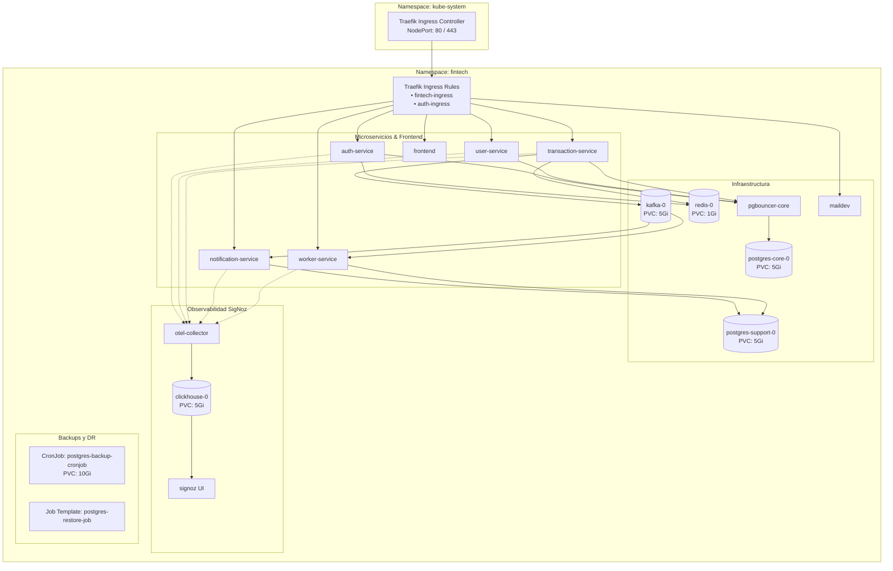

# Kubernetes: Manifiestos, Clúster y Operación

Este documento detalla la arquitectura de Kubernetes para **FinTech Wallet**, los manifiestos declarativos en `k8s/`, el orden secuencial de despliegue, la matriz completa de componentes y una guía práctica de operaciones y comandos `kubectl`.

---

## 📑 Contenido

1. [Arquitectura del Clúster y Namespace `fintech`](#1-arquitectura-del-clúster-y-namespace-fintech)
2. [Estructura y Orden de los Manifiestos (`k8s/`)](#2-estructura-y-orden-de-los-manifiestos-k8s)
3. [Matriz Exhaustiva de Componentes Kubernetes](#3-matriz-exhaustiva-de-componentes-kubernetes)
4. [Estrategia de Recursos y Scheduler QoS](#4-estrategia-de-recursos-y-scheduler-qos)
5. [Políticas de Seguridad y Aislamiento de Red](#5-políticas-de-seguridad-y-aislamiento-de-red)
6. [Guía de Operaciones con `kubectl` (Cheat Sheet)](#6-guía-de-operaciones-con-kubectl-cheat-sheet)

---

## 1. Arquitectura del Clúster y Namespace `fintech`

Todos los recursos del sistema residen en el espacio de nombres dedicado `fintech`, garantizando aislamiento lógico y gobernanza sobre las cargas de trabajo:



---

## 2. Estructura y Orden de los Manifiestos (`k8s/`)

Para evitar condiciones de carrera durante el despliegue, los archivos YAML están numerados y deben aplicarse en el siguiente orden estricto:

| Archivo Manifiesto | Tipo de Recursos Definidos | Propósito Principal |
| :--- | :--- | :--- |
| `00-namespace-config.yaml` | `Namespace`, `ConfigMap`, `Secret` | Crea el namespace `fintech`, inyecta scripts SQL iniciales y secretos de BD/JWT |
| `01-infrastructure.yaml` | `StatefulSet`, `Deployment`, `Service` | Despliega Postgres Core/Support, PgBouncer, Redis 7, Kafka 3.7 y Maildev |
| `02-microservices.yaml` | `Deployment`, `Service` | Despliega los 5 microservicios NestJS con sus Probes y variables |
| `03-frontend.yaml` | `Deployment`, `Service` (NodePort) | Despliega el contenedor Nginx con la aplicación React SPA |
| `04-observability.yaml` | `StatefulSet`, `Job`, `Deployment`, `Service`, `RBAC` | Despliega ClickHouse, ejecuta migraciones y levanta SigNoz y OTel Collector |
| `05-ingress.yaml` | `Middleware`, `Ingress`, `IngressRoute` | Configura routers de Traefik, StripPrefix, RateLimiting y Dashboard |
| `06-networkpolicy.yaml` | `NetworkPolicy` | Define reglas de aislamiento y tráfico permitido dentro del namespace |
| `07-backup-cronjob.yaml` | `PersistentVolumeClaim`, `ConfigMap`, `CronJob` | Programa el respaldo diario automático de bases de datos a las 02:00 AM UTC |
| `08-restore-job-template.yaml`| `Job` (Template bajo demanda) | Plantilla para recuperación ante desastres (DR) a partir de backups |

### Aprovisionamiento del Clúster y Carga de Imágenes con Podman

FinTech Wallet soporta dos entornos de ejecución: **Kind** (desarrollo local en Windows/macOS/Linux) y **K3s** (servidores Linux y máquinas virtuales).

#### Opción 1: Clúster Local con Kind (Windows / Linux)
```bash
# 1. Indicar a Kind que utilice Podman
export KIND_EXPERIMENTAL_PROVIDER=podman        # En Linux / macOS / WSL2
# $env:KIND_EXPERIMENTAL_PROVIDER="podman"      # En Windows PowerShell

# 2. Crear el clúster Kind con mapeo de puertos (HTTP 80/443 y NodePorts 30000/30301)
kind create cluster --name fintech --config kind-config.yaml

# 3. Compilar y cargar imágenes (formato tar archive)
podman build -f backend-nestjs/auth-service/Containerfile -t fintech/auth-service:1.0.0 ./backend-nestjs/auth-service
podman save --format docker-archive -o /tmp/auth-service.tar docker.io/fintech/auth-service:1.0.0
kind load image-archive /tmp/auth-service.tar --name fintech
rm -f /tmp/auth-service.tar
```

#### Opción 2: Clúster en Servidor Linux con K3s
```bash
# 1. Instalar K3s
curl -sfL https://get.k3s.io | sh -

# 2. Configurar acceso a kubectl para el usuario local
mkdir -p ~/.kube && sudo cp /etc/rancher/k3s/k3s.yaml ~/.kube/config && sudo chown -R $USER:$USER ~/.kube

# 3. Compilar con Podman Rootless e importar directamente al runtime containerd de K3s
podman build -f backend-nestjs/auth-service/Containerfile -t fintech/auth-service:1.0.0 ./backend-nestjs/auth-service
podman save --format docker-archive -o /tmp/auth-service.tar docker.io/fintech/auth-service:1.0.0
sudo k3s ctr images import /tmp/auth-service.tar
rm -f /tmp/auth-service.tar
podman image prune -f
```

> [!TIP]
> Todo este flujo está 100% automatizado mediante `.\deploy-k8s.ps1` (en Windows) o `./deploy-k8s.sh` (en Linux).

### Comandos de Despliegue Manual Secuencial

```bash
# 1. Configuración de Base, Secretos y SQL Scripts
kubectl apply -f k8s/00-namespace-config.yaml

# 2. Infraestructura con Estado
kubectl apply -f k8s/01-infrastructure.yaml

# 3. Microservicios NestJS
kubectl apply -f k8s/02-microservices.yaml

# 4. Frontend SPA React
kubectl apply -f k8s/03-frontend.yaml

# 5. Suite de Observabilidad SigNoz
kubectl delete job signoz-migrator -n fintech --ignore-not-found
kubectl apply -f k8s/04-observability.yaml

# 6. Reglas de Enrutamiento Ingress y Middlewares
kubectl apply -f k8s/05-ingress.yaml

# 7. Políticas de Seguridad de Red
kubectl apply -f k8s/06-networkpolicy.yaml

# 8. CronJob de Respaldo Automatizado
kubectl apply -f k8s/07-backup-cronjob.yaml
```

---

## 3. Matriz Exhaustiva de Componentes Kubernetes

| Componente | Tipo K8s | Réplicas | Puertos Internos / Expuestos | Requests (CPU/RAM) | Límites | Persistencia | Propósito |
| :--- | :--- | :---: | :--- | :--- | :--- | :--- | :--- |
| `auth-service` | Deployment | 1 | `3001` (ClusterIP) | `100m` / `128Mi` | N/A (Anti-throttling)| N/A | Auth, JWT, 2FA |
| `user-service` | Deployment | 1 | `3002` (Svc: `8082`) | `100m` / `128Mi` | N/A | N/A | Perfiles y saldos |
| `transaction-service`| Deployment | 1 | `3003` (Svc: `8083`) | `100m` / `128Mi` | N/A | N/A | Transferencias CQRS |
| `notification-service`| Deployment | 1 | `3004` (Svc: `8084`) | `100m` / `128Mi` | N/A | N/A | Consumidor Kafka y Email |
| `worker-service` | Deployment | 1 | `3005` (Svc: `8085`) | `100m` / `128Mi` | N/A | N/A | Extractos PDF y DLQ |
| `frontend` | Deployment | 1 | `80` (NodePort: `30000`) | `50m` / `64Mi` | N/A | N/A | Interfaz gráfica React |
| `postgres-core` | StatefulSet | 1 | `5432` (ClusterIP) | `100m` / `256Mi` | N/A | PVC: 5Gi (`local-path`)| `authdb`, `userdb`, `transactiondb` |
| `postgres-support` | StatefulSet | 1 | `5432` (ClusterIP) | `50m` / `128Mi` | N/A | PVC: 5Gi (`local-path`)| `notificationdb`, `workerdb` |
| `pgbouncer-core` | Deployment | 1 | `6432` (ClusterIP) | `50m` / `64Mi` | N/A | N/A | Connection pooler |
| `redis` | StatefulSet | 1 | `6379` (ClusterIP) | `50m` / `64Mi` | N/A | PVC: 1Gi (`local-path`)| Idempotencia y Blacklist |
| `kafka` | StatefulSet | 1 | `29092` / `9092` | `150m` / `384Mi` | N/A | PVC: 5Gi (`local-path`)| Broker KRaft |
| `maildev` | Deployment | 1 | `1080` (NodePort: `30080`), `1025` | `50m` / `64Mi` | N/A | N/A | Servidor SMTP pruebas |
| `clickhouse` | StatefulSet | 1 | `9000` (TCP), `8123` (HTTP) | `200m` / `512Mi` | N/A | PVC: 5Gi (`local-path`)| Almacén APM |
| `signoz` | Deployment | 1 | `8080` (NodePort: `30301`) | `50m` / `128Mi` | N/A | N/A | Dashboard UI SigNoz |
| `otel-collector` | Deployment | 1 | `4317` (gRPC), `4318` (HTTP) | `50m` / `128Mi` | N/A | N/A | Recolector OpenTelemetry |
| `postgres-backup` | CronJob | Programado | N/A | `50m` / `64Mi` | N/A | PVC: 10Gi | Respaldo diario 02:00 AM |

---

## 4. Estrategia de Recursos y Scheduler QoS

Siguiendo las mejores prácticas de Kubernetes para Node.js y K3s:

* **Garantía de Agendamiento (`requests`)**: Cada contenedor define `requests` de CPU y memoria explícitos para que el Kubernetes Scheduler ubique los pods sin sobrecargar los nodos.
* **Prevención de CFS Bandwidth Throttling**: Se omiten los `limits.cpu` en los microservicios Node.js para evitar que el planificador del kernel de Linux congele el Event Loop ante picos momentáneos de CPU.
* **Control de Memoria Node.js**: Se inyecta la variable `NODE_OPTIONS="--max-old-space-size=256"` para que el recolector de basura de V8 optimice la memoria antes de alcanzar límites del sistema operativo.

---

## 5. Políticas de Seguridad y Aislamiento de Red

El archivo `k8s/06-networkpolicy.yaml` define la política `allow-internal-namespace-ingress`:

* Permite la comunicación irrestricta entre todos los Pods que conviven dentro del namespace `fintech`.
* Acepta tráfico de entrada proveniente de otros namespaces del clúster (específicamente desde el Ingress Controller Traefik ubicado en `kube-system`).

---

## 6. Guía de Operaciones con `kubectl` (Cheat Sheet)

### 1. Inspección de Recursos

```bash
# Ver estado general de pods con nodos e IPs asignadas
kubectl get pods -n fintech -o wide

# Ver servicios y puertos expuestos
kubectl get svc -n fintech

# Ver volúmenes persistentes y su estado Bound
kubectl get pvc -n fintech

# Ver CronJobs y Jobs completados
kubectl get cronjobs,jobs -n fintech
```

### 2. Inspección de Logs en Tiempo Real

```bash
# Logs del microservicio de transacciones
kubectl logs -n fintech -l app=transaction-service -f --tail=100

# Logs de PgBouncer Core
kubectl logs -n fintech -l app=pgbouncer-core -f

# Logs del recolector OpenTelemetry
kubectl logs -n fintech -l app=otel-collector -f
```

### 3. Ejecución de Comandos dentro de Pods

```bash
# Abrir terminal interactiva en el pod de base de datos Postgres Core
kubectl exec -it -n fintech postgres-core-0 -- psql -U postgres -d transactiondb

# Ejecutar comando Redis CLI
kubectl exec -it -n fintech redis-0 -- redis-cli ping

# Abrir shell en el pod de Kafka
kubectl exec -it -n fintech kafka-0 -- /bin/bash
```

### 4. Reinicio Controlado (Rolling Restart)

```bash
# Reiniciar todos los microservicios sin pérdida de servicio
kubectl rollout restart deployment -n fintech auth-service user-service transaction-service notification-service worker-service

# Comprobar el progreso del rollout
kubectl rollout status deployment/transaction-service -n fintech
```

### 5. Escalado de Réplicas

```bash
# Escalar el servicio de transacciones a 3 réplicas
kubectl scale deployment/transaction-service -n fintech --replicas=3
```

### 6. Eliminación y Limpieza del Namespace

```bash
# Eliminar todos los recursos del sistema
kubectl delete namespace fintech
```

Para gestionar los despliegues de forma parametrizada mediante plantillas, consulta la guía de [Helm](helm.md).
