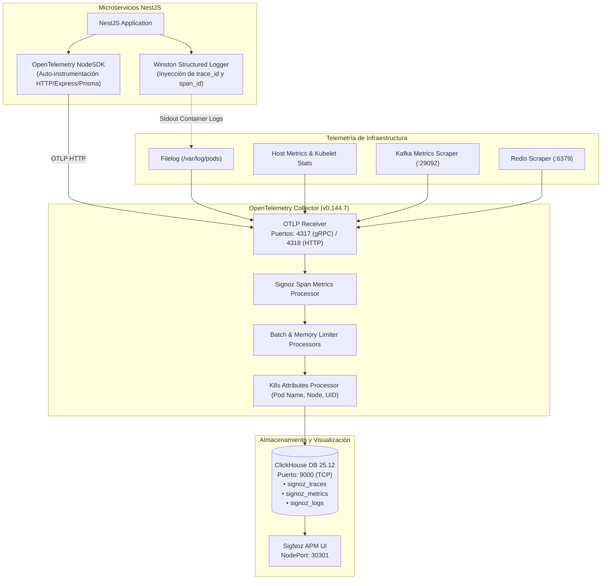

# Observabilidad: OpenTelemetry, SigNoz y ClickHouse

Este documento detalla la arquitectura de observabilidad integral (APM) de **FinTech Wallet**, la instrumentación del SDK de **OpenTelemetry**, la correlación de logs estructurados con trazas distribuidas, los pipelines del **OpenTelemetry Collector**, el almacenamiento columnar en **ClickHouse** y la visualización en **SigNoz UI**.

---

## 📑 Contenido

1. [Arquitectura del Pipeline de Telemetría](#1-arquitectura-del-pipeline-de-telemetría)
2. [Instrumentación en NestJS (OpenTelemetry SDK)](#2-instrumentación-en-nestjs-opentelemetry-sdk)
3. [Correlación de Logs con Winston y TraceID](#3-correlación-de-logs-con-winston-y-traceid)
4. [Configuración del OpenTelemetry Collector](#4-configuración-del-opentelemetry-collector)
   - [Receivers (Receptores)](#receivers-receptores)
   - [Processors (Procesadores)](#processors-procesadores)
   - [Exporters (Exportadores)](#exporters-exportadores)
   - [Pipelines Activos](#pipelines-activos)
5. [Almacenamiento Columnar en ClickHouse 25.12](#5-almacenamiento-columnar-en-clickhouse-2512)
6. [Visualización en SigNoz APM UI](#6-visualización-en-signoz-apm-ui)
7. [Verificación y Diagnóstico de Telemetría Activa](#7-verificación-y-diagnóstico-de-telemetría-activa)

---

## 1. Arquitectura del Pipeline de Telemetría

El ecosistema captura las tres señales fundamentales de observabilidad (**Trazas**, **Métricas** y **Logs**) de manera desacoplada:



---

## 2. Instrumentación en NestJS (OpenTelemetry SDK)

Para asegurar que los módulos de HTTP, Express y Prisma capturen todas las operaciones desde el inicio, la telemetría se inicializa en el archivo `main.ts` **antes** de importar o arrancar el módulo raíz de NestJS:

```typescript
// backend-nestjs/<servicio>/src/main.ts
import { startTelemetry, createWinstonLogger } from './infrastructure/telemetry';

// 1. Inicializar telemetría ANTES de instanciar NestFactory
startTelemetry();

import { NestFactory } from '@nestjs/core';
import { AppModule } from './app.module';

async function bootstrap() {
  const app = await NestFactory.create(AppModule, {
    logger: createWinstonLogger(), // 2. Usar logger correlacionado
  });
  // ...
}
bootstrap();
```

### Configuración del `NodeSDK`:

* **Recurso Semántico**: Asigna `service.name` (desde `OTEL_SERVICE_NAME`), versión y metadatos del clúster.
* **Exportador de Trazas**: `OTLPTraceExporter` apuntando a `http://otel-collector.fintech.svc.cluster.local:4318/v1/traces`.
* **Exportador de Métricas**: `OTLPMetricExporter` con `PeriodicExportingMetricReader` cada 15 segundos.
* **Auto-instrumentaciones**: Captura llamadas entrantes HTTP, consultas a base de datos Prisma ORM y operaciones de red.

---

## 3. Correlación de Logs con Winston y TraceID

El adaptador de logging (`createWinstonLogger`) intercepta cada registro e inyecta dinámicamente el contexto activo de OpenTelemetry:

```json
{
  "timestamp": "2026-08-17T12:00:00.123Z",
  "level": "info",
  "message": "Transferencia id=104 procesada exitosamente",
  "context": "TransferMoneyCommandHandler",
  "trace_id": "4bf92f3577b34da6a3ce929d0e0e4736",
  "span_id": "00f067aa0ba902b7",
  "service.name": "transaction-service"
}
```

Al inspeccionar una traza en SigNoz, la plataforma enlaza automáticamente todos los logs asociados gracias al `trace_id` compartido.

---

## 4. Configuración del OpenTelemetry Collector

Definido en el ConfigMap `otel-collector-config` de `k8s/04-observability.yaml`:

### Receivers (Receptores)
* `otlp`: Recibe trazas y métricas vía gRPC (`0.0.0.0:4317`) y HTTP (`0.0.0.0:4318` con soporte CORS).
* `kafkametrics`: Monitorea brokers, tópicos y lag de consumidores en `kafka:29092`.
* `redis`: Extrae métricas de consumo de memoria y comandos en `redis:6379`.
* `k8s_cluster` y `kubeletstats`: Recolecta métricas de estado de Pods, nodos y asignación de CPU/RAM.
* `hostmetrics`: Recolecta carga, CPU, memoria, disco y red del nodo.
* `filelog`: Recolecta logs de contenedores directamente desde `/var/log/pods/*/*/*.log`.

### Processors (Procesadores)
* `batch`: Agrupa eventos (batch size: 10000, timeout: 1s) para optimizar escrituras en ClickHouse.
* `memory_limiter`: Protege el Collector contra sobrecargas (límite: 75% de RAM).
* `k8sattributes`: Enriquece trazas y métricas con metadatos de Kubernetes (`k8s.pod.name`, `k8s.namespace.name`, `k8s.node.name`).
* `signozspanmetrics`: Genera histogramas de latencia y métricas RED (Rate, Errors, Duration) a partir de los spans.

### Exporters (Exportadores)
* `clickhousetraces`: Exporta trazas a `tcp://clickhouse:9000/signoz_traces`.
* `signozclickhousemetrics`: Exporta métricas a `tcp://clickhouse:9000/signoz_metrics`.
* `clickhouselogsexporter`: Exporta logs estructurados a `tcp://clickhouse:9000/signoz_logs`.

### Pipelines Activos
* **Traces**: `otlp` -> `signozspanmetrics` -> `k8sattributes` -> `memory_limiter` -> `batch` -> `clickhousetraces`
* **Metrics**: `otlp`, `kubeletstats`, `hostmetrics`, `kafkametrics`, `redis`, `k8s_cluster` -> `k8sattributes` -> `memory_limiter` -> `batch` -> `signozclickhousemetrics`
* **Logs**: `otlp`, `filelog`, `k8s_events` -> `k8sattributes` -> `memory_limiter` -> `batch` -> `clickhouselogsexporter`

---

## 5. Almacenamiento Columnar en ClickHouse 25.12

ClickHouse opera como StatefulSet (`clickhouse`) con volumen de 5 GiB:

* Las migraciones iniciales de esquemas y tablas son ejecutadas automáticamente por el Job de Kubernetes `signoz-migrator` antes del arranque del Collector y la interfaz UI.

---

## 6. Visualización en SigNoz APM UI

La consola web de SigNoz está expuesta mediante el servicio NodePort en el puerto `30301`:

* **URL de Acceso**: [http://localhost:30301/](http://localhost:30301/)

### Capacidades del Dashboard:
1. **Service Map**: Mapa dinámico de dependencias entre `frontend`, `auth-service`, `user-service`, `transaction-service`, `notification-service` y `worker-service`.
2. **Traces Explorer**: Búsqueda detallada de solicitudes por duración, código de estado HTTP o `trace_id`.
3. **Métricas RED**: Tasas de peticiones por segundo, porcentajes de error y percentiles de latencia (P50, P90, P99).
4. **Logs Viewer**: Explorador centralizado de logs con filtros por servicio y correlación directa a trazas.

---

## 7. Verificación y Diagnóstico de Telemetría Activa

Para validar que los microservicios están emitiendo telemetría y que ClickHouse la está persistiendo correctamente:

### 1. Ejecutar Script de Diagnóstico de Telemetría

```powershell
.\scripts\test-signoz-telemetry.ps1
```

### 2. Consultar Tablas Directamente en ClickHouse

```bash
# Comprobar el conteo de trazas almacenadas
kubectl exec -it -n fintech clickhouse-0 -- clickhouse-client \
  --query "SELECT count() FROM signoz_traces.signoz_index_v2;"

# Comprobar el conteo de logs estructurados
kubectl exec -it -n fintech clickhouse-0 -- clickhouse-client \
  --query "SELECT count() FROM signoz_logs.logs;"
```

### 3. Verificar Logs del OpenTelemetry Collector

```bash
kubectl logs -n fintech -l app=otel-collector --tail=50
```

Para validar el rendimiento y generar carga observable en SigNoz, consulta la [Guía de Testing y Benchmarking](testing.md).
