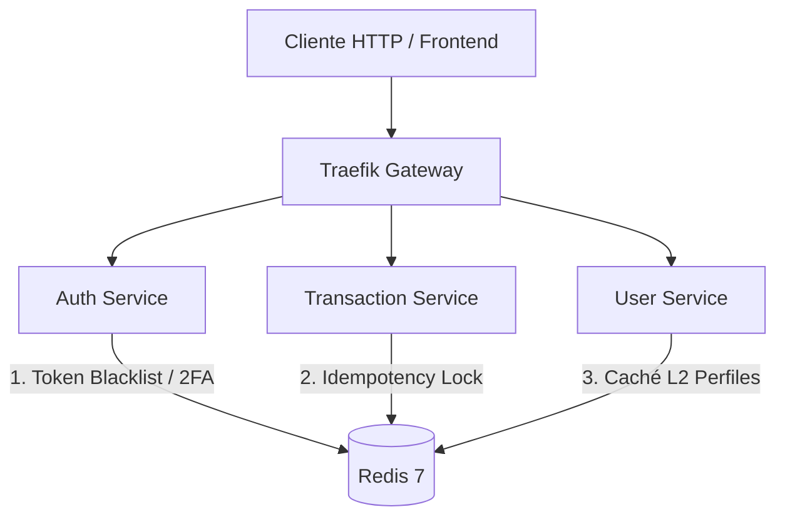

# Almacenamiento en Memoria e Idempotencia con Redis 7 ⚡

Este documento describe la arquitectura de caché en memoria, control de idempotencia y revocación de seguridad basada en **Redis 7** en **FinTech Wallet**.

---

## 1. Rol de Redis 7 en la Arquitectura

Redis opera como una capa de almacenamiento en memoria de ultra-alta velocidad (sub-milisegundo) que cumple tres funciones críticas en la plataforma:



---

## 2. Idempotencia Durable (Redis + PostgreSQL)

### ¿Por qué es necesaria la Idempotencia Financiera?
En redes móviles o llamadas HTTP inestables, un usuario o cliente puede presionar el botón "Transferir" dos veces, o la red puede reintentar una petición `POST /transactions/transfer`. Sin idempotencia, esto provocaría un **doble débito** en la billetera del usuario.

### El Flujo de Idempotencia
1. El cliente envía el encabezado HTTP: `X-Idempotency-Key: TX-882910-AAA`.
2. `transaction-service` consulta a Redis usando la clave `idempotency:TX-882910-AAA`.
3. Si la clave **ya existe**:
   - Redis devuelve el resultado previo inmediatamente sin volver a ejecutar la transacción.
   - Si la clave está bloqueada en procesamiento, retorna `HTTP 400 Bad Request: Concurrent request in progress`.
4. Si la clave **no existe**:
   - Se adquiere un Lock atómico en Redis (`SET key IN_PROGRESS NX EX 30`).
   - Se ejecuta la transferencia en PostgreSQL (`postgres-core` vía `pgbouncer-core`).
   - Al finalizar, se almacena el resultado en Redis con un **TTL de 24 horas** (`86400` segundos) y se respalda de forma durable en la tabla PostgreSQL `idempotency_records`.

```typescript
// Ejemplo de implementación en idempotency.service.ts
async registerKey(key: string, payload: any): Promise<boolean> {
  const redisKey = `idempotency:${key}`;
  const success = await this.redisClient.set(
    redisKey,
    JSON.stringify(payload),
    'NX',  // Only set if Not Exists
    'EX',  // Expiration in seconds
    86400  // 24 Hours TTL
  );
  return success === 'OK';
}
```

---

## 3. JWT Blacklist (Revocación Instantánea de Sesión)

Por naturaleza, los tokens **JWT (JSON Web Tokens)** son apátridas (*stateless*) y no se pueden anular antes de su tiempo de expiración. 

Para permitir un cierre de sesión seguro (*Logout*):
1. `auth-service` extrae el `jti` (JWT ID) o la firma del token al recibir `POST /auth/logout`.
2. Agrega la clave `blacklist:<token_jti>` en Redis con un TTL igual al tiempo de vida restante del JWT.
3. El middleware de autenticación valida en cada petición entrante que el token no resida en la lista negra de Redis.

---

## 4. Caché L2 de Perfiles y Saldos

Para optimizar lecturas masivas del perfil de usuario y saldos sin saturar la base de datos MySQL `userdb`:
- `user-service` almacena la entidad `UserProfile` en la clave `user:profile:<userId>` con un TTL de **5 minutos**.
- Al recibir una solicitud `GET /users/profile/:id`, se busca primero en Redis (**Cache Hit**). Si no existe (**Cache Miss**), lee de MySQL y actualiza Redis.
- Cuando ocurre una actualización de saldo o datos personales, se invalida proactivamente la clave en Redis.
