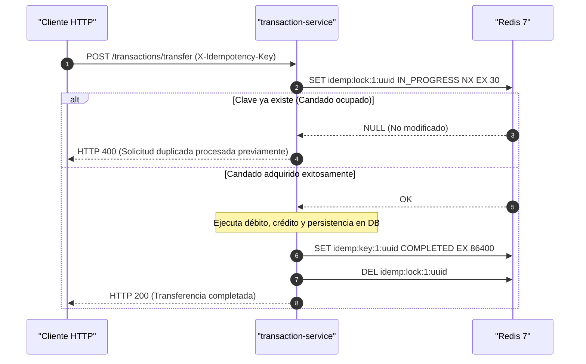

# Redis: Caché en Memoria, Idempotencia y Sesiones

Este documento describe la arquitectura, configuración y casos de uso de **Redis 7** en **FinTech Wallet**, detallando los patrones de clave, políticas de expiración (TTL) y comandos de inspección en el clúster de Kubernetes.

---

## 📑 Contenido

1. [Arquitectura y Despliegue de Redis](#1-arquitectura-y-despliegue-de-redis)
2. [Matriz de Claves, Patrones y TTL](#2-matriz-de-claves-patrones-y-ttl)
3. [Casos de Uso en Microservicios](#3-casos-de-uso-en-microservicios)
   - [Idempotencia y Bloqueo Distribuido (`transaction-service`)](#idempotencia-y-bloqueo-distribuido-transaction-service)
   - [Lista Negra de Tokens JWT (`auth-service`)](#lista-negra-de-tokens-jwt-auth-service)
   - [Caché L2 de Perfiles (`user-service`)](#caché-l2-de-perfiles-user-service)
4. [Inspección y Diagnóstico con `redis-cli`](#4-inspección-y-diagnóstico-con-redis-cli)

---

## 1. Arquitectura y Despliegue de Redis

Redis se ejecuta como un **StatefulSet** en Kubernetes (`redis`) con almacenamiento persistente para garantizar durabilidad de claves críticas:

* **Imagen**: `redis:7-alpine`
* **Puerto**: `6379` (ClusterIP: `redis.fintech.svc.cluster.local:6379`)
* **Límites de Memoria**: `--maxmemory 256mb` con política de desalojo `--maxmemory-policy volatile-lru` (expulsa primero las claves menos usadas recientemente que tengan un TTL configurado).
* **Persistencia**: Volumen PVC de 1 GiB (`redis-data` con storageClassName `local-path`).
* **Seguridad de Contenedor**: Ejecución sin privilegios (`runAsUser: 999`, `allowPrivilegeEscalation: false`, `drop: ALL`).

---

## 2. Matriz de Claves, Patrones y TTL

| Caso de Uso | Patrón de Clave (Key Pattern) | Tipo de Dato | TTL (Tiempo de Vida) | Microservicio Propietario |
| :--- | :--- | :--- | :--- | :--- |
| **Candado de Idempotencia** | `idemp:lock:<userId>:<key>` | String | `30 segundos` | `transaction-service` |
| **Registro de Idempotencia**| `idemp:key:<userId>:<key>` | String | `24 horas` (86400s) | `transaction-service` |
| **Token JWT Revocado** | `jwt:blacklist:<token>` | String | Tiempo restante del token | `auth-service` |
| **Caché de Perfil de Usuario**| `user:cache:<id>` | JSON / String | `1 hora` (3600s) | `user-service` |

---

## 3. Casos de Uso en Microservicios

### Idempotencia y Bloqueo Distribuido (`transaction-service`)

Para evitar la doble ejecución de transferencias bajo condiciones de concurrencia elevada o reintentos del cliente HTTP:



### Lista Negra de Tokens JWT (`auth-service`)

Al realizar un cierre de sesión o cambio de contraseña, el token JWT activo es revocado de forma inmediata:

1. `auth-service` calcula los segundos restantes hasta la fecha de expiración (`exp`) del token.
2. Ejecuta `SET jwt:blacklist:<token> "REVOKED" EX <segundos_restantes>`.
3. Cualquier solicitud posterior que presente ese token es rechazada por el guard con **HTTP 401 Unauthorized**.

### Caché L2 de Perfiles (`user-service`)

Las consultas de perfil por ID o email son almacenadas temporalmente en Redis para aliviar el tráfico de lectura sobre la base de datos `userdb`:

* Al actualizar saldo o límites, la clave `user:cache:<id>` se invalida automáticamente (`DEL`).

---

## 4. Inspección y Diagnóstico con `redis-cli`

Puedes inspeccionar el contenido de Redis directamente dentro del pod de Kubernetes:

```bash
# 1. Comprobar salud del servidor Redis
kubectl exec -it -n fintech redis-0 -- redis-cli ping
# Salida esperada: PONG

# 2. Listar todas las claves activas
kubectl exec -it -n fintech redis-0 -- redis-cli keys "*"

# 3. Consultar claves de idempotencia específicas
kubectl exec -it -n fintech redis-0 -- redis-cli keys "idemp:*"

# 4. Verificar el TTL restante de una clave (en segundos)
kubectl exec -it -n fintech redis-0 -- redis-cli ttl "idemp:key:1:tx-uuid-123"

# 5. Obtener el valor de una clave
kubectl exec -it -n fintech redis-0 -- redis-cli get "idemp:key:1:tx-uuid-123"

# 6. Inspeccionar consumo de memoria y estadísticas
kubectl exec -it -n fintech redis-0 -- redis-cli info memory
```

Para comprender el flujo de mensajería asíncrona complementario a Redis, consulta la guía de [Apache Kafka](kafka.md).
