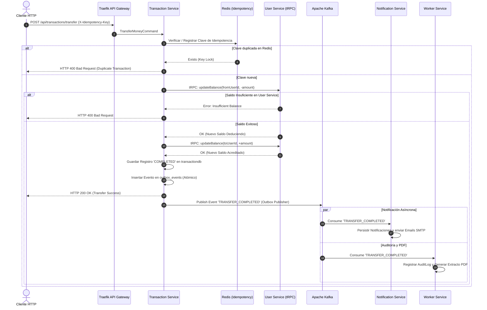

# Patrón SAGA y CQRS en FinTech Wallet 🔄

Este documento explica la implementación de transacciones distribuidas mediante el **Patrón SAGA** y el patrón **CQRS (Command Query Responsibility Segregation)** dentro del sistema microservicios **FinTech Wallet**.

---

## 1. El Problema de las Transacciones Distribuidas en Microservicios

En una arquitectura monolítica tradicional, una transferencia de dinero entre dos usuarios se ejecuta en un único bloque transaccional ACID SQL (`BEGIN TRANSACTION ... COMMIT`). 

En nuestra arquitectura de microservicios con **Database-per-Service**:
- `auth-service` administra `authdb`.
- `user-service` administra `userdb` (saldos de cuenta).
- `transaction-service` administra `transactiondb` (historial de transferencias e idempotencia).
- `notification-service` administra `notificationdb`.

No es viable utilizar un protocolo de commit en dos fases (**2PC / Two-Phase Commit**) debido al bloqueo de tablas en red, alto acoplamiento y falta de tolerancia a fallos. La solución es el **Patrón SAGA**.

---

## 2. ¿Qué es el Patrón SAGA?

El **Patrón SAGA** es una secuencia de transacciones locales. Cada transacción local actualiza los datos dentro de un solo microservicio y publica un evento o mensaje. Los otros servicios escuchan el evento y ejecutan su propia transacción local.

### Coreografía vs Orquestación

| Característica | SAGA por Coreografía (Implementado) | SAGA por Orquestación |
| :--- | :--- | :--- |
| **Coordinador** | Sin punto central de falla. Cada servicio reacciona a eventos. | Un orquestador central dirige la secuencia. |
| **Acoplamiento** | Muy bajo. Desacoplado vía Apache Kafka. | Moderado. El orquestador conoce todos los flujos. |
| **Complejidad** | Ideal para flujos de 2 a 4 pasos de negocio. | Ideal para flujos de decenas de pasos complejos. |

En **FinTech Wallet**, utilizamos **SAGA por Coreografía + Transactional Outbox**.

---

## 3. Flujo de Transacción SAGA en Transferencias de Dinero



---

## 4. Transacciones de Compensación (Compensating Actions)

Si la segunda fase de una SAGA falla (por ejemplo, el debito del emisor fue exitoso pero el crédito al receptor falló por cuenta bloqueada), la SAGA ejecuta una **Acción de Compensación**:

1. **Acción Principal**: Debitar $\$100$ de Usuario A.
2. **Falla**: Falla acreditación a Usuario B.
3. **Acción de Compensación**: Acreditar $\$100$ de vuelta al Usuario A (`updateBalance(fromUserId, +amount)`).
4. **Registro de Estado**: Se marca la transacción como `FAILED` en `transactiondb` y se publica el evento `TRANSFER_FAILED` a Kafka.

---

## 5. Arquitectura CQRS con `@nestjs/cqrs`

En `transaction-service`, aplicamos el patrón **CQRS (Command Query Responsibility Segregation)** para separar operaciones de escritura y lectura:

- **Commands (Escritura)**: Modifican el estado del sistema.
  - `TransferMoneyCommand`: Procesa la transferencia y valida idempotencia.
  - `CreateMoneyRequestCommand`: Genera una solicitud de cobro entre usuarios.
- **Queries (Lectura)**: Consultan vistas optimizadas sin efectos secundarios.
  - `GetTransactionHistoryQuery`: Obtiene el historial de transferencias.
  - `GetUserTransactionsQuery`: Obtiene transacciones asociadas a un usuario.

### Estructura en Código NestJS
```text
src/application/
├── commands/
│   ├── transfer-money.command.ts
│   └── transfer-money.handler.ts    # @CommandHandler(TransferMoneyCommand)
└── queries/
    ├── get-transaction-history.query.ts
    └── get-transaction-history.handler.ts # @QueryHandler(GetTransactionHistoryQuery)
```
