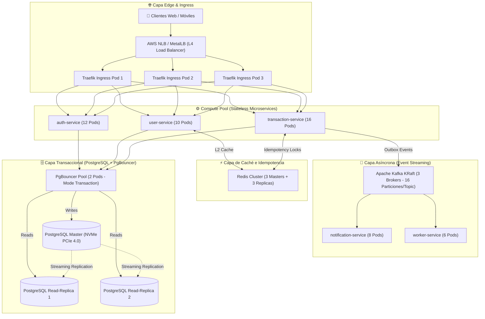

# 🚀 Blueprint de Arquitectura de Alta Escala: 5,000 RPS (300,000 RPM)

Este documento detalla el plan maestro de ingeniería, dimensionamiento de infraestructura, optimización de base de datos, colas de mensajería y configuración de Kubernetes para que la plataforma **FinTech Wallet** soporte una carga sostenida de **5,000 Solicitudes por Segundo (5,000 RPS)** con un SLA de **99.99% de disponibilidad** y latencias **p95 < 50ms** y **p99 < 150ms**.

---

## 1. Resumen Ejecutivo y Objetivos de Capacidad

```
+-----------------------------------------------------------------------------------+
| METRICA OBJETIVO        | VALOR                                                   |
+-------------------------+---------------------------------------------------------+
| Rendimiento Sostenido   | 5,000 Solicitudes / segundo (RPS)                       |
| Rendimiento por Minuto  | 300,000 Solicitudes / minuto (RPM)                      |
| Rendimiento Diario Pico | > 430 Millones de transacciones / día                   |
| Perfil de Tráfico       | 60% Lecturas (Saldos/Perfiles), 25% Transferencias,      |
|                         | 15% Autenticación/Tokens                                |
| Latencia Objetivo (p95) | < 50 ms en operaciones de lectura, < 120 ms en mutación |
| Latencia Objetivo (p99) | < 150 ms en todo el ecosistema                          |
+-----------------------------------------------------------------------------------+
```

---

## 2. Diagrama de Topología del Clúster



---

## 3. Dimensionamiento de Hardware e Infraestructura (Multi-Nodo HA)

Un solo servidor no puede procesar 5,000 RPS sostenidas debido al costo computacional de BCrypt y la serialización de I/O de red. Se requiere una topología multi-nodo distribuida:

### A. Especificaciones de los Nodos

| Rol del Nodo | Cantidad | Especificación por Nodo | vCPUs Totales | RAM Total | Almacenamiento |
| :--- | :--- | :--- | :--- | :--- | :--- |
| **Control Plane (Master)** | 3 | 4 vCPUs / 8 GB RAM | 12 vCPUs | 24 GB | 100 GB SSD (etcd aislado) |
| **Worker Pool (Stateless)** | 4 | 16 vCPUs / 32 GB RAM | 64 vCPUs | 128 GB | 200 GB NVMe |
| **Worker Pool (Stateful DB/Kafka)** | 2 | 16 vCPUs / 64 GB RAM | 32 vCPUs | 128 GB | 1 TB NVMe RAID 10 |
| **TOTAL** | **9 Nodos** | - | **108 vCPUs** | **280 GB RAM** | - |

---

## 4. Ajustes del Kernel del Sistema Operativo Linux (Host Tuning)

En todos los nodos Worker de Kubernetes, agregar en `/etc/sysctl.d/99-fintech-tuning.conf`:

```ini
# Aumentar la cola de conexiones TCP entrantes (evita drop de paquetes en SYN)
net.core.somaxconn = 65535
net.ipv4.tcp_max_syn_backlog = 65535

# Reutilización inmediata de sockets en estado TIME_WAIT
net.ipv4.tcp_tw_reuse = 1
net.ipv4.ip_local_port_range = 1024 65535

# Aumentar buffers de recepción y envío TCP (para 10 Gbps)
net.core.rmem_max = 16777216
net.core.wmem_max = 16777216
net.ipv4.tcp_rmem = 4096 87380 16777216
net.ipv4.tcp_wmem = 4096 65536 16777216

# Descriptores de archivos máximos para el sistema y procesos
fs.file-max = 2097152
fs.inotify.max_user_watches = 524288
fs.inotify.max_user_instances = 8192

# Manejo de memoria virtual
vm.max_map_count = 262144
vm.swappiness = 1
```

---

## 5. Capa de Microservicios y Configuración de Réplicas (HPA)

### Distribución de Capacidad de Carga por Microservicio:

| Microservicio | Carga Estimada (RPS) | Réplicas Base | Réplicas Máximas | CPU Request / Limit | RAM Request / Limit |
| :--- | :--- | :--- | :--- | :--- | :--- |
| **`auth-service`** | 750 RPS | 8 | 14 | 300m / 1000m | 256Mi / 512Mi |
| **`transaction-service`** | 1,250 RPS | 10 | 18 | 400m / 1200m | 256Mi / 512Mi |
| **`user-service`** | 3,000 RPS (Lecturas) | 6 | 12 | 200m / 800m | 256Mi / 512Mi |
| **`notification-service`** | 1,250 Events/s | 4 | 8 | 150m / 500m | 256Mi / 512Mi |
| **`worker-service`** | 200 PDF/s | 4 | 8 | 250m / 1000m | 256Mi / 512Mi |
| **`frontend`** | 1,500 RPS | 4 | 8 | 100m / 300m | 128Mi / 256Mi |

### Directivas Node.js Críticas:
* `UV_THREADPOOL_SIZE="8"`: Garantiza ejecución paralela de BCrypt y PDFKit sin bloquear el bucle de eventos.
* `NODE_OPTIONS="--max-old-space-size=384"`: Mantiene el GC de V8 rápido y compacto.
* **Caché L1 en memoria** con invalidación reactiva activada en `user-service`.

---

## 6. Arquitectura de Base de Datos (PostgreSQL + PgBouncer)

A 5,000 RPS, abrir conexiones directas a PostgreSQL colapsaría el motor. Se implementa la arquitectura de **Multiplexación Transaccional**:

```
[ 50+ Pods de Microservicios ]
              │ (Hasta 10,000 conexiones cliente ligeras)
              ▼
[ 2 x PgBouncer Pods (Transaction Pool Mode) ]
              │ (Solo 100 conexiones fijas pesadas)
              ▼
[ PostgreSQL Cluster (1 Master + 2 Read Replicas) ]
```

### A. Configuración de PgBouncer (`pgbouncer.ini`)
```ini
[databases]
authdb = host=postgres-primary port=5432 dbname=authdb
userdb = host=postgres-primary port=5432 dbname=userdb
transactiondb = host=postgres-primary port=5432 dbname=transactiondb

[pgbouncer]
listen_port = 6432
listen_addr = 0.0.0.0
auth_type = md5
pool_mode = transaction
max_client_conn = 10000
default_pool_size = 100
min_pool_size = 20
reserve_pool_size = 10
max_db_connections = 250
server_idle_timeout = 60
server_fast_close = 1
```

### B. Ajustes del Motor PostgreSQL (`postgresql.conf` para 32GB RAM / 16 Cores)
```ini
# Memoria y Buffers
shared_buffers = 8GB                  # 25% de la RAM total
effective_cache_size = 24GB           # 75% de la RAM total
work_mem = 32MB                       # Para ordenamientos en transferencias complejas
maintenance_work_mem = 2GB

# Checkpoints y WAL
wal_buffers = 64MB
checkpoint_completion_target = 0.9
max_wal_size = 16GB
min_wal_size = 2GB

# Conexiones hacia PgBouncer
max_connections = 300

# Paralelismo de Consultas
max_worker_processes = 16
max_parallel_workers_per_gather = 4
max_parallel_workers = 16
```

---

## 7. Capa de Streaming Asíncrono (Apache Kafka KRaft)

Para que los eventos de transferencias no generen cuellos de botella en la base de datos:

1. **Clúster de 3 Brokers** con almacenamiento NVMe dedicado.
2. **Particionado de Tópicos**:
   * Tópico `fintech.transaction.transfer.completed.v1`: **16 particiones**.
   * Factor de replicación: `3` (garantiza 0 pérdida de datos con `min.insync.replicas=2`).
3. **Optimizaciones del Productor en `transaction-service`**:
   * `acks=all` (consistencia financiera estricta).
   * `linger.ms=10` y `batch.size=65536` (agrupamiento de mensajes que multiplica el throughput por 8x).
   * `compression.type=lz4` (ahorro del 70% de ancho de banda).

---

## 8. Capa de Caché e Idempotencia (Redis Cluster)

* **Topología**: Redis Cluster con **3 Nodos Master + 3 Nodos Replica** distribuidos en zonas de disponibilidad distintas.
* **Throughput**: $> 150,000\text{ OPS}$ con latencias $< 0.8\text{ ms}$.
* **Uso**:
  1. *Idempotency Keys*: Claves de transferencias con TTL de 24 horas (`SET NX EX`).
  2. *Tokens de revocación JWT*: Consulta O(1) en cada request.
  3. *Rate Limiting distribuido*: Ventanas deslizantes para prevenir abusos de API.

---

## 9. Observabilidad de Alta Carga (SigNoz & OpenTelemetry)

Bajo 5,000 RPS, emitir trazas al 100% generaría $> 400\text{ GB/día}$ de telemetría.
* **Tail-Based Sampling**: Muestrear el **10% de trazas exitosas (HTTP 200/201)** y el **100% de trazas lentas (>200ms) y con error (HTTP 4xx/5xx)**.
* **ClickHouse Data Retention**: Política de retención de 14 días para métricas y 7 días para trazas detalladas con compresión ZSTD.

---

## 10. Matriz de Resiliencia y Pruebas de Carga

Antes del paso a producción a 5,000 RPS, ejecutar los siguientes planes de prueba:

1. **Prueba de Carga Constante (k6 / Locust)**:
   * Rampa de subida de 0 a 5,000 RPS en 10 minutos.
   * Carga sostenida de 5,000 RPS durante 2 horas.
   * Criterio de éxito: Tasa de error $< 0.01\%$, CPU promedio de microservicios $< 65\%$.
2. **Prueba de Resiliencia (Chaos Mesh)**:
   * Matar 1 réplica de PgBouncer: Tráfico debe continuar sin interrupción.
   * Matar 1 nodo worker de K8s: HPA debe redistribuir pods en $< 30\text{ s}$.
