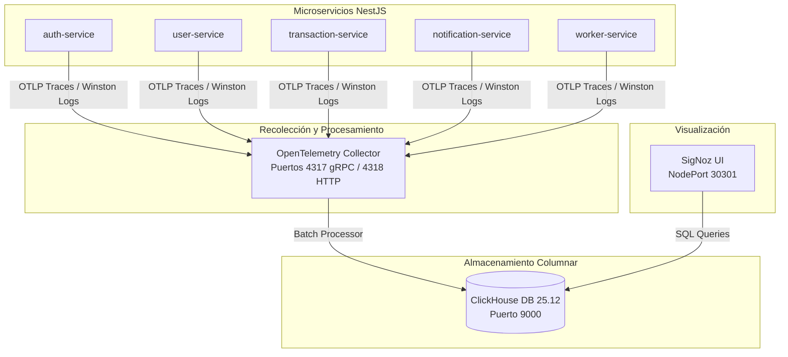

# Suite de Observabilidad SigNoz y OpenTelemetry 📊

Este documento describe la arquitectura de observabilidad integral (Trazas, Métricas y Logs) implementada en **FinTech Wallet** mediante **OpenTelemetry (OTLP)**, **ClickHouse DB** y **SigNoz UI**.

---

## 1. Arquitectura de Observabilidad

La observabilidad nos permite inspeccionar el comportamiento interno del sistema en tiempo real. La suite está compuesta por tres capas principales:



---

## 2. Los Tres Pilares de Observabilidad

### 1. Trazas Distribuidas (Distributed Tracing)
Permite visualizar el ciclo de vida completo de una solicitud del cliente a través de múltiples microservicios:
- **`trace_id`**: Identificador único global de 128 bits asignado a la petición inicial en `auth-service` o `transaction-service`.
- **Propagación de Contexto (W3C Trace Context)**: El `trace_id` se propaga automáticamente en las cabeceras HTTP de tRPC (`traceparent`) y en los headers de mensajes de Apache Kafka (`correlationId`).
- **Span Attributes**: Cada tramo captura el método HTTP, la consulta SQL a Prisma, los parámetros tRPC y el tiempo exacto de procesamiento en milisegundos.

### 2. Logs Estructurados Correlacionados (Winston OTLP)
Todos los microservicios utilizan el logger **Winston** configurado con el formateador OTLP JSON:
- Los logs inyectan automáticamente el `trace_id` y `span_id` activo.
- Inyectan metadatos nativos del nodo Kubernetes extraídos mediante el recurso `k8sattributes` de OpenTelemetry:
  ```json
  {
    "timestamp": "2026-08-13T14:30:00.000Z",
    "level": "info",
    "message": "Transferencia procesada exitosamente",
    "trace_id": "4f8b9e10a2c3d4e5",
    "span_id": "1a2b3c4d",
    "k8s.pod.name": "transaction-service-6789ab-cd",
    "k8s.namespace.name": "fintech",
    "service.name": "transaction-service"
  }
  ```

### 3. Métricas RED (Rate, Errors, Duration)
OpenTelemetry Collector calcula automáticamente métricas en tiempo real a partir de las trazas recibidas:
- **Rate**: Peticiones por segundo (RPS) atendidas por microservicio.
- **Errors**: Porcentaje de errores HTTP (status 4xx / 5xx) o excepciones no capturadas.
- **Duration**: Histograma de latencias P50, P95 y P99 (percentil 99).

---

## 3. Acceso y Uso de SigNoz UI

Para acceder al panel interactivo de SigNoz en entorno local:
- **URL**: **`http://localhost:30301`** (o IP del nodo en el puerto `30301`).

### Secciones Principales en SigNoz:
1. **Services / APM**: Muestra la lista de los 5 microservicios (`auth-service`, `user-service`, `transaction-service`, `notification-service`, `worker-service`), su tasa de peticiones, latencia p99 y porcentaje de error.
2. **Traces**: Buscador interactivo de trazas. Permite filtrar por `trace_id`, buscar peticiones lentas mayores a $500\text{ ms}$ o explorar la vista en cascada de llamadas tRPC y consultas MySQL.
3. **Logs**: Consola unificada de logs. Permite saltar directamente desde una traza específica a todos los logs emitidos durante la ejecución de esa solicitud.
4. **Dashboards**: Permite importar paneles personalizados pre-configurados.

---

## 4. Importación del Dashboard de FinTech Wallet

En la raíz del proyecto se encuentra el archivo de plantilla: **`signoz-nestjs-dashboard.json`**.

Para importar el dashboard en SigNoz UI:
1. Abre **`http://localhost:30301`** y dirígete al menú **Dashboards**.
2. Haz clic en el botón **New Dashboard** -> **Import JSON**.
3. Selecciona el archivo [`signoz-nestjs-dashboard.json`](file:///c:/dev/DevOps/fintech-wallet/signoz-nestjs-dashboard.json) del repositorio.
4. ¡Listo! Visualizarás métricas en tiempo real de transacciones, uso de CPU/RAM, consultas Prisma y eventos Kafka.
