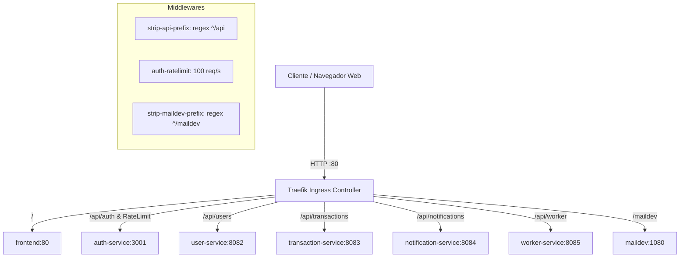

# Traefik API Gateway y Routing en Kubernetes 🚦

Este documento explica la configuración de **Traefik Ingress Controller** actuando como la puerta de entrada unificada (API Gateway) del sistema **FinTech Wallet**.

---

## 1. Rol de Traefik en la Arquitectura

Traefik es un **Ingress Controller** nativo y dinámico integrado en K3s / Rancher Desktop. Recibe todo el tráfico HTTP entrante desde los clientes en los puertos `80` y `443` y lo enruta hacia los servicios Kubernetes correspondientes dentro del namespace `fintech`.



---

## 2. Configuración de Middlewares Traefik

Los **Middlewares** de Traefik modifican o inspeccionan las peticiones HTTP antes de que lleguen a los microservicios backend.

### 1. `strip-api-prefix` (Limpieza de Ruta API)
Permite que el cliente consuma la API usando un prefijo unificado `/api/...`, pero le entrega la ruta limpia al controlador NestJS:
- **Petición del cliente**: `POST http://localhost/api/auth/login`
- **Ruta transformada enviada a `auth-service`**: `POST /auth/login`

```yaml
apiVersion: traefik.io/v1alpha1
kind: Middleware
metadata:
  name: strip-api-prefix
  namespace: fintech
spec:
  stripPrefixRegex:
    regex:
      - "^/api"
```

### 2. `auth-ratelimit` (Protección Rate Limiting)
Protege las rutas de autenticación e inicio de sesión contra ataques de denegación de servicio (DoS) o intentos masivos de fuerza bruta:
- **Tasa Promedio (`average`)**: 100 peticiones por segundo.
- **Ráfaga Máxima (`burst`)**: 50 peticiones consecutivas sin demora.

```yaml
apiVersion: traefik.io/v1alpha1
kind: Middleware
metadata:
  name: auth-ratelimit
  namespace: fintech
spec:
  rateLimit:
    average: 100
    burst: 50
```

---

## 3. Tabla de Rutas y Endpoints Expuestos

| Ruta Pública | Servicio Destino | Puerto K8s | Swagger UI / Documentación |
| :--- | :--- | :--- | :--- |
| `http://localhost/` | `frontend` | `80` | Aplicación Web React |
| `http://localhost/auth` | `auth-service` | `3001` | `http://localhost/auth/docs/` |
| `http://localhost/users` | `user-service` | `8082` | `http://localhost/users/docs/` |
| `http://localhost/transactions` | `transaction-service` | `8083` | `http://localhost/transactions/docs/` |
| `http://localhost/notifications` | `notification-service` | `8084` | `http://localhost/notifications/docs/` |
| `http://localhost/worker` | `worker-service` | `8085` | `http://localhost/worker/docs/` |
| `http://localhost/maildev` | `maildev` | `1080` | Interceptor de Correos SMTP |
| `http://traefik.localhost/` | `api@internal` | `Internal` | Dashboard de Traefik |

---

## 4. Acceso al Dashboard de Traefik

Traefik incluye un panel de control interactivo para visualizar todos los Routers, Middlewares y Services activos.

Para acceder al dashboard en entorno local:
1. Agrega a tu archivo `hosts` (`C:\Windows\System32\drivers\etc\hosts`):
   ```text
   127.0.0.1 traefik.localhost
   ```
2. Navega en tu navegador a: **`http://traefik.localhost/dashboard/`**
