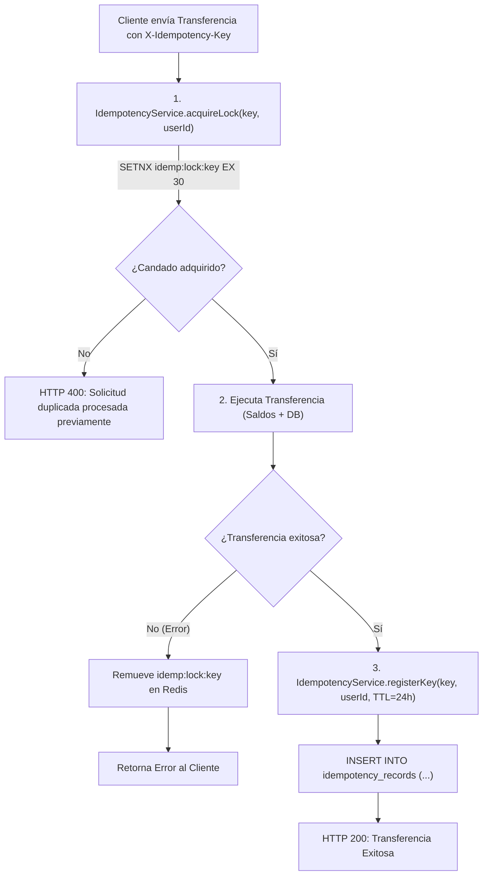
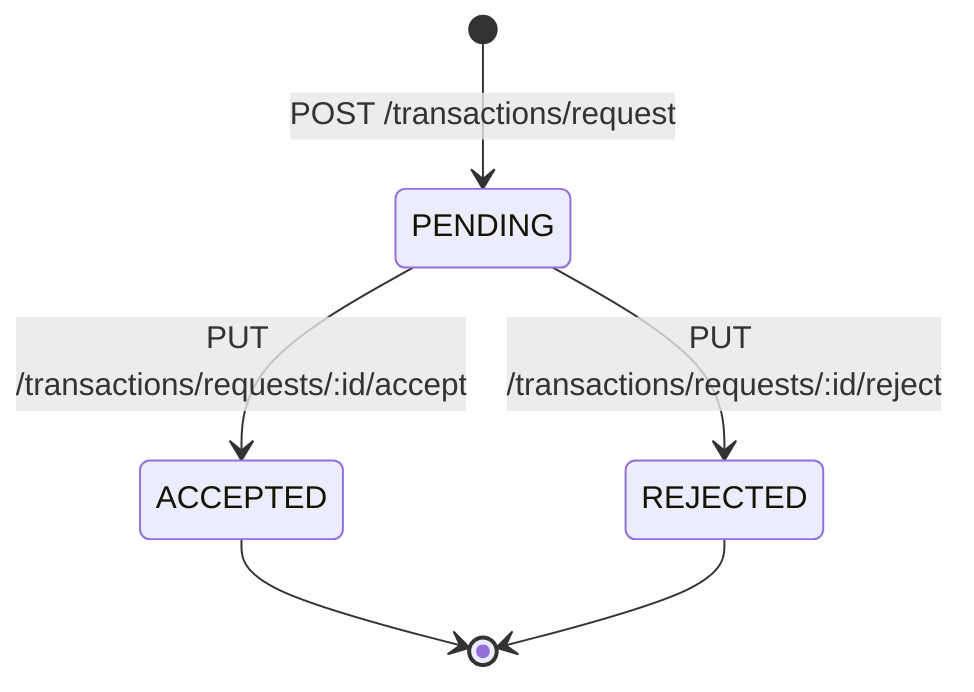

# Transacciones, CQRS, SAGA e Idempotencia

Este documento detalla el motor transaccional de **FinTech Wallet**, la arquitectura CQRS, los mecanismos de idempotencia distribuida, la orquestación SAGA con compensación atómica de saldos, el ciclo de vida de las solicitudes de dinero y la publicación de eventos mediante el Transactional Outbox Pattern.

---

## 📑 Contenido

1. [Modelo Transaccional](#1-modelo-transaccional)
2. [Implementación de CQRS (Command & Query Responsibility Segregation)](#2-implementación-de-cqrs-command--query-responsibility-segregation)
3. [Garantía de Idempotencia Distribuida](#3-garantía-de-idempotencia-distribuida)
   - [Candado Pesimista en Redis (`idemp:lock:*`)](#candado-pesimista-en-redis-idemplock)
   - [Registro de Operación Completada (`idemp:key:*`)](#registro-de-operación-completada-idempkey)
   - [Persistencia en Base de Datos (`idempotency_records`)](#persistencia-en-base-de-datos-idempotency_records)
4. [Flujo de una Transferencia y Compensación SAGA](#4-flujo-de-una-transferencia-y-compensación-saga)
5. [Solicitudes de Dinero (Money Requests)](#5-solicitudes-de-dinero-money-requests)
6. [Patrón Transactional Outbox y Event Streaming](#6-patrón-transactional-outbox-y-event-streaming)

---

## 1. Modelo Transaccional

El procesamiento financiero en `transaction-service` cumple con las propiedades ACID a nivel de base de datos local y garantiza **Consistencia Eventual** en el sistema distribuido:

* **Separación de Escritura y Lectura (CQRS)**: Las mutaciones transaccionales se procesan mediante comandos (`CommandBus`), mientras que las consultas de historial se resuelven mediante consultas optimizadas (`QueryBus`).
* **Comunicación Tipada de Saldo**: La consulta y modificación de balance en `user-service` se realiza mediante **tRPC** sobre HTTP para minimizar latencias y garantizar tipado estricto.
* **Tolerancia a Duplicados**: El encabezado HTTP `X-Idempotency-Key` previene dobles débitos o ejecuciones duplicadas en caso de reintentos del cliente o fluctuaciones de red.

---

## 2. Implementación de CQRS

El servicio utiliza el paquete `@nestjs/cqrs` para desacoplar el flujo de comandos (escrituras) del flujo de queries (lecturas):

```text
                                  ┌──────────────────────────────────────────────┐
                                  │            TransactionController             │
                                  └──────────────────────┬───────────────────────┘
                                                         │
                                ┌────────────────────────┴────────────────────────┐
                                │                                                 │
                                ▼                                                 ▼
                ┌───────────────────────────────┐                 ┌───────────────────────────────┐
                │          COMMAND BUS          │                 │           QUERY BUS           │
                ├───────────────────────────────┤                 ├───────────────────────────────┤
                │ TransferMoneyCommand          │                 │ GetTransactionHistoryQuery    │
                └───────────────┬───────────────┘                 └───────────────┬───────────────┘
                                │                                                 │
                                ▼                                                 ▼
                ┌───────────────────────────────┐                 ┌───────────────────────────────┐
                │  TransferMoneyCommandHandler  │                 │ GetTxHistoryQueryHandler      │
                │ • Idempotency lock            │                 │ • Lectura directa optimizada  │
                │ • tRPC balance debit & credit │                 │ • Filtro por userId           │
                │ • SAGA compensation           │                 │ • Paginación / Ordenación     │
                │ • DB Insert & Outbox event    │                 └───────────────────────────────┘
                │ • EventBus dispatch           │
                └───────────────────────────────┘
```

---

## 3. Garantía de Idempotencia Distribuida

Para asegurar que una transferencia solo se ejecute una única vez incluso ante reintentos de red o clics múltiples del usuario, se implementa una estrategia en dos fases con **Redis 7** y **PostgreSQL**:



### Detalle de Claves en Redis:

| Clave Redis | Propósito | TTL | Tipo de Operación |
| :--- | :--- | :--- | :--- |
| `idemp:lock:<userId>:<key>` | Candado pesimista durante el procesamiento en vuelo | `30 segundos` | `SET key value NX EX 30` |
| `idemp:key:<userId>:<key>` | Registro de idempotencia completada exitosamente | `24 horas` | `SET key "COMPLETED" EX 86400` |

---

## 4. Flujo de una Transferencia y Compensación SAGA

El caso de uso `TransferMoneyCommandHandler` coordina la transacción distribuida entre `transaction-service` y `user-service`:

```mermaid
sequenceDiagram
    autonumber
    actor Cliente as Cliente / Frontend
    participant TxSvc as "transaction-service"
    participant Redis as "Redis (Idempotencia)"
    participant UserSvc as "user-service (tRPC)"
    participant TxDB as "PostgreSQL (transactiondb)"
    participant Kafka as "Apache Kafka"

    Cliente->>TxSvc: POST /transactions/transfer (fromUserId, toUserId, amount, idempotencyKey)
    
    TxSvc->>Redis: acquireLock(idempotencyKey, fromUserId)
    alt Candado ocupado
        TxSvc-->>Cliente: HTTP 400 (Solicitud duplicada)
    end
    
    TxSvc->>UserSvc: getUser(fromUserId)
    UserSvc-->>TxSvc: Saldo emisor
    Note over TxSvc: Valida: saldo emisor >= amount
    
    TxSvc->>UserSvc: getUser(toUserId)
    UserSvc-->>TxSvc: Perfil receptor
    
    Note over TxSvc,UserSvc: PASO 1 SAGA: Débito en Cuenta Origen
    TxSvc->>UserSvc: updateBalance(fromUserId, -amount)
    UserSvc-->>TxSvc: Débito OK
    
    Note over TxSvc,UserSvc: PASO 2 SAGA: Crédito en Cuenta Destino
    TxSvc->>UserSvc: updateBalance(toUserId, +amount)
    
    alt Falla en Crédito (Error de red o cuenta inactiva)
        Note over TxSvc,UserSvc: ACCIÓN DE COMPENSACIÓN SAGA
        TxSvc->>UserSvc: updateBalance(fromUserId, +amount) - Compensación SAGA
        TxSvc->>Redis: removeKey(idempotencyKey)
        TxSvc-->>Cliente: HTTP 400 (Falla al acreditar cuenta; transferencia revertida)
    else Crédito Exitoso
        Note over TxSvc,TxDB: PERSISTENCIA ACID LOCAL (Misma Transacción)
        TxSvc->>TxDB: INSERT transactions (status='SUCCESS')
        TxSvc->>TxDB: INSERT outbox_events (eventType='TRANSFER_COMPLETED')
        TxDB-->>TxSvc: Commit OK
        
        TxSvc->>Redis: registerKey(idempotencyKey, TTL 24h)
        TxSvc->>Kafka: Publicar transfer_completed
        TxSvc-->>Cliente: HTTP 200 { id, status: 'SUCCESS' }
    end
```

---

## 5. Solicitudes de Dinero (Money Requests)

El sistema permite a un usuario solicitar dinero a otro mediante una máquina de estados controlada:



### Endpoints de Money Requests:

* `POST /transactions/request`: Crea una solicitud en estado `PENDING`.
* `GET /transactions/requests/:userId`: Lista todas las solicitudes asociadas a un usuario (como solicitante o receptor).
* `PUT /transactions/requests/:id/accept`: Ejecuta la transferencia de fondos desde el `targetId` hacia el `requesterId` y cambia el estado a `ACCEPTED`.
* `PUT /transactions/requests/:id/reject`: Actualiza el estado de la solicitud a `REJECTED`.

---

## 6. Patrón Transactional Outbox y Event Streaming

Para evitar discrepancias entre el estado de la base de datos y los mensajes en Kafka (problema del doble commit distribuido), `transaction-service` utiliza el patrón **Transactional Outbox**:

1. **Escritura Atómica**: Dentro de la misma transacción de base de datos donde se inserta el registro de `transactions`, se inserta un evento en `outbox_events` con estado `PENDING`.
2. **Publicación al EventBus**: Inmediatamente tras el commit exitoso, el evento `TransferCompletedEvent` es despachado a Apache Kafka en el tópico `transfer_completed`.
3. **Consumo Asíncrono Desacoplado**:
   - `notification-service` (`notification-group`): Persiste la notificación en `notificationdb` y envía el correo SMTP.
   - `worker-service` (`worker-group`): Registra la auditoría en `audit_logs` de `workerdb`.

Para conocer el diseño detallado de las tablas y relaciones, consulta el documento [Bases de Datos Relacionales](database.md).
