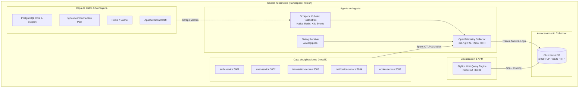
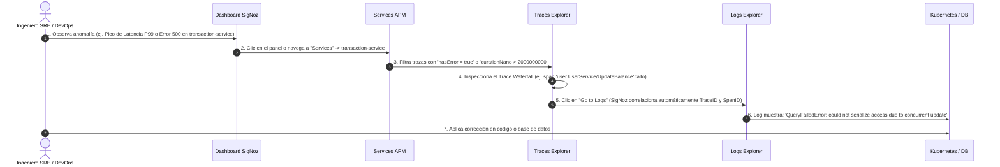

# Guía Maestra de Observabilidad y Monitoreo SRE - FinTech Wallet

Esta guía proporciona el marco conceptual, operativo y analítico para interpretar toda la telemetría recolectada en **SigNoz** a través de **OpenTelemetry (OTel)** en el clúster de Kubernetes de FinTech Wallet.

---

## 📑 Tabla de Contenidos
1. [Arquitectura de Telemetría y Flujo de Datos](#1-arquitectura-de-telemetría-y-flujo-de-datos)
2. [Métodos de Importación de Dashboards](#2-métodos-de-importación-de-dashboards)
3. [Fundamentos SRE: Métricas RED y USE](#3-fundamentos-sre-métricas-red-y-use)
4. [Interpretación Detallada de los 6 Dashboards](#4-interpretación-detallada-de-los-6-dashboards)
   - [01. Kubernetes Cluster & Pods Infrastructure](#dashboard-01-kubernetes-cluster--pods-infrastructure)
   - [02. NestJS Microservices RED Metrics & APM](#dashboard-02-nestjs-microservices-red-metrics--apm)
   - [03. PostgreSQL & PgBouncer Connection Pool](#dashboard-03-postgresql--pgbouncer-connection-pool)
   - [04. Apache Kafka KRaft & Event Streaming](#dashboard-04-apache-kafka-kraft--event-streaming)
   - [05. Redis Cache & Idempotency Store](#dashboard-05-redis-cache--idempotency-store)
   - [06. Ingress Controller & Network Edge Traffic](#dashboard-06-ingress-controller--network-edge-traffic)
5. [Cheat-Sheet SRE: Umbrales Normales vs Críticos](#5-cheat-sheet-sre-umbrales-normales-vs-críticos)
6. [Flujo de Correlación: Métricas ➔ Trazas ➔ Logs](#6-flujo-de-correlación-métricas--trazas--logs)
7. [Playbooks de Respuesta a Incidentes (Runbooks SRE)](#7-playbooks-de-respuesta-a-incidentes-runbooks-sre)

---

## 1. Arquitectura de Telemetría y Flujo de Datos

El sistema de observabilidad de FinTech Wallet implementa una arquitectura desacoplada y de alta fidelidad basada en OpenTelemetry y ClickHouse:



---

## 2. Métodos de Importación de Dashboards

Los dashboards están preconfigurados en formato JSON (Schema SigNoz v5) en la carpeta `k8s/dashboards/` (y sincronizados en `observability/dashboards/`).

### Método A: Auto-Importación Nativa en Kubernetes (Recomendado)
El manifiesto `k8s/12-signoz-dashboards-importer.yaml` incluye un `Job` que espera a que SigNoz esté listo y publica automáticamente los 6 tableros:
```bash
# Aplicar el Job de importación dentro del clúster
kubectl apply -f k8s/12-signoz-dashboards-importer.yaml

# Verificar la finalización del Job
kubectl get jobs -n fintech
kubectl logs job/signoz-dashboards-importer -n fintech
```

### Método B: Script Bash (Servidor Remoto `10.20.0.6` o Linux)
Si te encuentras conectado por SSH al servidor Linux:
```bash
# Si SigNoz está en NodePort 30301 local
./import-signoz-dashboards.sh http://localhost:30301

# Si te conectas desde otra máquina hacia la IP del servidor
./import-signoz-dashboards.sh http://10.20.0.6:30301
```

### Método C: Script PowerShell (Windows Local)
```powershell
# Ejecutar contra el servidor remoto
.\import-signoz-dashboards.ps1 -SigNozUrl "http://10.20.0.6:30301"

# O contra el clúster local
.\import-signoz-dashboards.ps1 -SigNozUrl "http://localhost:30301"
```

### Método D: Importación Manual desde la UI de SigNoz
1. Abre tu navegador en `http://10.20.0.6:30301` o `http://localhost:30301`.
2. Dirígete a la sección **Dashboards** en la barra lateral izquierda.
3. Haz clic en el botón superior derecho **+ New Dashboard** y selecciona **Import JSON**.
4. Arrastra o pega el contenido de cada archivo `.json` de `k8s/dashboards/` y haz clic en **Save**.

---

## 3. Fundamentos SRE: Métricas RED y USE

La plataforma FinTech Wallet utiliza dos estándares de observabilidad de la industria para garantizar diagnóstico rápido:

### 1. Metodología RED (Para Servicios y APIs)
Aplicada a los microservicios (`auth`, `user`, `transaction`, `notification`, `worker`) y el Ingress:
*   **Rate (Tasa)**: Número de peticiones por segundo (RPS) que procesa el servicio.
*   **Errors (Errores)**: Número o porcentaje de solicitudes que fallan (códigos HTTP 4xx/5xx, gRPC error codes).
*   **Duration (Duración / Latencia)**: Tiempo que tarda cada solicitud en procesarse, medido en percentiles (**P50**, **P95**, **P99**).

### 2. Metodología USE (Para Recursos e Infraestructura)
Aplicada a Nodos, Pods, Bases de Datos, Kafka y Redis:
*   **Utilization (Utilización)**: Porcentaje de tiempo o capacidad que el recurso está ocupado (ej. 70% de CPU, 60% de RAM).
*   **Saturation (Saturación)**: Grado en el que el trabajo extra se acumula en cola (ej. Event Loop Lag en Node.js, conexiones en espera en PgBouncer, Consumer Lag en Kafka).
*   **Errors (Errores)**: Conteo de eventos de error (ej. OOMKilled, Pod Restarts, Deadlocks SQL, DLQ events).

---

## 4. Interpretación Detallada de los 6 Dashboards

### Dashboard 01: Kubernetes Cluster & Pods Infrastructure
*Archivo: `01-signoz-k8s-cluster.json`*

| Panel | Métrica Evaluada | Significado Técnico | Qué Buscar / Cuándo Alarmarse |
| :--- | :--- | :--- | :--- |
| **Uso de CPU por Pod** | `container_cpu_usage_seconds_total` (m) | Milicores de CPU consumidos por contenedor. | Picos sostenidos por encima del request (100m). Si un pod alcanza el 100% de CPU de forma constante, Node.js sufrirá degradación en el Event Loop. |
| **Uso de RAM por Pod** | `container_memory_working_set_bytes` (MiB) | Memoria activa que no puede ser liberada por el kernel. | Es la métrica que el kernel de Linux usa para decidir a qué pod aplicar **OOMKilled**. Si se acerca al límite o crece linealmente sin estabilizarse, hay un memory leak. |
| **Reinicios de Pods (Restarts)** | `container_restart_count` / `k8s_pod_restarts_total` | Contador de veces que el contenedor ha muerto y K8s lo ha reiniciado. | **Cualquier valor > 0 es crítico**. Indica un crash de proceso no capturado (`SIGSEGV`, `UnhandledPromiseRejection`), probe fallido o desalojo por OOM. |
| **Utilización de CPU del Nodo** | `system_cpu_time{state!="idle"}` (%) | Saturación global del servidor host / nodo K8s. | Si supera el **85%**, el scheduler de Kubernetes tendrá dificultades para agendar nuevos pods o manejar ráfagas. |
| **Utilización de RAM del Nodo** | `system_memory_usage` (%) | Porcentaje de memoria física ocupada en el servidor. | Si supera el **90%**, el nodo entrará en condición de `MemoryPressure` y comenzará a desalojar pods de menor prioridad. |
| **Almacenamiento en PVCs** | `kubelet_volume_stats_used_bytes` (%) | Ocupación de disco en PostgreSQL, ClickHouse y Kafka. | Si supera el **80%**, programar expansión de PVC (`storage: 10Gi`) para evitar corrupción de datos por disco lleno (`ENOSPC`). |
| **Escalado Automático HPA** | `kube_horizontalpodautoscaler_*` | Réplicas actuales vs deseadas por el Horizontal Pod Autoscaler. | Muestra si los microservicios están escalando automáticamente bajo estrés (ej. de 1 a 5 pods). |
| **Tráfico de Red por Pod** | `container_network_receive/transmit_bytes` | Tasa de bytes I/O transferidos por pod. | Detección de cuellos de botella en transferencias masivas o saturación de sockets de red. |

---

### Dashboard 02: NestJS Microservices RED Metrics & APM
*Archivo: `02-signoz-nestjs-apm.json`*

| Panel | Métrica Evaluada | Significado Técnico | Qué Buscar / Cuándo Alarmarse |
| :--- | :--- | :--- | :--- |
| **Throughput (RPS)** | `http_server_duration_milliseconds_count` | Solicitudes por segundo procesadas por cada microservicio. | Caídas abruptas de RPS durante horas pico indican caída del Ingress o bloqueo aguas arriba. Picos repentinos indican ráfagas de tráfico o ataques. |
| **Latencias (P50, P95, P99)** | `http_server_duration_milliseconds_bucket` | **P50**: Caso típico (50% de usuarios).<br>**P95**: Usuarios lentos.<br>**P99**: Peor caso aceptable (1% más lento). | **P99 > 2000ms** viola el SLA financiero.<br>Si P50 es bajo (20ms) pero P99 es altísimo (3000ms), el problema suele ser contención de base de datos o bloqueos puntuales. |
| **Tasa de Errores HTTP (%)** | `http_status_code=~"4..|5.."` / total * 100 | Porcentaje de fallos clasificados por cliente (4xx) y servidor (5xx). | **Errores 5xx > 1%**: Requiere investigación inmediata (bugs de backend o caída de dependencias).<br>**Errores 4xx > 10%**: Posible ataque de fuerza bruta o expiración masiva de tokens JWT. |
| **Node.js Heap Memory** | `process_runtime_nodejs_memory_heap_used_bytes` | Memoria usada por objetos JavaScript en la heap de V8. | Debe tener forma de diente de sierra (crece y baja tras el Garbage Collection). Si la base del diente sube constantemente hacia los 256MB, existe una fuga de memoria (Memory Leak). |
| **Node.js Event Loop Lag** | `process_runtime_nodejs_event_loop_lag_seconds` (ms) | Retraso en el procesamiento de callbacks en el hilo principal. | **Normal: < 10ms**.<br>**Crítico: > 50ms**.<br>Un lag alto indica que se está ejecutando código síncrono bloqueante (criptografía pesada, JSON.parse de payloads gigantes o loops infinitos). |
| **Active Handles & Requests** | `process_runtime_nodejs_active_handles` | Conexiones de red abiertas y operaciones I/O pendientes. | Si sube constantemente sin bajar, hay conexiones de base de datos, Redis o HTTP que no se están cerrando (`socket leak`). |
| **Transferencias & Idempotencia** | `http_target=~".*transfer.*"` | Volumen de transferencias de dinero procesadas por minuto. | Métrica clave de negocio. Permite auditar el throughput financiero real de la plataforma. |
| **Llamadas gRPC Inter-Servicio** | `rpc_server_duration_milliseconds_count` | Rendimiento de llamadas internas gRPC a `user-service:9090`. | Mide la salud de la comunicación síncrona interna para obtención de perfiles y actualización de saldos. |

---

### Dashboard 03: PostgreSQL & PgBouncer Connection Pool
*Archivo: `03-signoz-postgresql-pgbouncer.json`*

| Panel | Métrica Evaluada | Significado Técnico | Qué Buscar / Cuándo Alarmarse |
| :--- | :--- | :--- | :--- |
| **Conexiones PgBouncer** | `client_active`, `client_waiting`, `server_active` | Estado del pooler de conexiones en modo `transaction`. | **`client_waiting > 0`**: Indica que los microservicios están esperando por una conexión libre a PostgreSQL. Si esto ocurre, incrementar `DEFAULT_POOL_SIZE` o investigar consultas lentas. |
| **QPS de Consultas SQL** | `db_client_duration_milliseconds_count` | Consultas por segundo ejecutadas contra PostgreSQL. | Permite correlacionar picos de peticiones HTTP con la carga real sobre el motor de base de datos. |
| **Latencia de Queries SQL** | `db_client_duration_milliseconds_bucket` (P95/P99) | Tiempo que tarda PostgreSQL en ejecutar y retornar las consultas. | **P99 > 200ms**: Indica falta de índices (`CREATE INDEX`), scans secuenciales de tablas grandes o contención de locks en transacciones. |
| **Commits vs Rollbacks** | `postgresql_commits` vs `postgresql_rollbacks` | Tasa de transacciones completadas con éxito vs revertidas. | Un aumento en la tasa de Rollbacks indica violaciones de restricciones de integridad (ej. saldo insuficiente, emails duplicados) o deadlocks. |
| **Bloqueos y Deadlocks** | `postgresql_deadlocks` / HTTP 409 | Conflictos de concurrencia al intentar modificar el mismo registro. | Si se detectan deadlocks, revisar el orden de actualización de tablas en `transaction-service` (ej. debitar origen antes de acreditar destino). |
| **Recursos de Pods de DB** | `container_memory/cpu` en `postgres-*` | Consumo de CPU y RAM en `postgres-core` y `postgres-support`. | Si PostgreSQL alcanza el 100% de CPU, verificar si `work_mem` o `shared_buffers` requieren ajuste. |

---

### Dashboard 04: Apache Kafka KRaft & Event Streaming
*Archivo: `04-signoz-kafka-streaming.json`*

| Panel | Métrica Evaluada | Significado Técnico | Qué Buscar / Cuándo Alarmarse |
| :--- | :--- | :--- | :--- |
| **Mensajes Producidos / seg** | `kafka_messages_in_total` / topic offset delta | Tasa de publicación de eventos de transferencias y outbox. | Valida que los eventos asíncronos generados por `transaction-service` se están inyectando al broker. |
| **Consumer Group Lag** | `kafka_consumergroup_lag` | Mensajes encolados en Kafka que el consumidor aún no ha procesado. | **Lag = 0 o < 10**: Estado ideal.<br>**Lag > 100 y creciendo**: El consumidor (`notification-service` o `worker-service`) está más lento que el productor. Escalar réplicas del servicio. |
| **Eventos en Dead Letter Queue** | Tópico `transfer-events-dlq` | Mensajes que fallaron tras agotar todos los reintentos automáticos. | **Cualquier incremento > 0 requiere auditoría manual**. Indica fallos irrecuperables en el envío de correos o generación de extractos PDF. |
| **Throughput de Red del Broker** | `kafka_network_io` (KB/s Rx/Tx) | Volumen de datos que entra y sale del broker Kafka. | Mide la saturación de I/O de red del cluster KRaft. |
| **Particiones & Quorum KRaft** | `kafka_brokers`, `kafka_topic_partitions` | Estado de salud del nodo y controlador KRaft (sin Zookeeper). | Verifica que el broker esté activo (`node_id=1`) y las particiones no tengan réplicas fuera de sincronía. |

---

### Dashboard 05: Redis Cache & Idempotency Store
*Archivo: `05-signoz-redis-cache.json`*

| Panel | Métrica Evaluada | Significado Técnico | Qué Buscar / Cuándo Alarmarse |
| :--- | :--- | :--- | :--- |
| **Hit Rate de Caché (%)** | `hits / (hits + misses) * 100` | Porcentaje de consultas servidas desde RAM sin ir a PostgreSQL. | **Objetivo: > 80%**.<br>Un Hit Rate bajo (< 50%) indica que el TTL de las claves es demasiado corto o que el patrón de claves no está reutilizándose eficientemente. |
| **Comandos por Segundo** | `redis_commands_processed_total` | Tasa de operaciones `GET`, `SET`, `DEL`, `EXPIRE`. | Monitorea la carga global en el motor single-threaded de Redis. |
| **Memoria Usada vs Límite** | `redis_memory_used_bytes` vs 256MB | Consumo frente a la cuota máxima configurada (`maxmemory 256mb`). | Si se acerca a 256MB, Redis comenzará a aplicar la política `volatile-lru` eliminando claves con expiración previa. |
| **Expiraciones vs Desalojos (Evictions)** | `expired_keys` vs `evicted_keys` | Claves expiradas por TTL natural vs claves eliminadas forzosamente por falta de memoria. | **`evicted_keys > 0`**: Indica que la memoria de 256MB es insuficiente para la carga actual y se están perdiendo claves antes de su tiempo. Aumentar `maxmemory`. |
| **Clientes Conectados** | `redis_connected_clients` | Conexiones de red activas hacia Redis desde los microservicios. | Si sube indefinidamente, revisar la configuración del pool de conexión de `ioredis`. |

---

### Dashboard 06: Ingress Controller & Network Edge Traffic
*Archivo: `06-signoz-ingress-networking.json`*

| Panel | Métrica Evaluada | Significado Técnico | Qué Buscar / Cuándo Alarmarse |
| :--- | :--- | :--- | :--- |
| **Volumen Ingress (RPS)** | `nginx_ingress_controller_requests` | Peticiones entrantes totales en el perímetro del clúster. | Primer punto de entrada de los usuarios. Permite dimensionar la carga externa real. |
| **Distribución de Códigos HTTP** | Desglose 2xx, 3xx, 4xx, 5xx | Proporción de respuestas entregadas a los clientes. | Permite ver de un vistazo la salud del sistema perimetral. |
| **Latencia en el Borde (P99)** | `request_duration_seconds` (ms) | Tiempo total de ida y vuelta percibido por el cliente externo. | Incluye la latencia de red, tiempo en Ingress y tiempo de ejecución del backend. |
| **Rate Limiting (HTTP 429)** | Conteo de respuestas 429 | Peticiones bloqueadas por exceso de solicitudes por IP. | Indica si las políticas de Rate Limiting están conteniendo ataques o afectando usuarios legítimos. |
| **Ancho de Banda Perimetral** | Bytes In / Out en Ingress (KB/s) | Volumen de datos entrante y saliente por el Gateway. | Permite identificar cargas pesadas de subida o descarga (ej. extractos bancarios PDF). |
| **Conexiones Concurrentes** | Conexiones TCP en Ingress | Usuarios y sockets conectados en simultáneo al clúster. | Monitorea la saturación de descriptores de archivos (`file descriptors`) del Ingress Controller. |

---

## 5. Cheat-Sheet SRE: Umbrales Normales vs Críticos

Usa esta tabla de referencia rápida para evaluar el estado operativo del clúster:

```
┌───────────────────────────┬─────────────────────────────┬──────────────────────────┬─────────────────────────────┐
│ Métrica                   │ Estado Saludable (Normal)   │ Advertencia (Warning)    │ Estado Crítico (Alarma P1)  │
├───────────────────────────┼─────────────────────────────┼──────────────────────────┼─────────────────────────────┤
│ APM Latencia P99          │ < 500 ms                    │ 500 ms - 2000 ms         │ > 2000 ms                   │
│ APM Tasa de Errores 5xx   │ < 0.5 %                     │ 0.5 % - 2.0 %            │ > 5.0 %                     │
│ Node.js Event Loop Lag    │ < 10 ms                     │ 10 ms - 50 ms            │ > 50 ms                     │
│ Node.js Heap Memory       │ < 180 MiB (Diente de Sierra)│ 180 MiB - 220 MiB        │ > 230 MiB (Riesgo OOM)      │
│ Pod Restarts (5m delta)   │ 0                           │ 1                        │ > 2 (CrashLoopBackOff)      │
│ PgBouncer Waiting Clients │ 0                           │ 1 - 5                    │ > 10 (Pool Saturado)        │
│ PostgreSQL Query P99      │ < 50 ms                     │ 50 ms - 200 ms           │ > 500 ms                    │
│ Kafka Consumer Lag        │ < 10 mensajes               │ 10 - 100 mensajes        │ > 500 mensajes              │
│ Kafka DLQ Events          │ 0                           │ 1 - 5                    │ > 10 eventos/min            │
│ Redis Cache Hit Rate      │ > 80 %                      │ 60 % - 80 %              │ < 50 %                      │
│ Redis Evicted Keys        │ 0                           │ 1 - 10 / seg             │ > 50 / seg (Falta de RAM)   │
│ Utilización CPU Nodo      │ < 70 %                      │ 70 % - 85 %              │ > 90 %                      │
│ Ocupación de PVCs (Disco) │ < 70 %                      │ 70 % - 85 %              │ > 90 % (Riesgo de Corrupción│
└───────────────────────────┴─────────────────────────────┴──────────────────────────┴─────────────────────────────┘
```

---

## 6. Flujo de Correlación: Métricas ➔ Trazas ➔ Logs

Cuando detectes una anomalía en un dashboard, sigue este flujo dentro de SigNoz para encontrar la causa raíz en segundos:



### Ejemplo Práctico: Depuración de una Transferencia Bancaria Fallida
1. **Detección**: En el dashboard `02. NestJS Microservices RED Metrics`, el panel **Tasa de Errores 5xx** sube al 8% en `transaction-service`.
2. **Aislamiento**: Ve a **Traces** en SigNoz y añade el filtro:
   `service.name = transaction-service` AND `http.status_code = 500`
3. **Análisis de Árbol de Spans (Flamegraph)**:
   *   El span raíz `POST /transactions/transfer` dura 1200ms.
   *   El span hijo `gRPC user.UserService/UpdateBalance` retorna `StatusCode: UNKNOWN`.
   *   El span hijo de base de datos muestra `SELECT balance FROM user_profiles WHERE id = 1 FOR UPDATE`.
4. **Inspección de Logs**: Al presionar **View Logs** dentro del Span, ves:
   `[Error] TransactionRolledBack: Lock wait timeout exceeded; try restarting transaction`.
5. **Diagnóstico Inmediato**: Dos transacciones simultáneas compitieron por el mismo usuario sin ordenamiento determinista, provocando timeout de bloqueo en PostgreSQL.

---

## 7. Playbooks de Respuesta a Incidentes (Runbooks SRE)

### Playbook 1: Saturación de Conexiones en PgBouncer / DB
*   **Síntoma**: El panel *Conexiones PgBouncer* muestra `Waiting Client Conns > 0` y la latencia HTTP sube.
*   **Paso 1**: Verificar si hay consultas bloqueantes activas en PostgreSQL:
    ```bash
    kubectl exec -it statefulset/postgres-core -n fintech -- psql -U postgres -d transactiondb -c "
      SELECT pid, now() - query_start AS duration, query, state 
      FROM pg_stat_activity 
      WHERE state != 'idle' ORDER BY duration DESC LIMIT 5;"
    ```
*   **Paso 2**: Si hay queries zombis o transacciones colgadas, terminarlas:
    ```bash
    kubectl exec -it statefulset/postgres-core -n fintech -- psql -U postgres -d transactiondb -c "
      SELECT pg_terminate_backend(pid) FROM pg_stat_activity WHERE duration > interval '1 minute';"
    ```
*   **Paso 3**: Si la carga es legítima, ajustar el pool en `k8s/01-infrastructure.yaml`:
    `DEFAULT_POOL_SIZE: "100"` y reiniciar `pgbouncer-core`.

---

### Playbook 2: Acumulación de Lag en Kafka (Consumer Lag > 500)
*   **Síntoma**: El panel *Consumer Group Lag* de `notification-service` o `worker-service` crece continuamente.
*   **Paso 1**: Comprobar si los pods consumidores están vivos y procesando:
    ```bash
    kubectl get pods -n fintech -l app=notification-service
    kubectl logs -n fintech -l app=notification-service --tail=50
    ```
*   **Paso 2**: Si el pod está vivo pero saturado por CPU, escalar horizontalmente:
    ```bash
    kubectl scale deployment/notification-service -n fintech --replicas=3
    ```
*   **Paso 3**: Verificar si el lag comienza a reducirse en el dashboard de Kafka.

---

### Playbook 3: Congelamiento del Event Loop en Node.js (Lag > 50ms)
*   **Síntoma**: El panel *Lag del Event Loop de Node.js* marca > 50ms, la CPU del pod está cerca de 1000m y la latencia P99 se dispara.
*   **Paso 1**: Identificar qué endpoint está consumiendo la CPU en SigNoz **Services ➔ Top Operations**.
*   **Paso 2**: Verificar si `UV_THREADPOOL_SIZE` está configurado adecuadamente (en el despliegue está en `8` para operaciones criptográficas y de I/O).
*   **Paso 3**: Si una operación matemática o criptográfica síncrona (como `bcrypt.hashSync`) está bloqueando el hilo, verificar que se esté usando la variante asíncrona `await bcrypt.hash`.

---

### Playbook 4: Pod Desalojado por Memoria (OOMKilled - Exit Code 137)
*   **Síntoma**: El panel *Reinicios de Pods* marca incrementos y `kubectl describe pod` muestra `Reason: OOMKilled`.
*   **Paso 1**: Verificar el consumo de Heap en el dashboard *02. NestJS APM*.
*   **Paso 2**: Asegurar que la bandera de Node.js `--max-old-space-size=256` esté alineada con el límite del pod.
*   **Paso 3**: Si la aplicación legítimamente requiere más memoria para generar reportes PDF o procesar lotes, incrementar el `requests.memory` a `384Mi` o `512Mi` en `k8s/02-microservices.yaml`.

---

## 8. Conclusión

Con esta suite de 6 dashboards, la automatización en Kubernetes y la metodología de correlación Traza-Log-Métrica, el equipo de ingeniería cuenta con visibilidad de nivel empresarial para operar, escalar y mantener con alta disponibilidad la plataforma FinTech Wallet.
